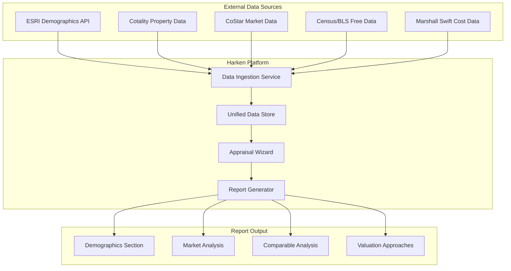

# Competitive Appraisal Analysis and Wizard Enhancement Plan

## Executive Summary

After analyzing 8 appraisals from the dataset, I've identified the following:

| Appraiser | Count | Appraisals |

|-----------|-------|------------|

| **ROVE Valuations** | 2 | 6907 Entryway Drive, Stevensville Development |

| **CBRE** | 2 | National Western Life (Austin), Zimmerman Trail Apartments |

| **Integra Realty Resources (IRR)** | 1 | 750 Southgate (Starbucks) |

| **Bridger Appraisals** | 1 | 34 N Bozeman Fire Station |

| **Glacier Appraisal** | 1 | 214 S Main Kalispell |

---

## Part 1: Competitive Analysis - What CBRE Does Better

### 1.1 Third-Party Data Integration (Critical Gap)

**CBRE Uses:**

- **ESRI Demographics** - Population, households, income at 1/3/5-mile radius
- **Employment by Industry** - 15+ industry categories with percentage breakdown
- **CoStar** - Property data, comparables, market research
- **PwC Real Estate Investor Survey** - Cap rate ranges, marketing times
- **CBRE National Investor Survey** - Market sentiment, investor preferences
- **Marshall & Swift / RS Means** - Cost approach data

**Rove Lacks:**

- No automated demographic data pulls
- No national/regional market indices
- Manual data collection for comparables
- No third-party investor surveys

**Example from CBRE (Zimmerman Trail):**

```
SELECTED NEIGHBORHOOD DEMOGRAPHICS
                          1 Mile    3 Miles   5 Miles   Metro
2027 Total Population     9,996     56,567    95,306    194,696
2022 Total Population     9,759     54,938    92,717    188,573
Annual Growth 2022-2027   0.48%     0.59%     0.55%     0.64%
2022 Median HH Income     $67,678   $64,759   $60,252   $62,916
College Graduates %       49.4%     43.0%     40.1%     35.1%
```

**Rove (6907 Entryway):**

- Simple population statement: "Billings has a 2022 population of 119,706 persons"
- No radius-based analysis
- No income or demographic projections

### 1.2 Economic Context and Market Outlook (Missing in Rove)

**CBRE Includes:**

- Federal Reserve policy analysis
- Interest rate projections (Federal Funds Rate, 10-Year Treasury)
- CBRE Research House View with forward-looking forecasts
- Market volatility disclaimers with specific guidance
- Construction pipeline data

**Example from CBRE:**

```
CBRE Research House View (July 2022):
                          2022          2023          2024-28
Federal Funds Rate        3.25%-3.5%    3.50%-3.75%   1.75%-2.00%
10-Year Treasury (Q4)     3.41%         2.56%         2.94%
```

**Rove:** No economic forecasting section present.

### 1.3 Report Depth and Structure

| Metric | CBRE | Rove |

|--------|------|------|

| Report Length | 100-150 pages | 46-69 pages |

| Character Count | 160K-299K | 105K-133K |

| Demographic Tables | 5-8 detailed tables | 1-2 basic mentions |

| Maps Included | 8-12 (aerial, flood, plat, site, neighborhood) | 3-5 |

| Addenda Sections | 7 (Land Sales, Improved Sales, Rent Comps, Operating Data, Legal, Contract, Qualifications) | 4-5 |

### 1.4 Valuation Sophistication

**CBRE Provides:**

- Multiple valuation scenarios (As Is, As Complete, As Stabilized)
- Detailed pro forma with Per-Unit metrics
- Band of Investment analysis
- Discounted Cash Flow (DCF) models
- Sensitivity analysis
- Expense ratio calculations

**Example Pro Forma (CBRE Zimmerman Trail):**

```
Pro Forma PHASES 1 & 2    Total         Per Unit
Effective Gross Income    $7,155,015    $23,850
Operating Expenses        $2,035,356    $6,785
Expense Ratio            28.45%
Net Operating Income      $5,119,659    $17,066
```

### 1.5 Quality Assurance (IRR does this well)

**IRR Includes:**

- Internal Quality Assurance Program documentation
- IRR Certified Reviewer sign-off
- Explicit competency statements

**CBRE Includes:**

- Valuation & Advisory Services operates independently
- Confidentiality statements
- Prior services disclosure

**Rove:** No formal QA documentation.

### 1.6 SWOT Analysis (IRR does this)

IRR includes explicit Strengths/Weaknesses/Opportunities/Threats analysis:

```
Strengths:
• Signed long-term lease with national corporation
• Strong, growing metro area

Weaknesses: None

Threats:
• Large amount of vacant land for future competition
```

---

## Part 2: Data Sources and Integrations Needed

### 2.1 Essential Data Integrations (Priority Order)

| Priority | Data Source | Purpose | Estimated Cost | Integration Complexity |

|----------|-------------|---------|----------------|----------------------|

| 1 | **ESRI/ArcGIS** | Demographics, radius analysis | $5K-15K/year | Medium |

| 2 | **Cotality (CoreLogic)** | Property data, sales history | $60K/year (MT+ND bulk) | Already planned |

| 3 | **CoStar** | Commercial real estate data | $15K-50K/year | High (API) |

| 4 | **PwC Real Estate Survey** | Cap rates, investor sentiment | $2K-5K/year | Low (manual entry) |

| 5 | **Marshall & Swift** | Cost approach data | $3K-8K/year | Medium |

| 6 | **Census/BLS Data** | Free demographics, employment | Free | Medium |

### 2.2 Data Flow Architecture



---

## Part 3: Wizard Enhancement Implementation

### 3.1 New Analysis Page Components

Based on your existing wizard structure and what's missing compared to CBRE:

#### A. Demographics Module (New)

**Location:** Add to Overview section or as separate step

```typescript
interface DemographicsAnalysis {
  // Radius-based analysis (1, 3, 5 mile)
  radiusAnalysis: {
    radius: number; // miles
    population: {
      current: number;
      projected: number;
      annualGrowth: number;
    };
    households: {
      current: number;
      projected: number;
      annualGrowth: number;
    };
    income: {
      medianHouseholdIncome: number;
      averageHouseholdIncome: number;
      perCapitaIncome: number;
    };
    education: {
      percentCollegeGraduates: number;
    };
    employmentByIndustry: Array<{
      industry: string;
      percentage: number;
    }>;
  }[];
  
  dataSource: 'ESRI' | 'Census' | 'Manual';
  dataPullDate: Date;
}
```

#### B. Market Outlook Module (New)

**Location:** Add to Analysis section

```typescript
interface MarketOutlook {
  // Economic indicators
  economicIndicators: {
    federalFundsRate: {
      current: number;
      projectedYear1: number;
      projectedYear2: number;
    };
    tenYearTreasury: {
      current: number;
      projected: number;
    };
    cpInflation: number;
    gdpGrowth: number;
  };
  
  // Local market conditions
  localMarketConditions: {
    propertyType: string;
    vacancyRate: number;
    absorptionRate: number;
    constructionPipeline: number;
    rentGrowth: number;
    capRateTrend: 'Compressing' | 'Stable' | 'Expanding';
  };
  
  // Growth patterns narrative
  growthPatterns: string;
  
  // Major developments
  majorDevelopments: Array<{
    name: string;
    type: string;
    size: string;
    status: string;
    impact: string;
  }>;
}
```

#### C. SWOT Analysis Module (New)

**Location:** Add to Analysis section

```typescript
interface SWOTAnalysis {
  strengths: string[];
  weaknesses: string[];
  opportunities: string[];
  threats: string[];
  
  valuationInfluencesSummary: string;
}
```

#### D. Enhanced Pro Forma / Financial Indicators (Enhance Existing)

**Location:** Enhance Income Approach

```typescript
interface EnhancedProForma {
  // Existing fields plus:
  perUnitMetrics: {
    effectiveGrossIncomePerUnit: number;
    operatingExpensesPerUnit: number;
    noiPerUnit: number;
    valuePerUnit: number;
  };
  
  perSFMetrics: {
    rentPerSF: number;
    expensesPerSF: number;
    noiPerSF: number;
    valuePerSF: number;
  };
  
  expenseRatio: number;
  operatingExpensePercentage: number;
  
  // Investor metrics
  cashOnCashReturn: number;
  debtServiceCoverageRatio: number;
}
```

### 3.2 Cost Approach (You mentioned this needs building)

Based on CBRE methodology and your existing `APPRAISAL_APPROACHES_ADJUSTMENT_FIELDS_ANALYSIS.md`:

```typescript
interface CostApproach {
  // STEP 1: Land Value
  landValue: {
    landSalesComps: LandSaleComp[];
    indicatedValuePerSF: number;
    indicatedValuePerAcre: number;
    totalLandValue: number;
  };
  
  // STEP 2: Replacement Cost New
  replacementCostNew: {
    improvements: Array<{
      improvementType: string; // Building, Site Improvements, etc.
      description: string;
      sizeSF: number;
      costPerSF: number; // From Marshall & Swift or local data
      totalCost: number;
    }>;
    totalImprovementCost: number;
    entrepreneurialProfit: number; // Typically 10-20%
    totalReplacementCostNew: number;
  };
  
  // STEP 3: Depreciation (NOT adjustments!)
  depreciation: {
    physicalDeterioration: {
      curable: number; // Deferred maintenance
      incurableShortLived: number; // Roof, HVAC, etc.
      incurableLongLived: number; // Structural
      total: number;
    };
    functionalObsolescence: {
      curable: number;
      incurable: number;
      total: number;
    };
    externalObsolescence: number;
    
    totalDepreciation: number;
    depreciationPercentage: number;
  };
  
  // STEP 4: Value Indication
  depreciatedCost: number; // Replacement Cost - Depreciation
  indicatedValue: number; // Land + Depreciated Cost
}
```

### 3.3 Sales Comparison Approach (Enhance Existing)

Add missing adjustment categories per your documentation:

```typescript
interface SalesComparisonAdjustments {
  // Transactional Adjustments (MISSING - Add these)
  transactional: {
    propertyRights: number;     // Fee simple, leasehold, etc.
    financingTerms: number;     // Cash equivalent adjustment
    conditionsOfSale: number;   // Arm's length verification
    marketConditions: number;   // Time adjustment
  };
  
  // Property Adjustments (Enhance existing)
  property: {
    location: number;
    size: number;
    quality: number;
    condition: number;
    age: number;
    functionalUtility: number;
    parking: number;
    // Property-type specific (conditional)
    ceilingHeight?: number;      // Industrial
    loadingDocks?: number;       // Industrial
    officePercentage?: number;   // Flex
  };
  
  // Calculation helpers
  totalTransactionalAdjustment: number;
  totalPropertyAdjustment: number;
  grossAdjustmentPercentage: number;
  netAdjustmentPercentage: number;
  
  // Validation flags
  isGrossAdjustmentExcessive: boolean; // > 40%
  isNetAdjustmentExcessive: boolean;   // > 25%
}
```

### 3.4 Report Template Enhancements

Based on CBRE structure, add these sections to your EJS templates:

| Section | Current Status | Action Needed |

|---------|----------------|---------------|

| Cover Page | Exists | Enhance with property image |

| Letter of Transmittal | Exists | Add market value summary table |

| Certification | Exists | Good |

| Executive Summary | Exists | Add financial indicators table, per-unit metrics |

| Table of Contents | Exists | Auto-generate from sections |

| Area Analysis | Basic | **Major Enhancement** - Add ESRI data tables |

| Neighborhood Analysis | Basic | Add land use map, growth patterns |

| Demographics Tables | **Missing** | **Add** - 1/3/5 mile radius tables |

| Employment by Industry | **Missing** | **Add** - ESRI integration |

| Market Outlook | **Missing** | **Add** - Economic indicators section |

| SWOT Analysis | **Missing** | **Add** - New section |

| Site Analysis | Exists | Add site summary table format |

| Improvements Analysis | Exists | Add summary table format |

| Flood Map | Exists | Good |

| Zoning | Exists | Good |

| Tax Assessment | Exists | Good |

| Highest and Best Use | Exists | Good |

| Cost Approach | **Incomplete** | **Build out** - Depreciation framework |

| Sales Comparison | Exists | Enhance adjustment grid |

| Income Approach | Exists | Add pro forma table format |

| Reconciliation | Exists | Add weighted average table |

| Assumptions/Limiting Conditions | Exists | Good |

| Addenda | Partial | Add data sheets for all comps |

---

## Part 4: Implementation Roadmap

### Phase 1: Foundation Data Integrations (Weeks 1-4)

**Priority: Critical**

1. **Census/BLS Free Data Integration**

   - Implement basic demographic data fetching
   - Population, income, employment by address/radius
   - Files: Create `packages/backend/src/services/demographics/`

2. **ESRI API Integration** (if budget allows)

   - Or use free alternatives: Census API, Data.gov
   - Radius-based demographic analysis

3. **Database Schema Updates**

   - Add demographic_cache table
   - Add market_outlook table
   - Add swot_analysis fields to evaluations

### Phase 2: Cost Approach Completion (Weeks 5-8)

**Priority: High** (You mentioned this needs building)

1. **Remove Adjustment Framework from Cost Approach**

   - Per your documentation, this is incorrectly implemented

2. **Build Depreciation Interface**

   - Physical, Functional, External breakdown
   - Age-life calculation helpers

3. **Marshall & Swift Integration** (or manual cost tables)

   - Building cost per SF by type/quality
   - Regional cost multipliers

### Phase 3: Sales Approach Enhancement (Weeks 9-12)

**Priority: Medium-High**

1. **Add Transactional Adjustments**

   - Property Rights, Financing, Conditions of Sale, Time

2. **Enhanced Adjustment Grid UI**

   - Match CBRE's detailed format
   - Add validation warnings (gross > 40%, net > 25%)

3. **Paired Sales Analysis Tool**

   - Help appraisers derive adjustment rates

### Phase 4: Report Template Enhancement (Weeks 13-16)

**Priority: Medium**

1. **Demographics Section Templates**

   - Radius tables (1/3/5 mile)
   - Employment by industry chart

2. **Market Outlook Template**

   - Economic indicators
   - Local market conditions

3. **Enhanced Executive Summary**

   - Financial indicators table
   - Per-unit/per-SF metrics

### Phase 5: Quality Assurance Features (Weeks 17-20)

**Priority: Lower (but differentiating)**

1. **Review Workflow**

   - Internal QA checklist
   - Reviewer sign-off tracking

2. **SWOT Analysis Module**

   - Guided input for each category
   - Auto-include in reports

---

## Part 5: Specific File Modifications

### Backend Changes

| File Path | Change Type | Description |

|-----------|-------------|-------------|

| `packages/backend/src/services/demographics/` | New | Demographics data service |

| `packages/backend/src/services/marketOutlook/` | New | Economic indicators service |

| `packages/backend/src/services/appraisalCostApproach/` | Major Refactor | Remove adjustments, add depreciation |

| `packages/backend/src/models/evaluation.sequelize.ts` | Enhance | Add SWOT, demographics fields |

| `packages/backend/src/migrations/` | New | Schema updates for new data |

### Frontend Changes

| File Path | Change Type | Description |

|-----------|-------------|-------------|

| `packages/frontend/src/pages/evaluation/overview/` | Enhance | Add demographics section |

| `packages/frontend/src/pages/evaluation/evaluation-cost-approach/` | Major Refactor | Depreciation UI |

| `packages/frontend/src/pages/evaluation/sales-approach/` | Enhance | Transactional adjustments |

| `packages/frontend/src/components/demographics/` | New | Radius analysis components |

| `packages/frontend/src/components/swot-analysis/` | New | SWOT input module |

### Report Templates

| File Path | Change Type | Description |

|-----------|-------------|-------------|

| `packages/backend/templates/report/pages/` | Enhance | Add new sections |

| Add: `demographics-analysis.ejs` | New | Radius demographic tables |

| Add: `market-outlook.ejs` | New | Economic indicators section |

| Add: `swot-analysis.ejs` | New | SWOT section |

| Enhance: `executive-summary.ejs` | Modify | Financial indicators table |

---

## Part 6: Budget Estimate for Data Sources

| Data Source | Annual Cost | One-Time Setup | Notes |

|-------------|-------------|----------------|-------|

| Cotality (MT+ND) | $60,000 | $25,500 | Already planned |

| ESRI Demographics | $5,000-15,000 | $5,000 | Can start with free Census API |

| CoStar API | $15,000-50,000 | $10,000 | Optional - high value but expensive |

| PwC Survey Subscription | $2,000-5,000 | $0 | Manual data entry possible |

| Marshall & Swift | $3,000-8,000 | $2,000 | For cost approach |

| Google APIs | $2,000-3,000 | Already have | Street View, Geocoding |

| **Total Minimum** | **~$72,000** | **~$42,500** | With Cotality + basics |

| **Total Comprehensive** | **~$140,000** | **~$52,500** | All integrations |

---

## Conclusion

The primary gaps between ROVE and CBRE are:

1. **Data depth** - CBRE uses 5+ third-party data sources; ROVE uses manual research
2. **Economic context** - CBRE includes macro economic outlook; ROVE omits this
3. **Demographic analysis** - CBRE has detailed radius-based tables; ROVE has narrative only
4. **Report length/detail** - CBRE 100-150 pages; ROVE 46-69 pages
5. **Financial metrics** - CBRE includes per-unit, per-SF, expense ratios; ROVE is basic

By implementing the phased approach above, Harken can close these gaps and position ROVE Evaluations competitively against national firms like CBRE, while maintaining the efficiency that comes from automated data integration.