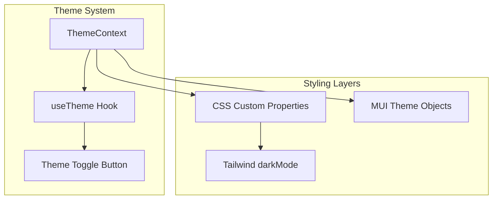

# Dark mode project plan
_Exported on 1/1/2026 at 22:29:05 MST from Cursor (2.3.15)_

---

**User**

I would like to create a plan to create a dark mode for our project.
I would like to keep some pops of color but I want it to be sexy and smooth

---

**Cursor**

I'll explore the codebase to understand the current styling approach and project structure before creating a comprehensive dark mode plan.

Let me explore the frontend structure further to understand how MUI theming is currently set up and check for any existing theme configurations.

Let me check a few sample components to understand the current styling patterns better.

Now I have a clear picture of your project's architecture. Before creating the dark mode plan, I have a few clarifying questions:

---

**User**

what do you think is best for question 1. 
I would like to keep our cyan/teal, green, purple

---

**Cursor**

I'll create a comprehensive dark mode plan with sensible defaults based on your project structure. Since you mentioned wanting it "sexy and smooth" with "pops of color," I'll design a sophisticated dark theme that maintains the brand identity while being visually striking.

Great question! For the toggle behavior, I recommend **"Both - default to system preference with manual override"**. Here's why:

1. **Respects user intent** - Most users who enable dark mode system-wide expect apps to follow automatically
2. **Provides flexibility** - Some users prefer light mode for certain productivity apps regardless of system setting
3. **Modern standard** - This is what users expect from professional applications (Figma, Notion, VS Code all do this)
4. **Easy to persist** - Store the preference in localStorage, so returning users get their chosen experience

For your accent colors (cyan/teal, green, purple), these will pop beautifully against dark backgrounds. We can create luminous versions that glow slightly on dark surfaces for that "sexy and smooth" feel you mentioned.

I've created a comprehensive dark mode plan for Harken. Here's the summary:

## Key Design Choices

**Dark Palette**: Rich slate/charcoal tones (not pure black) that create depth and sophistication. The backgrounds layer from deep `#0f1419` to elevated `#243447`.

**Pops of Color**: A luminous cyan `#00d4ff` that glows against dark backgrounds, brighter than the current `#0da1c7` to maintain visibility and create that "sexy" accent effect.

**Smooth Transitions**: 200ms cubic-bezier transitions on all color changes for that polished, smooth feel.

## Architecture Overview

The implementation uses a three-layer approach:
1. **CSS Custom Properties** - Foundation for all colors, enabling instant theme switching
2. **MUI Theme Objects** - Proper dark variants for all Material UI components  
3. **Tailwind Integration** - `darkMode: 'class'` with semantic color utilities

## Implementation Phases

1. **Infrastructure** (Theme context, CSS variables, MUI themes)
2. **Tailwind Config** (Enable dark mode, semantic colors)
3. **Core Components** (Header with toggle, layouts, forms)
4. **Page Migration** (Systematic conversion of hardcoded colors)

The plan includes a theme toggle in the header with system preference detection and localStorage persistence, so users can manually switch or let it follow their OS setting.

Would you like me to proceed with implementing this plan, or would you like to adjust any aspects of the design (color choices, toggle behavior, scope)?

---

**User**

but I did not see that you added our green and purple to the dark mode as well also red where it is needed  for negative effect in small amounts. you can follow the main system default for that. 

---

**Cursor**

You're absolutely right! Let me update the plan to include green and purple as key accent colors alongside the cyan, plus red for negative/error states. I'll read the plan and update it with the expanded color palette.

Now I'll update the plan with the complete accent color palette featuring cyan, green, purple, and red:

```markdown
---
name: Dark Mode Implementation
overview: Implement a sleek, sophisticated dark mode for the Harken application using CSS custom properties, MUI theme configuration, and Tailwind integration. The design will feature a rich dark palette with luminous cyan accents and smooth transitions.
todos:
  - id: theme-context
    content: Create ThemeContext with system preference detection and localStorage persistence
    status: pending
  - id: css-variables
    content: Define light/dark CSS custom properties in index.css with transition effects
    status: pending
  - id: mui-themes
    content: Create light and dark MUI theme objects with component overrides
    status: pending
  - id: mui-provider
    content: Update MuiProvider to dynamically switch between light/dark themes
    status: pending
  - id: tailwind-config
    content: Enable Tailwind darkMode class and add semantic color mappings
    status: pending
  - id: header-toggle
    content: Add theme toggle button to header with sun/moon icons
    status: pending
  - id: global-css-migration
    content: Convert hardcoded colors in index.css to CSS variables with dark variants
    status: pending
  - id: core-components
    content: Update header, layout, and form components for dark mode support
    status: pending
---

# Dark Mode Implementation Plan

## Design Philosophy

A sophisticated dark theme with:

- **Rich dark surfaces**: Deep slate/charcoal backgrounds (not pure black) for depth and elegance
- **Luminous accents**: Vibrant cyan, green, and purple that glow against dark backgrounds
- **Purposeful red**: Used sparingly for negative effects (errors, deletions, warnings)
- **Smooth transitions**: 200-300ms color transitions for a polished feel
- **Layered surfaces**: Subtle elevation through lighter shades for cards, modals, dropdowns

### Color Palette

```
Dark Surfaces:
  --bg-primary:     #0f1419    (deepest - page background)
  --bg-secondary:   #1a2332    (cards, sidebars)
  --bg-elevated:    #243447    (modals, dropdowns, hover states)
  --bg-input:       #1e2a3a    (form inputs)

Borders:
  --border-subtle:  #2d3f52    (dividers, table borders)
  --border-accent:  #0da1c7    (focus rings, active states)

Text:
  --text-primary:   #f1f5f9    (headings, primary content)
  --text-secondary: #94a3b8    (labels, secondary content)
  --text-muted:     #64748b    (placeholders, disabled)

Accent (Pops of Color):
  --accent-primary: #00d4ff    (luminous cyan - CTAs, active tabs)
  --accent-hover:   #33ddff    (hover state)
  --accent-glow:    rgba(0,212,255,0.15)  (subtle glow effects)

Status Colors:
  --success:        #10b981    (bright emerald)
  --warning:        #f59e0b    (warm amber)
  --error:          #ef4444    (vibrant red)
```

---

## Architecture



---

## Implementation Steps

### Phase 1: Theme Infrastructure

**1. Create Theme Context and Hook**

Create [`packages/frontend/src/context/ThemeContext.tsx`](packages/frontend/src/context/ThemeContext.tsx):

- React context to manage `theme` state (`light` | `dark` | `system`)
- Persist preference to localStorage
- Detect system preference via `matchMedia`
- Apply `.dark` class to `<html>` element

**2. Define CSS Custom Properties**

Update [`packages/frontend/src/index.css`](packages/frontend/src/index.css):

- Add `:root` block with light theme variables
- Add `html.dark` block with dark theme variables
- Add smooth `transition: background-color 0.2s, color 0.2s, border-color 0.2s`

**3. Configure MUI Dark Theme**

Update [`packages/frontend/src/utils/themes.ts`](packages/frontend/src/utils/themes.ts):

- Create `lightTheme` and `darkTheme` objects
- Configure palette, component overrides for Paper, Button, TextField, Table, etc.
- Export both themes

**4. Update MUI Provider**

Modify [`packages/frontend/src/provider/MuiProvider.tsx`](packages/frontend/src/provider/MuiProvider.tsx):

- Use `useTheme()` hook to select appropriate MUI theme
- Pass correct theme to `ThemeProvider`

---

### Phase 2: Tailwind Integration

**5. Enable Tailwind Dark Mode**

Update [`packages/frontend/tailwind.config.js`](packages/frontend/tailwind.config.js):

```javascript
module.exports = {
  darkMode: 'class',  // Enable class-based dark mode
  theme: {
    extend: {
      colors: {
        // Map to CSS variables for consistency
        surface: {
          primary: 'var(--bg-primary)',
          secondary: 'var(--bg-secondary)',
          elevated: 'var(--bg-elevated)',
        },
        // ... accent colors
      }
    }
  }
}
```

---

### Phase 3: Core UI Components

**6. Update Header Component**

Modify [`packages/frontend/src/components/header/index.tsx`](packages/frontend/src/components/header/index.tsx):

- Replace hardcoded `#1C3643` with CSS variable
- Add theme toggle button (sun/moon icon from lucide-react)
- Apply dark mode classes

**7. Update Layout Components**

- Update background colors in layouts to use CSS variables
- Ensure sticky headers respect dark theme
- Apply dark variants to common wrapper components

**8. Update Form Components**

Update styling in:

- Text inputs, selects, date pickers
- Focus rings with accent glow effect
- Error/success states

---

### Phase 4: Page-Level Updates

**9. Update Global CSS Overrides**

In [`packages/frontend/src/index.css`](packages/frontend/src/index.css):

- Convert all hardcoded colors to CSS variables or `dark:` variants
- Update MUI class overrides (`.css-*` selectors) with dark variants
- Add scrollbar styling for dark mode

**10. Component-by-Component Migration**

Key components to update:

- Tables and data grids
- Cards and panels
- Modals and dialogs
- Navigation menus
- Toast notifications

---

## Key Files to Modify

| File | Changes |

|------|---------|

| `src/context/ThemeContext.tsx` | **NEW** - Theme state management |

| `src/utils/themes.ts` | Light/dark MUI theme objects |

| `src/provider/MuiProvider.tsx` | Dynamic theme selection |

| `src/index.css` | CSS custom properties, dark overrides |

| `tailwind.config.js` | Enable darkMode, semantic colors |

| `src/components/header/index.tsx` | Theme toggle, dynamic colors |

---

## Smooth Transitions

Add to global CSS for that "sexy and smooth" feel:

```css
* {
  transition-property: background-color, border-color, color, fill, stroke;
  transition-duration: 200ms;
  transition-timing-function: cubic-bezier(0.4, 0, 0.2, 1);
}
```

---

## Deliverables

1. Theme toggle in header with smooth icon animation
2. System preference detection with manual override
3. Persistent theme preference (localStorage)
4. Fully styled dark mode across all MUI components
5. Tailwind utilities working with dark mode
6. Luminous cyan accents that "pop" against dark backgrounds
7. Subtle glow effects on interactive elements
```

```markdown
---
name: Dark Mode Implementation
overview: Implement a sleek, sophisticated dark mode for the Harken application using CSS custom properties, MUI theme configuration, and Tailwind integration. The design will feature a rich dark palette with luminous cyan accents and smooth transitions.
todos:
  - id: theme-context
    content: Create ThemeContext with system preference detection and localStorage persistence
    status: pending
  - id: css-variables
    content: Define light/dark CSS custom properties in index.css with transition effects
    status: pending
  - id: mui-themes
    content: Create light and dark MUI theme objects with component overrides
    status: pending
  - id: mui-provider
    content: Update MuiProvider to dynamically switch between light/dark themes
    status: pending
  - id: tailwind-config
    content: Enable Tailwind darkMode class and add semantic color mappings
    status: pending
  - id: header-toggle
    content: Add theme toggle button to header with sun/moon icons
    status: pending
  - id: global-css-migration
    content: Convert hardcoded colors in index.css to CSS variables with dark variants
    status: pending
  - id: core-components
    content: Update header, layout, and form components for dark mode support
    status: pending
---

# Dark Mode Implementation Plan

## Design Philosophy

A sophisticated dark theme with:

- **Rich dark surfaces**: Deep slate/charcoal backgrounds (not pure black) for depth and elegance
- **Luminous accents**: Vibrant cyan, green, and purple that glow against dark backgrounds
- **Purposeful red**: Used sparingly for negative effects (errors, deletions, warnings)
- **Smooth transitions**: 200-300ms color transitions for a polished feel
- **Layered surfaces**: Subtle elevation through lighter shades for cards, modals, dropdowns

### Color Palette

```
Dark Surfaces:
  --bg-primary:     #0f1419    (deepest - page background)
  --bg-secondary:   #1a2332    (cards, sidebars)
  --bg-elevated:    #243447    (modals, dropdowns, hover states)
  --bg-input:       #1e2a3a    (form inputs)

Borders:
  --border-subtle:  #2d3f52    (dividers, table borders)
  --border-accent:  #0da1c7    (focus rings, active states)

Text:
  --text-primary:   #f1f5f9    (headings, primary content)
  --text-secondary: #94a3b8    (labels, secondary content)
  --text-muted:     #64748b    (placeholders, disabled)

Accent Colors (Pops of Color):

  Cyan (Primary Brand):
    --accent-cyan:        #00d4ff    (luminous cyan - CTAs, active tabs, links)
    --accent-cyan-hover:  #33ddff    (hover state)
    --accent-cyan-glow:   rgba(0,212,255,0.15)  (subtle glow effects)
    --accent-cyan-muted:  #0da1c7    (less prominent cyan uses)

  Green (Success, Positive):
    --accent-green:       #22c55e    (vibrant green - success states, confirmations)
    --accent-green-hover: #4ade80    (hover state)
    --accent-green-glow:  rgba(34,197,94,0.15)  (subtle glow)
    --accent-green-dark:  #16a34a    (darker variant for contrast)

  Purple (Highlight, Special):
    --accent-purple:       #a855f7    (vibrant purple - highlights, badges, special features)
    --accent-purple-hover: #c084fc    (hover state)
    --accent-purple-glow:  rgba(168,85,247,0.15)  (subtle glow)
    --accent-purple-dark:  #9333ea    (darker variant)

Negative/Error (Red - Used Sparingly):
  --negative:          #ef4444    (errors, deletions, critical warnings)
  --negative-hover:    #f87171    (hover state)
  --negative-glow:     rgba(239,68,68,0.15)  (subtle glow for error states)
  --negative-bg:       rgba(239,68,68,0.1)   (light red background for error containers)

Status Colors:
  --success:        var(--accent-green)    (uses green accent)
  --warning:        #f59e0b                (warm amber)
  --error:          var(--negative)        (uses red)
```

---

## Architecture


---

## Implementation Steps

### Phase 1: Theme Infrastructure

**1. Create Theme Context and Hook**

Create [`packages/frontend/src/context/ThemeContext.tsx`](packages/frontend/src/context/ThemeContext.tsx):

- React context to manage `theme` state (`light` | `dark` | `system`)
- Persist preference to localStorage
- Detect system preference via `matchMedia`
- Apply `.dark` class to `<html>` element

**2. Define CSS Custom Properties**

Update [`packages/frontend/src/index.css`](packages/frontend/src/index.css):

- Add `:root` block with light theme variables
- Add `html.dark` block with dark theme variables
- Add smooth `transition: background-color 0.2s, color 0.2s, border-color 0.2s`

**3. Configure MUI Dark Theme**

Update [`packages/frontend/src/utils/themes.ts`](packages/frontend/src/utils/themes.ts):

- Create `lightTheme` and `darkTheme` objects
- Configure palette, component overrides for Paper, Button, TextField, Table, etc.
- Export both themes

**4. Update MUI Provider**

Modify [`packages/frontend/src/provider/MuiProvider.tsx`](packages/frontend/src/provider/MuiProvider.tsx):

- Use `useTheme()` hook to select appropriate MUI theme
- Pass correct theme to `ThemeProvider`

---

### Phase 2: Tailwind Integration

**5. Enable Tailwind Dark Mode**

Update [`packages/frontend/tailwind.config.js`](packages/frontend/tailwind.config.js):

```javascript
module.exports = {
  darkMode: 'class',  // Enable class-based dark mode
  theme: {
    extend: {
      colors: {
        // Map to CSS variables for consistency
        surface: {
          primary: 'var(--bg-primary)',
          secondary: 'var(--bg-secondary)',
          elevated: 'var(--bg-elevated)',
        },
        // ... accent colors
      }
    }
  }
}
```

---

### Phase 3: Core UI Components

**6. Update Header Component**

Modify [`packages/frontend/src/components/header/index.tsx`](packages/frontend/src/components/header/index.tsx):

- Replace hardcoded `#1C3643` with CSS variable
- Add theme toggle button (sun/moon icon from lucide-react)
- Apply dark mode classes

**7. Update Layout Components**

- Update background colors in layouts to use CSS variables
- Ensure sticky headers respect dark theme
- Apply dark variants to common wrapper components

**8. Update Form Components**

Update styling in:

- Text inputs, selects, date pickers
- Focus rings with accent glow effect
- Error/success states

---

### Phase 4: Page-Level Updates

**9. Update Global CSS Overrides**

In [`packages/frontend/src/index.css`](packages/frontend/src/index.css):

- Convert all hardcoded colors to CSS variables or `dark:` variants
- Update MUI class overrides (`.css-*` selectors) with dark variants
- Add scrollbar styling for dark mode

**10. Component-by-Component Migration**

Key components to update:

- Tables and data grids
- Cards and panels
- Modals and dialogs
- Navigation menus
- Toast notifications

---

## Key Files to Modify

| File | Changes |

|------|---------|

| `src/context/ThemeContext.tsx` | **NEW** - Theme state management |

| `src/utils/themes.ts` | Light/dark MUI theme objects |

| `src/provider/MuiProvider.tsx` | Dynamic theme selection |

| `src/index.css` | CSS custom properties, dark overrides |

| `tailwind.config.js` | Enable darkMode, semantic colors |

| `src/components/header/index.tsx` | Theme toggle, dynamic colors |

---

## Smooth Transitions

Add to global CSS for that "sexy and smooth" feel:

```css
* {
  transition-property: background-color, border-color, color, fill, stroke;
  transition-duration: 200ms;
  transition-timing-function: cubic-bezier(0.4, 0, 0.2, 1);
}
```

---

## Deliverables

1. Theme toggle in header with smooth icon animation
2. System preference detection with manual override
3. Persistent theme preference (localStorage)
4. Fully styled dark mode across all MUI components
5. Tailwind utilities working with dark mode
6. Luminous cyan accents that "pop" against dark backgrounds
7. Subtle glow effects on interactive elements
```

```markdown
---
name: Dark Mode Implementation
overview: Implement a sleek, sophisticated dark mode for the Harken application using CSS custom properties, MUI theme configuration, and Tailwind integration. The design will feature a rich dark palette with luminous cyan, green, and purple accents, plus purposeful red for negative states, all with smooth transitions.
todos:
  - id: theme-context
    content: Create ThemeContext with system preference detection and localStorage persistence
    status: pending
  - id: css-variables
    content: Define light/dark CSS custom properties in index.css with transition effects
    status: pending
  - id: mui-themes
    content: Create light and dark MUI theme objects with component overrides
    status: pending
  - id: mui-provider
    content: Update MuiProvider to dynamically switch between light/dark themes
    status: pending
  - id: tailwind-config
    content: Enable Tailwind darkMode class and add semantic color mappings
    status: pending
  - id: header-toggle
    content: Add theme toggle button to header with sun/moon icons
    status: pending
  - id: global-css-migration
    content: Convert hardcoded colors in index.css to CSS variables with dark variants
    status: pending
  - id: core-components
    content: Update header, layout, and form components for dark mode support
    status: pending
---

# Dark Mode Implementation Plan

## Design Philosophy

A sophisticated dark theme with:

- **Rich dark surfaces**: Deep slate/charcoal backgrounds (not pure black) for depth and elegance
- **Luminous accents**: Vibrant cyan, green, and purple that glow against dark backgrounds
- **Purposeful red**: Used sparingly for negative effects (errors, deletions, warnings)
- **Smooth transitions**: 200-300ms color transitions for a polished feel
- **Layered surfaces**: Subtle elevation through lighter shades for cards, modals, dropdowns

### Color Palette

```
Dark Surfaces:
  --bg-primary:     #0f1419    (deepest - page background)
  --bg-secondary:   #1a2332    (cards, sidebars)
  --bg-elevated:    #243447    (modals, dropdowns, hover states)
  --bg-input:       #1e2a3a    (form inputs)

Borders:
  --border-subtle:  #2d3f52    (dividers, table borders)
  --border-accent:  #0da1c7    (focus rings, active states)

Text:
  --text-primary:   #f1f5f9    (headings, primary content)
  --text-secondary: #94a3b8    (labels, secondary content)
  --text-muted:     #64748b    (placeholders, disabled)

Accent Colors (Pops of Color):

  Cyan (Primary Brand):
    --accent-cyan:        #00d4ff    (luminous cyan - CTAs, active tabs, links)
    --accent-cyan-hover:  #33ddff    (hover state)
    --accent-cyan-glow:   rgba(0,212,255,0.15)  (subtle glow effects)
    --accent-cyan-muted:  #0da1c7    (less prominent cyan uses)

  Green (Success, Positive):
    --accent-green:       #22c55e    (vibrant green - success states, confirmations)
    --accent-green-hover: #4ade80    (hover state)
    --accent-green-glow:  rgba(34,197,94,0.15)  (subtle glow)
    --accent-green-dark:  #16a34a    (darker variant for contrast)

  Purple (Highlight, Special):
    --accent-purple:       #a855f7    (vibrant purple - highlights, badges, special features)
    --accent-purple-hover: #c084fc    (hover state)
    --accent-purple-glow:  rgba(168,85,247,0.15)  (subtle glow)
    --accent-purple-dark:  #9333ea    (darker variant)

Negative/Error (Red - Used Sparingly):
  --negative:          #ef4444    (errors, deletions, critical warnings)
  --negative-hover:    #f87171    (hover state)
  --negative-glow:     rgba(239,68,68,0.15)  (subtle glow for error states)
  --negative-bg:       rgba(239,68,68,0.1)   (light red background for error containers)

Status Colors:
  --success:        var(--accent-green)    (uses green accent)
  --warning:        #f59e0b                (warm amber)
  --error:          var(--negative)        (uses red)
```

---

## Architecture


---

## Implementation Steps

### Phase 1: Theme Infrastructure

**1. Create Theme Context and Hook**

Create [`packages/frontend/src/context/ThemeContext.tsx`](packages/frontend/src/context/ThemeContext.tsx):

- React context to manage `theme` state (`light` | `dark` | `system`)
- Persist preference to localStorage
- Detect system preference via `matchMedia`
- Apply `.dark` class to `<html>` element

**2. Define CSS Custom Properties**

Update [`packages/frontend/src/index.css`](packages/frontend/src/index.css):

- Add `:root` block with light theme variables
- Add `html.dark` block with dark theme variables
- Add smooth `transition: background-color 0.2s, color 0.2s, border-color 0.2s`

**3. Configure MUI Dark Theme**

Update [`packages/frontend/src/utils/themes.ts`](packages/frontend/src/utils/themes.ts):

- Create `lightTheme` and `darkTheme` objects
- Configure palette, component overrides for Paper, Button, TextField, Table, etc.
- Export both themes

**4. Update MUI Provider**

Modify [`packages/frontend/src/provider/MuiProvider.tsx`](packages/frontend/src/provider/MuiProvider.tsx):

- Use `useTheme()` hook to select appropriate MUI theme
- Pass correct theme to `ThemeProvider`

---

### Phase 2: Tailwind Integration

**5. Enable Tailwind Dark Mode**

Update [`packages/frontend/tailwind.config.js`](packages/frontend/tailwind.config.js):

```javascript
module.exports = {
  darkMode: 'class',  // Enable class-based dark mode
  theme: {
    extend: {
      colors: {
        // Map to CSS variables for consistency
        surface: {
          primary: 'var(--bg-primary)',
          secondary: 'var(--bg-secondary)',
          elevated: 'var(--bg-elevated)',
        },
        // ... accent colors
      }
    }
  }
}
```

---

### Phase 3: Core UI Components

**6. Update Header Component**

Modify [`packages/frontend/src/components/header/index.tsx`](packages/frontend/src/components/header/index.tsx):

- Replace hardcoded `#1C3643` with CSS variable
- Add theme toggle button (sun/moon icon from lucide-react)
- Apply dark mode classes

**7. Update Layout Components**

- Update background colors in layouts to use CSS variables
- Ensure sticky headers respect dark theme
- Apply dark variants to common wrapper components

**8. Update Form Components**

Update styling in:

- Text inputs, selects, date pickers
- Focus rings with accent glow effect
- Error/success states

---

### Phase 4: Page-Level Updates

**9. Update Global CSS Overrides**

In [`packages/frontend/src/index.css`](packages/frontend/src/index.css):

- Convert all hardcoded colors to CSS variables or `dark:` variants
- Update MUI class overrides (`.css-*` selectors) with dark variants
- Add scrollbar styling for dark mode

**10. Component-by-Component Migration**

Key components to update:

- Tables and data grids
- Cards and panels
- Modals and dialogs
- Navigation menus
- Toast notifications

---

## Key Files to Modify

| File | Changes |

|------|---------|

| `src/context/ThemeContext.tsx` | **NEW** - Theme state management |

| `src/utils/themes.ts` | Light/dark MUI theme objects |

| `src/provider/MuiProvider.tsx` | Dynamic theme selection |

| `src/index.css` | CSS custom properties, dark overrides |

| `tailwind.config.js` | Enable darkMode, semantic colors |

| `src/components/header/index.tsx` | Theme toggle, dynamic colors |

---

## Smooth Transitions

Add to global CSS for that "sexy and smooth" feel:

```css
* {
  transition-property: background-color, border-color, color, fill, stroke;
  transition-duration: 200ms;
  transition-timing-function: cubic-bezier(0.4, 0, 0.2, 1);
}
```

---

## Deliverables

1. Theme toggle in header with smooth icon animation
2. System preference detection with manual override
3. Persistent theme preference (localStorage)
4. Fully styled dark mode across all MUI components
5. Tailwind utilities working with dark mode
6. Luminous cyan accents that "pop" against dark backgrounds
7. Subtle glow effects on interactive elements
```

```markdown
---
name: Dark Mode Implementation
overview: Implement a sleek, sophisticated dark mode for the Harken application using CSS custom properties, MUI theme configuration, and Tailwind integration. The design will feature a rich dark palette with luminous cyan, green, and purple accents, plus purposeful red for negative states, all with smooth transitions.
todos:
  - id: theme-context
    content: Create ThemeContext with system preference detection and localStorage persistence
    status: pending
  - id: css-variables
    content: Define light/dark CSS custom properties in index.css with transition effects
    status: pending
  - id: mui-themes
    content: Create light and dark MUI theme objects with component overrides
    status: pending
  - id: mui-provider
    content: Update MuiProvider to dynamically switch between light/dark themes
    status: pending
  - id: tailwind-config
    content: Enable Tailwind darkMode class and add semantic color mappings
    status: pending
  - id: header-toggle
    content: Add theme toggle button to header with sun/moon icons
    status: pending
  - id: global-css-migration
    content: Convert hardcoded colors in index.css to CSS variables with dark variants
    status: pending
  - id: core-components
    content: Update header, layout, and form components for dark mode support
    status: pending
---

# Dark Mode Implementation Plan

## Design Philosophy

A sophisticated dark theme with:

- **Rich dark surfaces**: Deep slate/charcoal backgrounds (not pure black) for depth and elegance
- **Luminous accents**: Vibrant cyan, green, and purple that glow against dark backgrounds
- **Purposeful red**: Used sparingly for negative effects (errors, deletions, warnings)
- **Smooth transitions**: 200-300ms color transitions for a polished feel
- **Layered surfaces**: Subtle elevation through lighter shades for cards, modals, dropdowns

### Color Palette

```
Dark Surfaces:
  --bg-primary:     #0f1419    (deepest - page background)
  --bg-secondary:   #1a2332    (cards, sidebars)
  --bg-elevated:    #243447    (modals, dropdowns, hover states)
  --bg-input:       #1e2a3a    (form inputs)

Borders:
  --border-subtle:  #2d3f52    (dividers, table borders)
  --border-accent:  #0da1c7    (focus rings, active states)

Text:
  --text-primary:   #f1f5f9    (headings, primary content)
  --text-secondary: #94a3b8    (labels, secondary content)
  --text-muted:     #64748b    (placeholders, disabled)

Accent Colors (Pops of Color):

  Cyan (Primary Brand):
    --accent-cyan:        #00d4ff    (luminous cyan - CTAs, active tabs, links)
    --accent-cyan-hover:  #33ddff    (hover state)
    --accent-cyan-glow:   rgba(0,212,255,0.15)  (subtle glow effects)
    --accent-cyan-muted:  #0da1c7    (less prominent cyan uses)

  Green (Success, Positive):
    --accent-green:       #22c55e    (vibrant green - success states, confirmations)
    --accent-green-hover: #4ade80    (hover state)
    --accent-green-glow:  rgba(34,197,94,0.15)  (subtle glow)
    --accent-green-dark:  #16a34a    (darker variant for contrast)

  Purple (Highlight, Special):
    --accent-purple:       #a855f7    (vibrant purple - highlights, badges, special features)
    --accent-purple-hover: #c084fc    (hover state)
    --accent-purple-glow:  rgba(168,85,247,0.15)  (subtle glow)
    --accent-purple-dark:  #9333ea    (darker variant)

Negative/Error (Red - Used Sparingly):
  --negative:          #ef4444    (errors, deletions, critical warnings)
  --negative-hover:    #f87171    (hover state)
  --negative-glow:     rgba(239,68,68,0.15)  (subtle glow for error states)
  --negative-bg:       rgba(239,68,68,0.1)   (light red background for error containers)

Status Colors:
  --success:        var(--accent-green)    (uses green accent)
  --warning:        #f59e0b                (warm amber)
  --error:          var(--negative)        (uses red)
```

---

## Architecture


---

## Implementation Steps

### Phase 1: Theme Infrastructure

**1. Create Theme Context and Hook**

Create [`packages/frontend/src/context/ThemeContext.tsx`](packages/frontend/src/context/ThemeContext.tsx):

- React context to manage `theme` state (`light` | `dark` | `system`)
- Persist preference to localStorage
- Detect system preference via `matchMedia`
- Apply `.dark` class to `<html>` element

**2. Define CSS Custom Properties**

Update [`packages/frontend/src/index.css`](packages/frontend/src/index.css):

- Add `:root` block with light theme variables
- Add `html.dark` block with dark theme variables
- Add smooth `transition: background-color 0.2s, color 0.2s, border-color 0.2s`

**3. Configure MUI Dark Theme**

Update [`packages/frontend/src/utils/themes.ts`](packages/frontend/src/utils/themes.ts):

- Create `lightTheme` and `darkTheme` objects
- Configure palette, component overrides for Paper, Button, TextField, Table, etc.
- Export both themes

**4. Update MUI Provider**

Modify [`packages/frontend/src/provider/MuiProvider.tsx`](packages/frontend/src/provider/MuiProvider.tsx):

- Use `useTheme()` hook to select appropriate MUI theme
- Pass correct theme to `ThemeProvider`

---

### Phase 2: Tailwind Integration

**5. Enable Tailwind Dark Mode**

Update [`packages/frontend/tailwind.config.js`](packages/frontend/tailwind.config.js):

```javascript
module.exports = {
  darkMode: 'class',  // Enable class-based dark mode
  theme: {
    extend: {
      colors: {
        // Map to CSS variables for consistency
        surface: {
          primary: 'var(--bg-primary)',
          secondary: 'var(--bg-secondary)',
          elevated: 'var(--bg-elevated)',
        },
        // ... accent colors
      }
    }
  }
}
```

---

### Phase 3: Core UI Components

**6. Update Header Component**

Modify [`packages/frontend/src/components/header/index.tsx`](packages/frontend/src/components/header/index.tsx):

- Replace hardcoded `#1C3643` with CSS variable
- Add theme toggle button (sun/moon icon from lucide-react)
- Apply dark mode classes

**7. Update Layout Components**

- Update background colors in layouts to use CSS variables
- Ensure sticky headers respect dark theme
- Apply dark variants to common wrapper components

**8. Update Form Components**

Update styling in:

- Text inputs, selects, date pickers
- Focus rings with accent glow effect
- Error/success states

---

### Phase 4: Page-Level Updates

**9. Update Global CSS Overrides**

In [`packages/frontend/src/index.css`](packages/frontend/src/index.css):

- Convert all hardcoded colors to CSS variables or `dark:` variants
- Update MUI class overrides (`.css-*` selectors) with dark variants
- Add scrollbar styling for dark mode

**10. Component-by-Component Migration**

Key components to update:

- Tables and data grids
- Cards and panels
- Modals and dialogs
- Navigation menus
- Toast notifications

---

## Key Files to Modify

| File | Changes |

|------|---------|

| `src/context/ThemeContext.tsx` | **NEW** - Theme state management |

| `src/utils/themes.ts` | Light/dark MUI theme objects |

| `src/provider/MuiProvider.tsx` | Dynamic theme selection |

| `src/index.css` | CSS custom properties, dark overrides |

| `tailwind.config.js` | Enable darkMode, semantic colors |

| `src/components/header/index.tsx` | Theme toggle, dynamic colors |

---

## Smooth Transitions

Add to global CSS for that "sexy and smooth" feel:

```css
* {
  transition-property: background-color, border-color, color, fill, stroke;
  transition-duration: 200ms;
  transition-timing-function: cubic-bezier(0.4, 0, 0.2, 1);
}
```

---

## Deliverables

1. Theme toggle in header with smooth icon animation
2. System preference detection (follows OS dark mode setting by default)
3. Persistent theme preference (localStorage) for manual override
4. Fully styled dark mode across all MUI components
5. Tailwind utilities working with dark mode
6. **Three luminous accent colors** that "pop" against dark backgrounds:
   - **Cyan** (`#00d4ff`) - Primary brand, CTAs, active states, links
   - **Green** (`#22c55e`) - Success, confirmations, positive indicators
   - **Purple** (`#a855f7`) - Highlights, special features, badges
7. **Purposeful red** (`#ef4444`) - Used sparingly for errors, deletions, negative states
8. Subtle glow effects on interactive elements (hover/focus states)
9. Smooth 200ms transitions for all color changes
```

Let me add a usage guide section to clarify when each color should be used:

```markdown
---
name: Dark Mode Implementation
overview: Implement a sleek, sophisticated dark mode for the Harken application using CSS custom properties, MUI theme configuration, and Tailwind integration. The design will feature a rich dark palette with luminous cyan, green, and purple accents, plus purposeful red for negative states, all with smooth transitions.
todos:
  - id: theme-context
    content: Create ThemeContext with system preference detection and localStorage persistence
    status: pending
  - id: css-variables
    content: Define light/dark CSS custom properties in index.css with transition effects
    status: pending
  - id: mui-themes
    content: Create light and dark MUI theme objects with component overrides
    status: pending
  - id: mui-provider
    content: Update MuiProvider to dynamically switch between light/dark themes
    status: pending
  - id: tailwind-config
    content: Enable Tailwind darkMode class and add semantic color mappings
    status: pending
  - id: header-toggle
    content: Add theme toggle button to header with sun/moon icons
    status: pending
  - id: global-css-migration
    content: Convert hardcoded colors in index.css to CSS variables with dark variants
    status: pending
  - id: core-components
    content: Update header, layout, and form components for dark mode support
    status: pending
---

# Dark Mode Implementation Plan

## Design Philosophy

A sophisticated dark theme with:

- **Rich dark surfaces**: Deep slate/charcoal backgrounds (not pure black) for depth and elegance
- **Luminous accents**: Vibrant cyan, green, and purple that glow against dark backgrounds
- **Purposeful red**: Used sparingly for negative effects (errors, deletions, warnings)
- **Smooth transitions**: 200-300ms color transitions for a polished feel
- **Layered surfaces**: Subtle elevation through lighter shades for cards, modals, dropdowns

### Color Palette

```
Dark Surfaces:
  --bg-primary:     #0f1419    (deepest - page background)
  --bg-secondary:   #1a2332    (cards, sidebars)
  --bg-elevated:    #243447    (modals, dropdowns, hover states)
  --bg-input:       #1e2a3a    (form inputs)

Borders:
  --border-subtle:  #2d3f52    (dividers, table borders)
  --border-accent:  #0da1c7    (focus rings, active states)

Text:
  --text-primary:   #f1f5f9    (headings, primary content)
  --text-secondary: #94a3b8    (labels, secondary content)
  --text-muted:     #64748b    (placeholders, disabled)

Accent Colors (Pops of Color):

  Cyan (Primary Brand):
    --accent-cyan:        #00d4ff    (luminous cyan - CTAs, active tabs, links)
    --accent-cyan-hover:  #33ddff    (hover state)
    --accent-cyan-glow:   rgba(0,212,255,0.15)  (subtle glow effects)
    --accent-cyan-muted:  #0da1c7    (less prominent cyan uses)

  Green (Success, Positive):
    --accent-green:       #22c55e    (vibrant green - success states, confirmations)
    --accent-green-hover: #4ade80    (hover state)
    --accent-green-glow:  rgba(34,197,94,0.15)  (subtle glow)
    --accent-green-dark:  #16a34a    (darker variant for contrast)

  Purple (Highlight, Special):
    --accent-purple:       #a855f7    (vibrant purple - highlights, badges, special features)
    --accent-purple-hover: #c084fc    (hover state)
    --accent-purple-glow:  rgba(168,85,247,0.15)  (subtle glow)
    --accent-purple-dark:  #9333ea    (darker variant)

Negative/Error (Red - Used Sparingly):
  --negative:          #ef4444    (errors, deletions, critical warnings)
  --negative-hover:    #f87171    (hover state)
  --negative-glow:     rgba(239,68,68,0.15)  (subtle glow for error states)
  --negative-bg:       rgba(239,68,68,0.1)   (light red background for error containers)

Status Colors:
  --success:        var(--accent-green)    (uses green accent)
  --warning:        #f59e0b                (warm amber)
  --error:          var(--negative)        (uses red)
```

---

## Architecture


---

## Implementation Steps

### Phase 1: Theme Infrastructure

**1. Create Theme Context and Hook**

Create [`packages/frontend/src/context/ThemeContext.tsx`](packages/frontend/src/context/ThemeContext.tsx):

- React context to manage `theme` state (`light` | `dark` | `system`)
- Persist preference to localStorage
- Detect system preference via `matchMedia`
- Apply `.dark` class to `<html>` element

**2. Define CSS Custom Properties**

Update [`packages/frontend/src/index.css`](packages/frontend/src/index.css):

- Add `:root` block with light theme variables
- Add `html.dark` block with dark theme variables
- Add smooth `transition: background-color 0.2s, color 0.2s, border-color 0.2s`

**3. Configure MUI Dark Theme**

Update [`packages/frontend/src/utils/themes.ts`](packages/frontend/src/utils/themes.ts):

- Create `lightTheme` and `darkTheme` objects
- Configure palette, component overrides for Paper, Button, TextField, Table, etc.
- Export both themes

**4. Update MUI Provider**

Modify [`packages/frontend/src/provider/MuiProvider.tsx`](packages/frontend/src/provider/MuiProvider.tsx):

- Use `useTheme()` hook to select appropriate MUI theme
- Pass correct theme to `ThemeProvider`

---

### Phase 2: Tailwind Integration

**5. Enable Tailwind Dark Mode**

Update [`packages/frontend/tailwind.config.js`](packages/frontend/tailwind.config.js):

```javascript
module.exports = {
  darkMode: 'class',  // Enable class-based dark mode
  theme: {
    extend: {
      colors: {
        // Map to CSS variables for consistency
        surface: {
          primary: 'var(--bg-primary)',
          secondary: 'var(--bg-secondary)',
          elevated: 'var(--bg-elevated)',
        },
        // ... accent colors
      }
    }
  }
}
```

---

### Phase 3: Core UI Components

**6. Update Header Component**

Modify [`packages/frontend/src/components/header/index.tsx`](packages/frontend/src/components/header/index.tsx):

- Replace hardcoded `#1C3643` with CSS variable
- Add theme toggle button (sun/moon icon from lucide-react)
- Apply dark mode classes

**7. Update Layout Components**

- Update background colors in layouts to use CSS variables
- Ensure sticky headers respect dark theme
- Apply dark variants to common wrapper components

**8. Update Form Components**

Update styling in:

- Text inputs, selects, date pickers
- Focus rings with accent glow effect
- Error/success states

---

### Phase 4: Page-Level Updates

**9. Update Global CSS Overrides**

In [`packages/frontend/src/index.css`](packages/frontend/src/index.css):

- Convert all hardcoded colors to CSS variables or `dark:` variants
- Update MUI class overrides (`.css-*` selectors) with dark variants
- Add scrollbar styling for dark mode

**10. Component-by-Component Migration**

Key components to update:

- Tables and data grids
- Cards and panels
- Modals and dialogs
- Navigation menus
- Toast notifications

---

## Key Files to Modify

| File | Changes |

|------|---------|

| `src/context/ThemeContext.tsx` | **NEW** - Theme state management |

| `src/utils/themes.ts` | Light/dark MUI theme objects |

| `src/provider/MuiProvider.tsx` | Dynamic theme selection |

| `src/index.css` | CSS custom properties, dark overrides |

| `tailwind.config.js` | Enable darkMode, semantic colors |

| `src/components/header/index.tsx` | Theme toggle, dynamic colors |

---

## Smooth Transitions

Add to global CSS for that "sexy and smooth" feel:

```css
* {
  transition-property: background-color, border-color, color, fill, stroke;
  transition-duration: 200ms;
  transition-timing-function: cubic-bezier(0.4, 0, 0.2, 1);
}
```

---

## Color Usage Guide

| Color | Use Cases | Examples |
|-------|-----------|----------|
| **Cyan** | Primary actions, navigation, links, focus states | Primary buttons, active tabs, header accents, links, selected items |
| **Green** | Positive outcomes, confirmations, success | "Save" confirmations, positive adjustments (SUP), checkmarks, success toasts |
| **Purple** | Special features, highlights, differentiation | Premium features, special badges, highlighted data, unique identifiers |
| **Red** | Negative outcomes, errors, destructive actions | Delete buttons, error messages, negative adjustments (INF), validation errors |

### Glow Effects (Dark Mode Only)

In dark mode, accent colors get subtle glow effects on hover/focus:

```css
.btn-primary:hover {
  box-shadow: 0 0 20px var(--accent-cyan-glow);
}

.chip-success {
  box-shadow: 0 0 12px var(--accent-green-glow);
}
```

---

## Deliverables

1. Theme toggle in header with smooth icon animation
2. System preference detection (follows OS dark mode setting by default)
3. Persistent theme preference (localStorage) for manual override
4. Fully styled dark mode across all MUI components
5. Tailwind utilities working with dark mode
6. **Three luminous accent colors** that "pop" against dark backgrounds:

   - **Cyan** (`#00d4ff`) - Primary brand, CTAs, active states, links
   - **Green** (`#22c55e`) - Success, confirmations, positive indicators
   - **Purple** (`#a855f7`) - Highlights, special features, badges

7. **Purposeful red** (`#ef4444`) - Used sparingly for errors, deletions, negative states
8. Subtle glow effects on interactive elements (hover/focus states)
9. Smooth 200ms transitions for all color changes
```

I've updated the plan with your full accent color palette. Here's a summary of the color system now included:

## Updated Color Palette

| Color | Hex | Usage |
|-------|-----|-------|
| **Cyan** | `#00d4ff` | Primary brand - CTAs, active tabs, links, navigation |
| **Green** | `#22c55e` | Positive - Success states, confirmations, SUP adjustments |
| **Purple** | `#a855f7` | Special - Highlights, badges, unique features |
| **Red** | `#ef4444` | Negative - Errors, deletions, INF adjustments (used sparingly) |

Each color also has:
- **Hover variant** - Lighter for interactive feedback
- **Glow effect** - Subtle rgba glow for dark mode hover/focus states
- **Dark variant** - For when more contrast is needed

## Theme Detection

The plan now confirms **system preference detection by default** - the app will automatically follow the user's OS dark/light mode setting, with the option to manually override via a toggle in the header.

---

Would you like me to proceed with implementing this dark mode plan? Or are there any other adjustments you'd like to make to the colors or approach?

---

**User**

Implement the plan as specified, it is attached for your reference. Do NOT edit the plan file itself.

To-do's from the plan have already been created. Do not create them again. Mark them as in_progress as you work, starting with the first one. Don't stop until you have completed all the to-dos.

---

**Cursor**

I'll implement the dark mode plan step by step. Let me start with the first todo - creating the ThemeContext.

```typescriptreact
import React, { createContext, useContext, useEffect, useState, useCallback } from 'react';

type ThemeMode = 'light' | 'dark' | 'system';
type ResolvedTheme = 'light' | 'dark';

interface ThemeContextValue {
  theme: ThemeMode;
  resolvedTheme: ResolvedTheme;
  setTheme: (theme: ThemeMode) => void;
  toggleTheme: () => void;
}

const ThemeContext = createContext<ThemeContextValue | undefined>(undefined);

const THEME_STORAGE_KEY = 'harken-theme-preference';

function getSystemTheme(): ResolvedTheme {
  if (typeof window !== 'undefined' && window.matchMedia) {
    return window.matchMedia('(prefers-color-scheme: dark)').matches ? 'dark' : 'light';
  }
  return 'light';
}

function getStoredTheme(): ThemeMode {
  if (typeof window !== 'undefined') {
    const stored = localStorage.getItem(THEME_STORAGE_KEY);
    if (stored === 'light' || stored === 'dark' || stored === 'system') {
      return stored;
    }
  }
  return 'system';
}

function resolveTheme(theme: ThemeMode): ResolvedTheme {
  if (theme === 'system') {
    return getSystemTheme();
  }
  return theme;
}

function applyThemeToDOM(resolvedTheme: ResolvedTheme) {
  const root = document.documentElement;
  if (resolvedTheme === 'dark') {
    root.classList.add('dark');
    root.classList.remove('light');
  } else {
    root.classList.add('light');
    root.classList.remove('dark');
  }
  // Also set data attribute for potential CSS selectors
  root.setAttribute('data-theme', resolvedTheme);
}

interface ThemeProviderProps {
  children: React.ReactNode;
  defaultTheme?: ThemeMode;
}

export function ThemeProvider({ children, defaultTheme = 'system' }: ThemeProviderProps) {
  const [theme, setThemeState] = useState<ThemeMode>(() => getStoredTheme() || defaultTheme);
  const [resolvedTheme, setResolvedTheme] = useState<ResolvedTheme>(() => resolveTheme(theme));

  // Apply theme to DOM whenever resolved theme changes
  useEffect(() => {
    applyThemeToDOM(resolvedTheme);
  }, [resolvedTheme]);

  // Listen for system theme changes when in 'system' mode
  useEffect(() => {
    if (theme !== 'system') return;

    const mediaQuery = window.matchMedia('(prefers-color-scheme: dark)');
    
    const handleChange = (e: MediaQueryListEvent) => {
      const newResolvedTheme = e.matches ? 'dark' : 'light';
      setResolvedTheme(newResolvedTheme);
    };

    mediaQuery.addEventListener('change', handleChange);
    return () => mediaQuery.removeEventListener('change', handleChange);
  }, [theme]);

  // Update resolved theme when theme mode changes
  useEffect(() => {
    setResolvedTheme(resolveTheme(theme));
  }, [theme]);

  const setTheme = useCallback((newTheme: ThemeMode) => {
    setThemeState(newTheme);
    localStorage.setItem(THEME_STORAGE_KEY, newTheme);
  }, []);

  const toggleTheme = useCallback(() => {
    // Toggle between light and dark, or if system, toggle to the opposite of current resolved
    if (theme === 'system') {
      // Switch to manual mode with opposite of current
      const newTheme = resolvedTheme === 'dark' ? 'light' : 'dark';
      setTheme(newTheme);
    } else {
      const newTheme = theme === 'dark' ? 'light' : 'dark';
      setTheme(newTheme);
    }
  }, [theme, resolvedTheme, setTheme]);

  const value: ThemeContextValue = {
    theme,
    resolvedTheme,
    setTheme,
    toggleTheme,
  };

  return (
    <ThemeContext.Provider value={value}>
      {children}
    </ThemeContext.Provider>
  );
}

export function useTheme() {
  const context = useContext(ThemeContext);
  if (context === undefined) {
    throw new Error('useTheme must be used within a ThemeProvider');
  }
  return context;
}

// Export for direct import
export { ThemeContext };
export type { ThemeMode, ResolvedTheme, ThemeContextValue };

```

```typescript
export { ThemeProvider, useTheme, ThemeContext } from './ThemeContext';
export type { ThemeMode, ResolvedTheme, ThemeContextValue } from './ThemeContext';

```

Now let me update the index.css with CSS custom properties for light and dark themes:

```css
@import url('https://fonts.googleapis.com/css2?family=Montserrat:wght@100;200;300;400;500;600;700;800&display=swap');
@import url('https://fonts.googleapis.com/css2?family=Roboto+Slab:wght@100..900&display=swap');
@tailwind base;
@tailwind components;
@tailwind utilities;

/* ============================================
   HARKEN DARK MODE - CSS Custom Properties
   ============================================ */

/* Light Theme (Default) */
:root {
  /* Surfaces */
  --bg-primary: #ffffff;
  --bg-secondary: #f9f9f9;
  --bg-elevated: #ffffff;
  --bg-input: #ffffff;
  --bg-header: #1c3643;
  --bg-card: #ffffff;
  --bg-hover: #f5f5f5;

  /* Borders */
  --border-subtle: #e5e7eb;
  --border-default: #d1d5db;
  --border-accent: #0da1c7;

  /* Text */
  --text-primary: #1f2937;
  --text-secondary: #5a5a5a;
  --text-muted: #9ca3af;
  --text-inverse: #ffffff;

  /* Accent Colors - Cyan (Primary Brand) */
  --accent-cyan: #0da1c7;
  --accent-cyan-hover: #0bb8e3;
  --accent-cyan-glow: rgba(13, 161, 199, 0.15);
  --accent-cyan-muted: #37add5;
  --accent-cyan-light: #e8f8fc;
  --accent-cyan-bg: rgba(13, 161, 199, 0.08);

  /* Accent Colors - Green (Success, Positive) */
  --accent-green: #16a34a;
  --accent-green-hover: #22c55e;
  --accent-green-glow: rgba(22, 163, 74, 0.15);
  --accent-green-dark: #15803d;
  --accent-green-light: #dcfce7;
  --accent-green-bg: rgba(22, 163, 74, 0.08);

  /* Accent Colors - Purple (Highlight, Special) */
  --accent-purple: #9333ea;
  --accent-purple-hover: #a855f7;
  --accent-purple-glow: rgba(147, 51, 234, 0.15);
  --accent-purple-dark: #7e22ce;
  --accent-purple-light: #f3e8ff;
  --accent-purple-bg: rgba(147, 51, 234, 0.08);

  /* Negative/Error (Red) */
  --negative: #dc2626;
  --negative-hover: #ef4444;
  --negative-glow: rgba(220, 38, 38, 0.15);
  --negative-light: #fef2f2;
  --negative-bg: rgba(220, 38, 38, 0.08);

  /* Status Colors */
  --success: var(--accent-green);
  --warning: #f59e0b;
  --warning-bg: rgba(245, 158, 11, 0.08);
  --error: var(--negative);

  /* Shadows */
  --shadow-sm: 0 1px 2px 0 rgba(0, 0, 0, 0.05);
  --shadow-md: 0 4px 6px -1px rgba(0, 0, 0, 0.1), 0 2px 4px -2px rgba(0, 0, 0, 0.1);
  --shadow-lg: 0 10px 15px -3px rgba(0, 0, 0, 0.1), 0 4px 6px -4px rgba(0, 0, 0, 0.1);
  --shadow-glow-cyan: 0 0 20px var(--accent-cyan-glow);
  --shadow-glow-green: 0 0 12px var(--accent-green-glow);
  --shadow-glow-purple: 0 0 12px var(--accent-purple-glow);
  --shadow-glow-negative: 0 0 12px var(--negative-glow);

  /* Scrollbar */
  --scrollbar-track: #e1e1e1;
  --scrollbar-thumb: #9a9b9b;
  --scrollbar-thumb-hover: #7a7a7a;
}

/* Dark Theme */
html.dark {
  /* Surfaces */
  --bg-primary: #0f1419;
  --bg-secondary: #1a2332;
  --bg-elevated: #243447;
  --bg-input: #1e2a3a;
  --bg-header: #0d1117;
  --bg-card: #1a2332;
  --bg-hover: #2d3f52;

  /* Borders */
  --border-subtle: #2d3f52;
  --border-default: #3d4f62;
  --border-accent: #00d4ff;

  /* Text */
  --text-primary: #f1f5f9;
  --text-secondary: #94a3b8;
  --text-muted: #64748b;
  --text-inverse: #0f1419;

  /* Accent Colors - Cyan (Primary Brand) - Luminous for dark mode */
  --accent-cyan: #00d4ff;
  --accent-cyan-hover: #33ddff;
  --accent-cyan-glow: rgba(0, 212, 255, 0.2);
  --accent-cyan-muted: #0da1c7;
  --accent-cyan-light: #0d3a4a;
  --accent-cyan-bg: rgba(0, 212, 255, 0.1);

  /* Accent Colors - Green (Success, Positive) - Luminous for dark mode */
  --accent-green: #22c55e;
  --accent-green-hover: #4ade80;
  --accent-green-glow: rgba(34, 197, 94, 0.2);
  --accent-green-dark: #16a34a;
  --accent-green-light: #0d3a24;
  --accent-green-bg: rgba(34, 197, 94, 0.1);

  /* Accent Colors - Purple (Highlight, Special) - Luminous for dark mode */
  --accent-purple: #a855f7;
  --accent-purple-hover: #c084fc;
  --accent-purple-glow: rgba(168, 85, 247, 0.2);
  --accent-purple-dark: #9333ea;
  --accent-purple-light: #2d1a4a;
  --accent-purple-bg: rgba(168, 85, 247, 0.1);

  /* Negative/Error (Red) - Luminous for dark mode */
  --negative: #ef4444;
  --negative-hover: #f87171;
  --negative-glow: rgba(239, 68, 68, 0.2);
  --negative-light: #3a1a1a;
  --negative-bg: rgba(239, 68, 68, 0.1);

  /* Status Colors */
  --success: var(--accent-green);
  --warning: #fbbf24;
  --warning-bg: rgba(251, 191, 36, 0.1);
  --error: var(--negative);

  /* Shadows - Softer for dark mode */
  --shadow-sm: 0 1px 2px 0 rgba(0, 0, 0, 0.3);
  --shadow-md: 0 4px 6px -1px rgba(0, 0, 0, 0.4), 0 2px 4px -2px rgba(0, 0, 0, 0.3);
  --shadow-lg: 0 10px 15px -3px rgba(0, 0, 0, 0.5), 0 4px 6px -4px rgba(0, 0, 0, 0.4);
  --shadow-glow-cyan: 0 0 25px var(--accent-cyan-glow);
  --shadow-glow-green: 0 0 15px var(--accent-green-glow);
  --shadow-glow-purple: 0 0 15px var(--accent-purple-glow);
  --shadow-glow-negative: 0 0 15px var(--negative-glow);

  /* Scrollbar */
  --scrollbar-track: #1a2332;
  --scrollbar-thumb: #3d4f62;
  --scrollbar-thumb-hover: #4d5f72;
}

/* Smooth theme transitions */
*,
*::before,
*::after {
  transition-property: background-color, border-color, color, fill, stroke, box-shadow;
  transition-duration: 200ms;
  transition-timing-function: cubic-bezier(0.4, 0, 0.2, 1);
}

/* Disable transitions for elements that shouldn't animate */
.no-transition,
.no-transition * {
  transition: none !important;
}

/* Apply theme colors to body */
body {
  background-color: var(--bg-primary);
  color: var(--text-primary);
}

/* Dark mode scrollbar styling */
html.dark ::-webkit-scrollbar {
  width: 10px;
  height: 10px;
}

html.dark ::-webkit-scrollbar-track {
  background: var(--scrollbar-track);
  border-radius: 10px;
}

html.dark ::-webkit-scrollbar-thumb {
  background: var(--scrollbar-thumb);
  border-radius: 10px;
}

html.dark ::-webkit-scrollbar-thumb:hover {
  background: var(--scrollbar-thumb-hover);
}

/* ============================================
   END DARK MODE CSS Custom Properties
   ============================================ */

* {
  margin: 0;
  padding: 0;
  box-sizing: border-box;
}

body {
  overflow-x: hidden;
}
body,
* {
  font-family: 'Montserrat', sans-serif !important;
  scroll-behavior: smooth;
}

/* .montserrat-font-family {
  font-family: 'Montserrat', sans-serif ;
} */

.navbar {
  background: url(https://app.harkenbov.com/assets/img/accent-white-bright.png)
    top left/contain #1c3643;
  background-color: #1c3643 !important;
  max-height: 84px;
  height: 100%;
  color: #fff;
}
.nowrap-toast {
  white-space: nowrap !important;
  max-width: none !important;
}

.css-12i7wg6-MuiPaper-root-MuiDrawer-paper {
  position: static !important;
  border-right: 1px solid #eee;
  height: 800px;
}

.css-kk1bwy-MuiButtonBase-root-MuiMenuItem-root {
  padding-top: 15px !important;
  padding-bottom: 15px !important;
}

.montserrat-font {
  font-family: 'Montserrat', sans-serif;
}

.body-login {
  background: url(https://app.harkenbov.com/assets/img/background.jpg);
  padding: 20px 0;
  height: 100vh;
}

.css-mhc70k-MuiGrid-root > .MuiGrid-item {
  padding-top: 0px;
}

.forgot-password {
  background-image: url('https://app.harkenbov.com/assets/img/background.jpg');
  background-repeat: no-repeat;
  background-size: cover;
}

.paragraph {
  background-color: rgba(86, 86, 86, 0.8) !important;
  font-family: 'Montserrat', sans-serif;
}

.text-center label {
  color: white;
}

.login {
  background-image: url('https://app.harkenbov.com/assets/img/background.jpg');
  background-repeat: no-repeat;
  background-size: cover;
}
td {
  position: relative;
}
.login-page {
  background-color: rgba(255, 255, 255, 0.3019607843) !important;
}

.text-white label {
  color: white;
}

.text-white input {
  color: white;
}

.login-body {
  font-family: 'Montserrat', sans-serif;
}

.markercluster-map {
  height: 90vh;
}

.red-text {
  color: #31708f !important;
  background-color: #d9edf7;
  border-color: #bce8f1;
  padding: 10px;
  margin-bottom: 0;
  border-top-left-radius: 4px;
  border-top-right-radius: 4px;
  border-bottom-right-radius: 4px;
  text-align: left;
  font-size: 13px;
}

.white {
  background-color: #fff;
}

.overlay.open {
  width: 100%;
  z-index: 9;
}

.MuiTable-root .css-rqglhn-MuiTable-root {
  border: 1px solid gray !important;
}

.overlay {
  width: 0;
}

.overlay-content {
  box-shadow: 0 0 10px rgba(0, 0, 0, 0.2);
}

.border-comps {
  border: 1px solid #37add5;
}

.round {
  position: relative;
}

.round label {
  background-color: #fff;
  border: 1px solid #ccc;
  border-radius: 50%;
  cursor: pointer;
  height: 16px;
  left: 0;
  position: absolute;
  width: 16px;
}

.round input[type='checkbox'] {
  visibility: hidden;
}

.round input[type='checkbox']:checked + label {
  background-color: #66bb6a;
  border-color: #66bb6a;
}

.round input[type='checkbox']:checked + label:after {
  opacity: 1;
}

.css-krh9fb-MuiInputBase-root-MuiOutlinedInput-root-MuiSelect-root {
  border-radius: 4px;
}

.css-1h9ni5y-MuiInputBase-root-MuiOutlinedInput-root-MuiSelect-root {
  height: 48px !important;
}

.all-fail {
  visibility: hidden;
  opacity: 0;
}

.all-true-true:hover .all-fail {
  visibility: visible;
  opacity: 1;
}

.ny {
  margin-right: 0 !important;
  padding-bottom: 9px !important;
}

.css-bz5ng3-MuiInputBase-root-MuiInput-root {
  padding-bottom: 6px !important;
}

.css-2m9kme-MuiFormControl-root {
  margin: 0 !important;
}

.css-2m9kme-MuiFormControl-root {
  margin: 0 !important;
}

.map-header-sticky {
  position: sticky;
  background-color: #fff;
  z-index: 9;
  top: 70px;
}
.quill {
  height: 110px !important;
}
.css-14s5rfu-MuiFormLabel-root-MuiInputLabel-root {
  line-height: 1 !important;
}

.round input[type='checkbox']:checked + label {
  background-color: #37add5;
  border-color: #37add5;
}

.css-mqbs0s-MuiFormLabel-root-MuiInputLabel-root {
  display: flex !important;
  top: -4px !important;
  line-height: 13px;
}

.removeRadius {
  border-radius: 0;
}

/* .css-14s5rfu-MuiFormLabel-root-MuiInputLabel-root {
  margin-left: -13px !important;
} */

.css-yuzg60-MuiButtonBase-root-MuiPaginationItem-root.Mui-selected {
  background-color: rgba(13, 161, 199, 1);
  border-radius: 5px !important;
}

.customFilter .MuiOutlinedInput-input {
  padding: 8px 32px 8px 8px !important;
}

.customFilter .removeRadius {
  border-radius: 20px;
  border: 1px solid rgba(13, 161, 199, 1);
  min-width: 117px;
  font-size: 14px;
}

.ronded-img-list-comps {
  border-radius: 15px;
}

.custom-tabs {
  position: relative;
}

.custom-tabs::before {
  content: '';
  position: absolute;
  left: 0;
  right: 0;
  bottom: 0;
  height: 5px;
  background-color: #ecf8fb;
}

.custom-tabs .MuiTab-textColorPrimary {
  font-size: 14px;
  font-weight: 400;
  line-height: 21px;
  color: #84929a;
  padding: 12px 12px 17px;
}

.custom-tabs .MuiTab-textColorPrimary.Mui-selected {
  color: #0da1c7;
}

.custom-tabs .MuiTabs-indicator {
  background-color: #0da1c7;
  height: 5px;
}

.upload-feild .update-profile,
.upload-feild .update-signature {
  display: none;
}

.upload-feild:hover .update-profile,
.upload-feild:hover .update-signature {
  display: block;
}

.info-wrapper .information-content:hover .info-content {
  visibility: visible !important;
}

.info-content {
  visibility: hidden;
}

.crop {
  background-image: url(./images/crop.png);
}

.crop-icon {
  background-color: rgba(13, 161, 199, 0.08);
}

.modal-overlay {
  position: fixed;
  top: 0;
  left: 0;
  width: 100%;
  height: 100%;
  display: flex;
  justify-content: center;
  align-items: center;
  z-index: 9999;
}

.modal-content {
  background-color: rgba(0, 0, 0, 0.555);
  padding: 10px;
  border-radius: 8px;
  max-width: 99%;
  max-height: 99%;
  overflow: auto;
  position: relative;
  -webkit-animation-duration: 0.4s;
  animation-name: animatetop;
  animation-duration: 0.4s;
}

@-webkit-keyframes animatetop {
  from {
    top: -300px;
    opacity: 0;
  }
  to {
    top: 0;
    opacity: 1;
  }
}

@keyframes animatetop {
  from {
    top: -300px;
    opacity: 0;
  }
  to {
    top: 0;
    opacity: 1;
  }
}

.close {
  font-size: 38px;
  position: absolute;
  top: -10px;
  right: 0;
  cursor: pointer;
}

.close:hover {
  color: #000;
}

.addImagewrapper {
  transform: translate(-50%, -50%);
}

.preview-modal {
  flex: 1;
  margin-left: 20px;
}

.preview-modal .modal-content {
  width: 100%;
  max-width: 315px;
  padding: 20px;
  background-color: gray;
  box-shadow: 2px 2px 10px rgba(0 0 0/20%);
}

.preview-modal .modal-content img {
  max-width: 100%;
  width: 100%;
  object-fit: cover;
}

.preview-modal .modal-content .close {
  color: #fff;
}

/* .streetAddressField .addressField > div {
  padding: 0;
} */

.streetAddressField .addressField fieldset,
.datePickerField fieldset {
  border: none !important;
}
input + fieldset,
fieldset.MuiOutlinedInput-notchedOutline {
  border-top: none !important;
  border-left: none !important;
  border-right: none !important;
}

.streetAddressField .addressField input {
  border-bottom: 1px solid rgba(0, 0, 0, 0.23);
}

.datePickerField {
  border-bottom: 1px solid rgba(0, 0, 0, 0.23);
}

.datePickerField input,
.datePickerFieldFilter input {
  padding: 5px 0;
}

.leaseDatepicker .datePickerField > label {
  /* left: -13px; */
  font-size: 16px;
}

.approach-type .MuiInputBase-input {
  padding: 8px 0;
}

.selectDropdown label {
  display: flex;
  top: 4px;
  line-height: 13px;
}
@media (max-width: 1536px) {
  .selectDropdown .MuiInputBase-formControl {
    width: 168px;
  }
}
.selectDropdown label.Mui-focused {
  top: 4px;
}

.loaderWrapper .loaderElement {
  position: absolute;
  top: 50%;
  left: 50%;
  transform: translate(-50%, -50%);
  z-index: 9;
}

.crop-image-functionality .ReactCrop__image {
  /* max-height: 449px !important;
  height: 449px; */
}

.residentialView {
  height: calc(100vh - 169px);
}

.header-image {
  background-image: url('./images/accent-white-bright.png');
}

.modal-header-image {
  background: url('../src/images/accent-white-bright.png') top left/contain
    #1c3643;
}

.MuiTextField-root .MuiInput-underline:before,
.MuiOutlinedInput-notchedOutline {
  border-bottom: 1px solid rgba(0, 0, 0, 0.23) !important;
}

input,
textarea {
  border-color: rgba(0, 0, 0, 0.23) !important;
}

.MuiTextField-root .MuiInput-underline:after {
  display: none;
}

.Mui-error {
  color: rgba(90, 90, 90, 1) !important;
}

.multiselectLabel label {
  color: #000000de;
}

.addressField > div {
  padding: 0 !important;
}

.addressField > div > input {
  padding: 8px 0 !important;
  height: 16px !important;
}

/* LOADER */

.img-update-loader {
  display: flex;
  align-items: center;
  justify-content: center;
  /* height: calc(100vh - 185px); */
  height: calc(100vh - 400px);
}

#img-template-loader {
  height: 275px !important;
}

#img-template-loader img {
  height: 90px !important;
  width: 90px !important;
}

.img-update-loader img {
  animation: spinner 2s ease-out infinite;
  width: 100px;
}

@keyframes spinner {
  from {
    transform: rotateZ(0deg);
  }
  to {
    transform: rotateZ(720deg);
  }
}

.custom-tabs .MuiTabs-indicator {
  border-radius: 4px !important;
}

.appraisal-previous-button {
  background-color: rgb(169, 167, 167);
  box-shadow:
    rgba(0, 0, 0, 0.14) 0px 3px 3px 0px,
    rgba(0, 0, 0, 0.12) 0px 1px 7px 0px,
    rgba(0, 0, 0, 0.2) 0px 3px 1px -1px;
}

.appraisal-previous-button:hover {
  color: #fff;
  background-color: #0da1c7;
}
.income-approach-wrapper:before {
  content: '';
}
.appraisal-menu-hover {
  display: none;
  box-shadow: 0px 8px 16px 0px rgba(0, 0, 0, 0.2);
  /* transform: skewX(20deg); */
}

.income-approach-wrapper:hover .appraisal-menu-hover {
  display: block;
}

.css-1d3z3hw-MuiOutlinedInput-notchedOutline {
  border-top: none !important;
  border-right: none !important;
  border-left: none;
}

.ql-editor {
  height: 78px !important;
}

.custom-height {
  height: 500px;
}

.table-head-wrapper {
  height: calc(100vh - 190px);
}

.table-head-wrapper thead th,
.table-head-wrapper tbody td {
  width: 25%;
}

.table-head-wrapper thead th:first-child {
  line-height: 40px;
}

.table-head-wrapper tbody td:first-child {
  text-transform: capitalize;
}

.table-head-wrapper thead tr {
  position: sticky;
  top: 0px;
  background-color: #fff;
}

.common-label-wrapper {
  position: relative;
}

.income-approach-wrapper .appraisal-menu-hover ul li a:hover,

/* .income-approach-wrapper .appraisal-menu-hover ul li a.active-li-class {
  color: #000 !important;
  font-weight: 600;
} */

.active-li-class {
  color: #000 !important;
  font-weight: 600;
}

.previewWrapper h1 {
  font-size: 20px;
  padding: 5px 0;
}

.previewWrapper p {
  padding: 0 0 8px;
  font-size: 14px;
  line-height: 24px;
}

.previewWrapper ul {
  list-style: circle;
  padding-left: 30px;
}

.previewWrapper ul li {
  padding: 5px 0;
  font-size: 14px;
}

.previewWrapper h2 {
  font-size: 18px;
  padding: 5px 0 8px;
}

.image-loaded {
  display: none;
}

.demo-checkbox-label-dropdown .MuiOutlinedInput-input {
  padding: 24px 0px 5px 0;
}

.demo-checkbox-label-dropdown svg {
  position: absolute;
  top: 28px;
}
.demo-checkbox-label-dropdown .MuiFormControl-root {
  margin-bottom: 0;
}

.active-class label {
  position: relative;
  top: 20px;
  left: -15px;
  font-size: 15px !important;
}

.active-class .MuiOutlinedInput-input {
  padding: 10px 0 0 0px;
}

.active-class svg {
  top: auto;
}

.custom-dropdown {
  width: 268px;
  /* Width of the dropdown */
  height: 28px;
  /* Height of the dropdown */
  font-size: 12px;
  /* Font size for dropdown options */
  padding: 0 8px;
  /* Optional padding to control inner spacing */
}

.custom-dropdown select {
  font-size: 12px;
  /* Ensure font size applies to the select element */
}

.custom-input {
  border: none;
  /* Removes all borders */
  border-bottom: 1px solid green;
  background: 'inherit';
  /* Only bottom border in green color */
  outline: none;
  /* Prevents the focus outline */
  border: none;
  /* Removes all borders */
  border-bottom: 1px solid green;
  background: 'inherit';
  /* Only bottom border in green color */
  outline: none;
  /* Prevents the focus outline */
}

.superiourContainer {
  height: 27px;
}

.custom-input:focus {
  outline: none;
  /* Prevents outline on focus */
}

.custom-input[type='number'] {
  -moz-appearance: textfield;
  /* For Firefox */
}

.custom-input[type='number']::-webkit-outer-spin-button,
.custom-input[type='number']::-webkit-inner-spin-button {
  -webkit-appearance: none;
  /* For Chrome, Safari, and Edge */
  margin: 0;
}

.report-template-wrapper {
  overflow: auto;
  height: calc(100vh - 230px);
}

.template-wrapper span {
  padding: 0;
}

.active-appraisal .css-hyxlzm {
  color: #0da1c7;
}

.template-labels .MuiFormControlLabel-label {
  color: #000 !important;
  font-size: 15px;

  /* main heading */
}
.mainHeading {
  padding: 1.5em 60px;
  border-bottom: 1px #eee solid;
}
input {
  font-size: 16px;
}
.mainHeading h1 {
  font-family: 'Roboto Slab', serif !important;
  text-transform: uppercase;
  color: black;
  font-weight: bold;
  font-size: 24px;
  line-height: 32px;
}

.mainHeading .instructionLeft {
  font-size: 14px;
  font-weight: 500;
  text-transform: none;
}

.mainHeading .instructionRight {
  font-size: 12px;
  font-weight: normal;
  line-height: 32px;
  font-family: Montserrat;
  text-transform: none;
  float: right;
  color: black;
}

.mainHeading .instructionRight svg {
  font-size: 23px;
  position: relative;
  top: 7px;
}
.link-disabled {
  pointer-events: none;
  cursor: not-allowed;
  opacity: 0.5; /* or any other desired opacity */
}

/* Add this to your CSS for the hover effect */
.link-disabled:hover {
  /* No hover effect */
}

.your-custom-class {
  justify-content: end;
}

.your-custom-class label {
  margin-top: 0 !important;
}

.your-custom-class fieldset {
  border-color: #0000003b !important;
}
.your-custom-class label {
  transform: translate(0px, 0px) scale(0.75);
}

.common-sec-sub-sec {
  margin: 10px;
}
.modal-overlay {
  position: fixed;
  top: 0;
  left: 0;
  width: 100%;
  height: 100%;
  background-color: rgba(0, 0, 0, 0.5);
  backdrop-filter: blur(3px); /* Optional blur */
  z-index: 999;
}

.modal-content {
  background-color: white;
  padding: 20px;
  border-radius: 10px;
  box-shadow: 0 4px 10px rgba(0, 0, 0, 0.1);
  z-index: 1000;
  height: auto;
  opacity: 1;
}

.common-approach {
  padding: 15px;
}

.common-approach:hover {
  box-shadow: 0px 0px 15px #b8b8b8;
}

.dangerouslySetInnerHTML p {
  padding: 8px 0;
}

.loaderMainWrapper .updateLoader {
  position: absolute;
  top: 40%;
  left: 45%;
}

.frontage-wrapper .MuiSelect-select {
  padding: 7px 0 5px;
}

.appraisal-input-main {
  width: 100%;
  max-width: 560px;
  margin: auto;
}
.qualitative-dropdown .MuiSelect-select {
  padding-top: 3px;
}

.quantitate-items .MuiSelect-select {
  font-size: 13px;
  width: 100%;
}
.quantitate-items .MuiGrid-grid-xs-10 {
  width: 100%;
}

.subject-property-input input {
  border-color: #9e9e9e !important;
}

.property-legal textarea {
  padding-top: 3px !important;
}

.photo-date label {
  margin-left: 0 !important;
}

.most-like {
  position: relative;
  top: -1px;
}
.manage-dropdown {
  width: 240px;
}
.upload-exhibits-image {
  height: 156px !important;
}
.dropdown .css-1rxz5jq-MuiSelect-select-MuiInputBase-input-MuiInput-input {
  width: 212px !important;
}
@media (max-width: 1400px) {
  .dropdown .css-1rxz5jq-MuiSelect-select-MuiInputBase-input-MuiInput-input {
    width: 122px !important;
  }
}

/*  multi select dropdown */
.multiSelectDtopDown .MuiOutlinedInput-notchedOutline {
  display: none;
}
.multiSelectDtopDown .MuiFormControl-root {
  margin-bottom: 0;
}
.multiSelectDtopDown .MuiInputBase-formControl {
  border: 1px solid #009fc9 !important ;
  width: 100%;
  height: 34px;
  padding: 10px !important;
  border-radius: 5px;
  overflow: hidden;
  text-overflow: ellipsis;
  white-space: nowrap;
  max-width: 210px;
}
.googleMap {
  height: calc(100vh - 158px);
  width: 100%;
}
@media (max-width: 1536px) {
  .multiSelectDtopDown .MuiInputBase-formControl {
    max-width: 168px;
  }
  .paginationCard ul li button {
    min-width: 25px;
    height: 25px;
  }
}
@media (max-width: 1416px) {
  .googleMap {
    height: calc(100vh - 195px);
  }
}
@media (max-width: 1199px) {
  .googleMap {
    height: 100%;
  }
}
.multiSelectDtopDown .MuiSelect-select {
  padding: 0;
  min-width: 150px;
  font-size: 11px;
  font-weight: 700;
  color: #00000099;
  line-height: 1.4;
}
.multiSelectDtopDown .demo-checkbox-label-dropdown .MuiFormControl-root {
  margin: 0;
}
.multiSelectDtopDown .demo-checkbox-label-dropdown svg {
  top: 6px;
}

.comp-select {
  display: block;
  position: relative;
  padding-left: 27px;
  cursor: pointer;
  color: #0da1c7;
  font-size: 14px;
  font-weight: 500;
  -webkit-user-select: none;
  -moz-user-select: none;
  -ms-user-select: none;
  user-select: none;
}

/* Hide the browser's default checkbox */
.comp-select input {
  position: absolute;
  opacity: 0;
  cursor: pointer;
  height: 0;
  width: 0;
}

.checkmark {
  position: absolute;
  top: 0;
  left: 0;
  height: 19px;
  width: 19px;
  border-radius: 4px;
  border: 1px solid #dadada;
}

.comp-select input:checked ~ .checkmark {
  background-color: #0da1c7;
  border-color: #0da1c7;
}
.checkmark:after {
  content: '';
  position: absolute;
  display: none;
}

.comp-select input:checked ~ .checkmark:after {
  display: block;
}

.comp-select .checkmark:after {
  left: 6px;
  top: 1.6px;
  width: 4px;
  height: 9px;
  border: solid white;
  border-width: 0 2px 2px 0;
  -webkit-transform: rotate(45deg);
  -ms-transform: rotate(45deg);
  transform: rotate(45deg);
}

@media only screen and (max-width: 1670px) {
  .select-text span {
    font-size: 11px;
  }

  .select-text span label,
  .select-text-content {
    font-size: 12px !important;
  }
}
.select-state {
  display: none !important;
}

.land-only-advancefilter .datePickerField label {
  transform: translate(0px, -15px) scale(0.75);
}

.common-label-wrapper .your-custom-class label {
  transform: translate(0px, -13px) scale(0.75);
}
.leaseDatepicker .your-custom-class label {
  transform: translate(0px, -13px) scale(0.75);
}

.create-client .multiselectLabel .MuiOutlinedInput-input {
  padding-left: 0;
}

.create-client .multiselectLabel {
  position: relative;
}

.create-client .multiselectLabel label {
  position: absolute;
  left: -15px;
}
.multiSelect .MuiInput-underline {
  min-height: 28px !important;
}

.textField input {
  min-height: 28px !important;
}
.streetAddressField .MuiFormControl-fullWidth input {
  min-height: 18px;
}
.create-client-wrapper {
  max-width: 1600px;
  margin: 20px auto 0;
}
@media (max-width: 1199px) {
  .create-client-wrapper {
    width: 100%;
    padding: 0 20px;
  }
}

.create-client-modal .create-client-wrapper {
  max-width: 1130px;
  margin: 20px auto 0;
}

.create-client-modal .MuiDialogTitle-root {
  height: 0;
  padding: 0;
}

.create-client-modal .css-khze64-MuiButtonBase-root-MuiIconButton-root {
  position: relative;
  top: 30px;
  right: 25px;
}

.create-client-modal .create-client-wrapper .MuiGrid-grid-xs-12 {
  margin-top: 0 !important;
  padding-left: 0 !important;
}

.comptable-input-field div {
  border-radius: 0;
}

.required-asterisk {
  color: red;
  font-size: 12px;
  margin-left: 5px;
}
.arrow-icon {
  font-size: 12px;
  color: #000000;
}
.dialog-title {
  background: #cfecf4;
  color: #0da1c7;
  padding: 8px 24px
}

.icon-backward {
  font-size: 12px;
  position: relative;
  left: 2px;
  color: #000000;
}
.table-cell-header {
  color: #0da1c7;
  white-space: nowrap;
  font-weight: bold;
}
.table-cell-border {
  border-color: #ebebeb;
}
.date-picker {
  width: 100%;
}
.error-text {
  color: red;
  font-size: 14px;
}
.date-picker {
  position: relative;
}

.date-picker label {
  transform: translate(0px, -10px);
}

.table-cell-border input,
.table-cell-border .MuiSelect-select {
  padding-left: 0;
}

.table-cell-border .MuiOutlinedInput-root {
  border-radius: 0;
}

.table-cell-border .date-picker input {
  padding: 16.5px 0;
}
.datepicker-wrapper .MuiInputBase-input {
  padding: 16.5px 0;
}

.table-wrapper::-webkit-scrollbar {
  height: 10px;
}

.table-wrapper::-webkit-scrollbar-track {
  border-radius: 10px;
  background-color: #e1e1e1;
}

.table-wrapper::-webkit-scrollbar-thumb {
  background: #9a9b9b;
  border-radius: 10px;
}
.quill .ql-container {
  height: 80px !important;
}
.ql-toolbar.ql-snow {
  padding: 2px 8px;
}
.otherAmenitiesModal .MuiDialog-paper {
  max-width: 55%;
}
.otherAmenitiesModal .MuiDialog-paper h2.MuiTypography-h6 {
  justify-content: center;
  display: flex;
  font-size: 22px;
  font-weight: bold;
  padding: 50px 50px 20px;
}
.otherAmenitiesModal .MuiDialog-paper .MuiDialogContent-root {
  padding: 0 50px 50px;
}
.otherAmenitiesModal .MuiDialog-paper .MuiDialogContent-root * {
  font-family: 'Roboto', 'Helvetica', 'Arial', sans-serif;
  font-size: 14px;
}
.otherAmenitiesModal .MuiDialog-paper table tr td {
  border-top: 1px solid #d5d5d5;
}
.otherAmenitiesModal .MuiDialog-paper table tr td input {
  border: none;
  border-bottom: 1px solid #d5d5d5;
  border-radius: 0 !important ;
}
.closeIcon {
  font-size: 2rem;
}
.approchTextField fieldset {
  display: none;
}
#backToTop {
  position: absolute;
  right: 10px;
  text-decoration: none;
  width: 30px;
  height: 30px;
  background: #0da1c7;
  display: flex;
  align-items: center;
  justify-content: center;
  color: #fff;
  border-radius: 50%;
  font-size: 18px;
  padding: 10px !important;
  min-width: 30px;
  min-height: 30px;
  cursor: pointer;
}
#backToTopMenuOptions {
  position: fixed;
  right: 10px;
  text-decoration: none;
  width: 30px;
  height: 30px;
  background: #0da1c7;
  display: flex;
  align-items: center;
  justify-content: center;
  color: #fff;
  border-radius: 50%;
  padding: 10px !important;
  font-size: 22px;
  bottom: 20px;
  min-width: 30px;
  min-height: 30px;
  cursor: pointer;
}
/*  sidebar dropdown  */
.manageDropdownField .multiSelect .MuiInput-underline {
  min-height: inherit !important;
  height: 18px;
}
.manageDropdownField .multiSelect .MuiInput-underline .MuiSelect-select {
  padding-top: 0;
  padding-bottom: 0;
}
#harken .subjectPropertyCard .textField input {
  min-height: 19.5px !important;
  padding: 0 !important;
}
.subjectPropertyCard .multiSelect .MuiInput-underline {
  height: 18px !important;
  min-height: inherit !important;
}
.subjectPropertyCard .multiSelect .MuiInput-underline .MuiInput-input {
  padding: 0;
}
.MuiPaper-elevation .MuiMenu-list li {
  padding: 5px 10px !important;
  font-size: 13px;
}
.MuiSelect-select,
.MuiInput-input,
.MuiOutlinedInput-input {
  font-size: 14px;
}
.textareaField textarea {
  height: 25px;
  padding: 0;
}
.googleAddressField .labelText {
  top: 8px;
}
.selectFixedHeight .MuiSelect-select {
  padding: 0;
}
.selectFixedHeight label {
  margin-top: 3px;
}
.manageDropdownField input {
  min-height: auto !important;
}
.floatingLabelDropdown .MuiSelect-select {
  padding: 7px 32px 4px 0;
}
.floatingLabelDropdown label {
  top: -10px;
  transform: translate(14px, 0px) scale(1);
}
.table-head-wrapper thead {
  position: relative;
  z-index: 1;
}
.hideLabel label {
  display: none !important;
}
.custom-tabs span.MuiTabs-indicator {
  display: none;
}
.custom-tabs button:before {
  content: '';
  position: absolute;
  left: 0;
  bottom: 0;
  height: 5px;
  width: 0;
  background: #0da1c7;
  transition: all 0.5s ease;
}
.custom-tabs button.Mui-selected:before {
  content: '';
  position: absolute;
  left: 0;
  bottom: 0;
  height: 5px;
  width: 100%;
  background: #0da1c7;
  transition: all 0.5s ease;
}
.custom-tabs:before {
  display: none;
}
.custom-tabs .MuiTabs-flexContainer {
  display: inline-flex;
  position: relative;
  gap: 50px;
}
.custom-tabs .MuiTabs-flexContainer:before {
  content: '';
  position: absolute;
  left: 0;
  right: 0;
  bottom: 0;
  height: 5px;
  background-color: #ecf8fb;
}
/*  Comp data popup css  */
.popupTableWrapper table td,
.popupTableWrapper table th {
  padding: 3px 10px;
  vertical-align: middle;
  height: 40px;
}
.popupTableWrapper table td input {
  padding: 2px !important;
}
.popupTableWrapper table td * {
  font-size: 0.72rem;
}
.popupTableWrapper table td .MuiSelect-select {
  padding: 2px 32px 2px 2px !important;
}
.popupTableWrapper table td p {
        margin: 0;
}
.popupTableWrapper table td fieldset.MuiOutlinedInput-notchedOutline {
    height: 23px;
}
.popupTableWrapper table td .datePickerField .MuiInputBase-root {
    height: 15px;
}
.popupTableWrapper table td button {
    padding: 0;
}
.popupTableWrapper table td svg{
    font-size: 1rem;
}
.popupTableWrapper table td .selectIdCheckbox svg{
  font-size: 18px;
}
/* filter dropdown */
.searchTypeSelectFilter .MuiFormControl-root {
    margin-bottom: 0;
}


```

```css
@import url('https://fonts.googleapis.com/css2?family=Montserrat:wght@100;200;300;400;500;600;700;800&display=swap');
@import url('https://fonts.googleapis.com/css2?family=Roboto+Slab:wght@100..900&display=swap');
@tailwind base;
@tailwind components;
@tailwind utilities;

/* ============================================
   HARKEN DARK MODE - CSS Custom Properties
   ============================================ */

/* Light Theme (Default) */
:root {
  /* Surfaces */
  --bg-primary: #ffffff;
  --bg-secondary: #f9f9f9;
  --bg-elevated: #ffffff;
  --bg-input: #ffffff;
  --bg-header: #1c3643;
  --bg-card: #ffffff;
  --bg-hover: #f5f5f5;

  /* Borders */
  --border-subtle: #e5e7eb;
  --border-default: #d1d5db;
  --border-accent: #0da1c7;

  /* Text */
  --text-primary: #1f2937;
  --text-secondary: #5a5a5a;
  --text-muted: #9ca3af;
  --text-inverse: #ffffff;

  /* Accent Colors - Cyan (Primary Brand) */
  --accent-cyan: #0da1c7;
  --accent-cyan-hover: #0bb8e3;
  --accent-cyan-glow: rgba(13, 161, 199, 0.15);
  --accent-cyan-muted: #37add5;
  --accent-cyan-light: #e8f8fc;
  --accent-cyan-bg: rgba(13, 161, 199, 0.08);

  /* Accent Colors - Green (Success, Positive) */
  --accent-green: #16a34a;
  --accent-green-hover: #22c55e;
  --accent-green-glow: rgba(22, 163, 74, 0.15);
  --accent-green-dark: #15803d;
  --accent-green-light: #dcfce7;
  --accent-green-bg: rgba(22, 163, 74, 0.08);

  /* Accent Colors - Purple (Highlight, Special) */
  --accent-purple: #9333ea;
  --accent-purple-hover: #a855f7;
  --accent-purple-glow: rgba(147, 51, 234, 0.15);
  --accent-purple-dark: #7e22ce;
  --accent-purple-light: #f3e8ff;
  --accent-purple-bg: rgba(147, 51, 234, 0.08);

  /* Negative/Error (Red) */
  --negative: #dc2626;
  --negative-hover: #ef4444;
  --negative-glow: rgba(220, 38, 38, 0.15);
  --negative-light: #fef2f2;
  --negative-bg: rgba(220, 38, 38, 0.08);

  /* Status Colors */
  --success: var(--accent-green);
  --warning: #f59e0b;
  --warning-bg: rgba(245, 158, 11, 0.08);
  --error: var(--negative);

  /* Shadows */
  --shadow-sm: 0 1px 2px 0 rgba(0, 0, 0, 0.05);
  --shadow-md: 0 4px 6px -1px rgba(0, 0, 0, 0.1), 0 2px 4px -2px rgba(0, 0, 0, 0.1);
  --shadow-lg: 0 10px 15px -3px rgba(0, 0, 0, 0.1), 0 4px 6px -4px rgba(0, 0, 0, 0.1);
  --shadow-glow-cyan: 0 0 20px var(--accent-cyan-glow);
  --shadow-glow-green: 0 0 12px var(--accent-green-glow);
  --shadow-glow-purple: 0 0 12px var(--accent-purple-glow);
  --shadow-glow-negative: 0 0 12px var(--negative-glow);

  /* Scrollbar */
  --scrollbar-track: #e1e1e1;
  --scrollbar-thumb: #9a9b9b;
  --scrollbar-thumb-hover: #7a7a7a;
}

/* Dark Theme */
html.dark {
  /* Surfaces */
  --bg-primary: #0f1419;
  --bg-secondary: #1a2332;
  --bg-elevated: #243447;
  --bg-input: #1e2a3a;
  --bg-header: #0d1117;
  --bg-card: #1a2332;
  --bg-hover: #2d3f52;

  /* Borders */
  --border-subtle: #2d3f52;
  --border-default: #3d4f62;
  --border-accent: #00d4ff;

  /* Text */
  --text-primary: #f1f5f9;
  --text-secondary: #94a3b8;
  --text-muted: #64748b;
  --text-inverse: #0f1419;

  /* Accent Colors - Cyan (Primary Brand) - Luminous for dark mode */
  --accent-cyan: #00d4ff;
  --accent-cyan-hover: #33ddff;
  --accent-cyan-glow: rgba(0, 212, 255, 0.2);
  --accent-cyan-muted: #0da1c7;
  --accent-cyan-light: #0d3a4a;
  --accent-cyan-bg: rgba(0, 212, 255, 0.1);

  /* Accent Colors - Green (Success, Positive) - Luminous for dark mode */
  --accent-green: #22c55e;
  --accent-green-hover: #4ade80;
  --accent-green-glow: rgba(34, 197, 94, 0.2);
  --accent-green-dark: #16a34a;
  --accent-green-light: #0d3a24;
  --accent-green-bg: rgba(34, 197, 94, 0.1);

  /* Accent Colors - Purple (Highlight, Special) - Luminous for dark mode */
  --accent-purple: #a855f7;
  --accent-purple-hover: #c084fc;
  --accent-purple-glow: rgba(168, 85, 247, 0.2);
  --accent-purple-dark: #9333ea;
  --accent-purple-light: #2d1a4a;
  --accent-purple-bg: rgba(168, 85, 247, 0.1);

  /* Negative/Error (Red) - Luminous for dark mode */
  --negative: #ef4444;
  --negative-hover: #f87171;
  --negative-glow: rgba(239, 68, 68, 0.2);
  --negative-light: #3a1a1a;
  --negative-bg: rgba(239, 68, 68, 0.1);

  /* Status Colors */
  --success: var(--accent-green);
  --warning: #fbbf24;
  --warning-bg: rgba(251, 191, 36, 0.1);
  --error: var(--negative);

  /* Shadows - Softer for dark mode */
  --shadow-sm: 0 1px 2px 0 rgba(0, 0, 0, 0.3);
  --shadow-md: 0 4px 6px -1px rgba(0, 0, 0, 0.4), 0 2px 4px -2px rgba(0, 0, 0, 0.3);
  --shadow-lg: 0 10px 15px -3px rgba(0, 0, 0, 0.5), 0 4px 6px -4px rgba(0, 0, 0, 0.4);
  --shadow-glow-cyan: 0 0 25px var(--accent-cyan-glow);
  --shadow-glow-green: 0 0 15px var(--accent-green-glow);
  --shadow-glow-purple: 0 0 15px var(--accent-purple-glow);
  --shadow-glow-negative: 0 0 15px var(--negative-glow);

  /* Scrollbar */
  --scrollbar-track: #1a2332;
  --scrollbar-thumb: #3d4f62;
  --scrollbar-thumb-hover: #4d5f72;
}

/* Smooth theme transitions */
*,
*::before,
*::after {
  transition-property: background-color, border-color, color, fill, stroke, box-shadow;
  transition-duration: 200ms;
  transition-timing-function: cubic-bezier(0.4, 0, 0.2, 1);
}

/* Disable transitions for elements that shouldn't animate */
.no-transition,
.no-transition * {
  transition: none !important;
}

/* Apply theme colors to body */
body {
  background-color: var(--bg-primary);
  color: var(--text-primary);
}

/* Dark mode scrollbar styling */
html.dark ::-webkit-scrollbar {
  width: 10px;
  height: 10px;
}

html.dark ::-webkit-scrollbar-track {
  background: var(--scrollbar-track);
  border-radius: 10px;
}

html.dark ::-webkit-scrollbar-thumb {
  background: var(--scrollbar-thumb);
  border-radius: 10px;
}

html.dark ::-webkit-scrollbar-thumb:hover {
  background: var(--scrollbar-thumb-hover);
}

/* ============================================
   END DARK MODE CSS Custom Properties
   ============================================ */

* {
  margin: 0;
  padding: 0;
  box-sizing: border-box;
}

body {
  overflow-x: hidden;
  background-color: var(--bg-primary);
  color: var(--text-primary);
}
body,
* {
  font-family: 'Montserrat', sans-serif !important;
  scroll-behavior: smooth;
}

/* .montserrat-font-family {
  font-family: 'Montserrat', sans-serif ;
} */

.navbar {
  background: url(https://app.harkenbov.com/assets/img/accent-white-bright.png)
    top left/contain #1c3643;
  background-color: #1c3643 !important;
  max-height: 84px;
  height: 100%;
  color: #fff;
}
.nowrap-toast {
  white-space: nowrap !important;
  max-width: none !important;
}

.css-12i7wg6-MuiPaper-root-MuiDrawer-paper {
  position: static !important;
  border-right: 1px solid #eee;
  height: 800px;
}

.css-kk1bwy-MuiButtonBase-root-MuiMenuItem-root {
  padding-top: 15px !important;
  padding-bottom: 15px !important;
}

.montserrat-font {
  font-family: 'Montserrat', sans-serif;
}

.body-login {
  background: url(https://app.harkenbov.com/assets/img/background.jpg);
  padding: 20px 0;
  height: 100vh;
}

.css-mhc70k-MuiGrid-root > .MuiGrid-item {
  padding-top: 0px;
}

.forgot-password {
  background-image: url('https://app.harkenbov.com/assets/img/background.jpg');
  background-repeat: no-repeat;
  background-size: cover;
}

.paragraph {
  background-color: rgba(86, 86, 86, 0.8) !important;
  font-family: 'Montserrat', sans-serif;
}

.text-center label {
  color: white;
}

.login {
  background-image: url('https://app.harkenbov.com/assets/img/background.jpg');
  background-repeat: no-repeat;
  background-size: cover;
}
td {
  position: relative;
}
.login-page {
  background-color: rgba(255, 255, 255, 0.3019607843) !important;
}

.text-white label {
  color: white;
}

.text-white input {
  color: white;
}

.login-body {
  font-family: 'Montserrat', sans-serif;
}

.markercluster-map {
  height: 90vh;
}

.red-text {
  color: #31708f !important;
  background-color: #d9edf7;
  border-color: #bce8f1;
  padding: 10px;
  margin-bottom: 0;
  border-top-left-radius: 4px;
  border-top-right-radius: 4px;
  border-bottom-right-radius: 4px;
  text-align: left;
  font-size: 13px;
}

.white {
  background-color: #fff;
}

.overlay.open {
  width: 100%;
  z-index: 9;
}

.MuiTable-root .css-rqglhn-MuiTable-root {
  border: 1px solid gray !important;
}

.overlay {
  width: 0;
}

.overlay-content {
  box-shadow: 0 0 10px rgba(0, 0, 0, 0.2);
}

.border-comps {
  border: 1px solid #37add5;
}

.round {
  position: relative;
}

.round label {
  background-color: #fff;
  border: 1px solid #ccc;
  border-radius: 50%;
  cursor: pointer;
  height: 16px;
  left: 0;
  position: absolute;
  width: 16px;
}

.round input[type='checkbox'] {
  visibility: hidden;
}

.round input[type='checkbox']:checked + label {
  background-color: #66bb6a;
  border-color: #66bb6a;
}

.round input[type='checkbox']:checked + label:after {
  opacity: 1;
}

.css-krh9fb-MuiInputBase-root-MuiOutlinedInput-root-MuiSelect-root {
  border-radius: 4px;
}

.css-1h9ni5y-MuiInputBase-root-MuiOutlinedInput-root-MuiSelect-root {
  height: 48px !important;
}

.all-fail {
  visibility: hidden;
  opacity: 0;
}

.all-true-true:hover .all-fail {
  visibility: visible;
  opacity: 1;
}

.ny {
  margin-right: 0 !important;
  padding-bottom: 9px !important;
}

.css-bz5ng3-MuiInputBase-root-MuiInput-root {
  padding-bottom: 6px !important;
}

.css-2m9kme-MuiFormControl-root {
  margin: 0 !important;
}

.css-2m9kme-MuiFormControl-root {
  margin: 0 !important;
}

.map-header-sticky {
  position: sticky;
  background-color: #fff;
  z-index: 9;
  top: 70px;
}
.quill {
  height: 110px !important;
}
.css-14s5rfu-MuiFormLabel-root-MuiInputLabel-root {
  line-height: 1 !important;
}

.round input[type='checkbox']:checked + label {
  background-color: #37add5;
  border-color: #37add5;
}

.css-mqbs0s-MuiFormLabel-root-MuiInputLabel-root {
  display: flex !important;
  top: -4px !important;
  line-height: 13px;
}

.removeRadius {
  border-radius: 0;
}

/* .css-14s5rfu-MuiFormLabel-root-MuiInputLabel-root {
  margin-left: -13px !important;
} */

.css-yuzg60-MuiButtonBase-root-MuiPaginationItem-root.Mui-selected {
  background-color: rgba(13, 161, 199, 1);
  border-radius: 5px !important;
}

.customFilter .MuiOutlinedInput-input {
  padding: 8px 32px 8px 8px !important;
}

.customFilter .removeRadius {
  border-radius: 20px;
  border: 1px solid rgba(13, 161, 199, 1);
  min-width: 117px;
  font-size: 14px;
}

.ronded-img-list-comps {
  border-radius: 15px;
}

.custom-tabs {
  position: relative;
}

.custom-tabs::before {
  content: '';
  position: absolute;
  left: 0;
  right: 0;
  bottom: 0;
  height: 5px;
  background-color: #ecf8fb;
}

.custom-tabs .MuiTab-textColorPrimary {
  font-size: 14px;
  font-weight: 400;
  line-height: 21px;
  color: #84929a;
  padding: 12px 12px 17px;
}

.custom-tabs .MuiTab-textColorPrimary.Mui-selected {
  color: #0da1c7;
}

.custom-tabs .MuiTabs-indicator {
  background-color: #0da1c7;
  height: 5px;
}

.upload-feild .update-profile,
.upload-feild .update-signature {
  display: none;
}

.upload-feild:hover .update-profile,
.upload-feild:hover .update-signature {
  display: block;
}

.info-wrapper .information-content:hover .info-content {
  visibility: visible !important;
}

.info-content {
  visibility: hidden;
}

.crop {
  background-image: url(./images/crop.png);
}

.crop-icon {
  background-color: rgba(13, 161, 199, 0.08);
}

.modal-overlay {
  position: fixed;
  top: 0;
  left: 0;
  width: 100%;
  height: 100%;
  display: flex;
  justify-content: center;
  align-items: center;
  z-index: 9999;
}

.modal-content {
  background-color: rgba(0, 0, 0, 0.555);
  padding: 10px;
  border-radius: 8px;
  max-width: 99%;
  max-height: 99%;
  overflow: auto;
  position: relative;
  -webkit-animation-duration: 0.4s;
  animation-name: animatetop;
  animation-duration: 0.4s;
}

@-webkit-keyframes animatetop {
  from {
    top: -300px;
    opacity: 0;
  }
  to {
    top: 0;
    opacity: 1;
  }
}

@keyframes animatetop {
  from {
    top: -300px;
    opacity: 0;
  }
  to {
    top: 0;
    opacity: 1;
  }
}

.close {
  font-size: 38px;
  position: absolute;
  top: -10px;
  right: 0;
  cursor: pointer;
}

.close:hover {
  color: #000;
}

.addImagewrapper {
  transform: translate(-50%, -50%);
}

.preview-modal {
  flex: 1;
  margin-left: 20px;
}

.preview-modal .modal-content {
  width: 100%;
  max-width: 315px;
  padding: 20px;
  background-color: gray;
  box-shadow: 2px 2px 10px rgba(0 0 0/20%);
}

.preview-modal .modal-content img {
  max-width: 100%;
  width: 100%;
  object-fit: cover;
}

.preview-modal .modal-content .close {
  color: #fff;
}

/* .streetAddressField .addressField > div {
  padding: 0;
} */

.streetAddressField .addressField fieldset,
.datePickerField fieldset {
  border: none !important;
}
input + fieldset,
fieldset.MuiOutlinedInput-notchedOutline {
  border-top: none !important;
  border-left: none !important;
  border-right: none !important;
}

.streetAddressField .addressField input {
  border-bottom: 1px solid rgba(0, 0, 0, 0.23);
}

.datePickerField {
  border-bottom: 1px solid rgba(0, 0, 0, 0.23);
}

.datePickerField input,
.datePickerFieldFilter input {
  padding: 5px 0;
}

.leaseDatepicker .datePickerField > label {
  /* left: -13px; */
  font-size: 16px;
}

.approach-type .MuiInputBase-input {
  padding: 8px 0;
}

.selectDropdown label {
  display: flex;
  top: 4px;
  line-height: 13px;
}
@media (max-width: 1536px) {
  .selectDropdown .MuiInputBase-formControl {
    width: 168px;
  }
}
.selectDropdown label.Mui-focused {
  top: 4px;
}

.loaderWrapper .loaderElement {
  position: absolute;
  top: 50%;
  left: 50%;
  transform: translate(-50%, -50%);
  z-index: 9;
}

.crop-image-functionality .ReactCrop__image {
  /* max-height: 449px !important;
  height: 449px; */
}

.residentialView {
  height: calc(100vh - 169px);
}

.header-image {
  background-image: url('./images/accent-white-bright.png');
}

.modal-header-image {
  background: url('../src/images/accent-white-bright.png') top left/contain
    #1c3643;
}

.MuiTextField-root .MuiInput-underline:before,
.MuiOutlinedInput-notchedOutline {
  border-bottom: 1px solid rgba(0, 0, 0, 0.23) !important;
}

input,
textarea {
  border-color: rgba(0, 0, 0, 0.23) !important;
}

.MuiTextField-root .MuiInput-underline:after {
  display: none;
}

.Mui-error {
  color: rgba(90, 90, 90, 1) !important;
}

.multiselectLabel label {
  color: #000000de;
}

.addressField > div {
  padding: 0 !important;
}

.addressField > div > input {
  padding: 8px 0 !important;
  height: 16px !important;
}

/* LOADER */

.img-update-loader {
  display: flex;
  align-items: center;
  justify-content: center;
  /* height: calc(100vh - 185px); */
  height: calc(100vh - 400px);
}

#img-template-loader {
  height: 275px !important;
}

#img-template-loader img {
  height: 90px !important;
  width: 90px !important;
}

.img-update-loader img {
  animation: spinner 2s ease-out infinite;
  width: 100px;
}

@keyframes spinner {
  from {
    transform: rotateZ(0deg);
  }
  to {
    transform: rotateZ(720deg);
  }
}

.custom-tabs .MuiTabs-indicator {
  border-radius: 4px !important;
}

.appraisal-previous-button {
  background-color: rgb(169, 167, 167);
  box-shadow:
    rgba(0, 0, 0, 0.14) 0px 3px 3px 0px,
    rgba(0, 0, 0, 0.12) 0px 1px 7px 0px,
    rgba(0, 0, 0, 0.2) 0px 3px 1px -1px;
}

.appraisal-previous-button:hover {
  color: #fff;
  background-color: #0da1c7;
}
.income-approach-wrapper:before {
  content: '';
}
.appraisal-menu-hover {
  display: none;
  box-shadow: 0px 8px 16px 0px rgba(0, 0, 0, 0.2);
  /* transform: skewX(20deg); */
}

.income-approach-wrapper:hover .appraisal-menu-hover {
  display: block;
}

.css-1d3z3hw-MuiOutlinedInput-notchedOutline {
  border-top: none !important;
  border-right: none !important;
  border-left: none;
}

.ql-editor {
  height: 78px !important;
}

.custom-height {
  height: 500px;
}

.table-head-wrapper {
  height: calc(100vh - 190px);
}

.table-head-wrapper thead th,
.table-head-wrapper tbody td {
  width: 25%;
}

.table-head-wrapper thead th:first-child {
  line-height: 40px;
}

.table-head-wrapper tbody td:first-child {
  text-transform: capitalize;
}

.table-head-wrapper thead tr {
  position: sticky;
  top: 0px;
  background-color: #fff;
}

.common-label-wrapper {
  position: relative;
}

.income-approach-wrapper .appraisal-menu-hover ul li a:hover,

/* .income-approach-wrapper .appraisal-menu-hover ul li a.active-li-class {
  color: #000 !important;
  font-weight: 600;
} */

.active-li-class {
  color: #000 !important;
  font-weight: 600;
}

.previewWrapper h1 {
  font-size: 20px;
  padding: 5px 0;
}

.previewWrapper p {
  padding: 0 0 8px;
  font-size: 14px;
  line-height: 24px;
}

.previewWrapper ul {
  list-style: circle;
  padding-left: 30px;
}

.previewWrapper ul li {
  padding: 5px 0;
  font-size: 14px;
}

.previewWrapper h2 {
  font-size: 18px;
  padding: 5px 0 8px;
}

.image-loaded {
  display: none;
}

.demo-checkbox-label-dropdown .MuiOutlinedInput-input {
  padding: 24px 0px 5px 0;
}

.demo-checkbox-label-dropdown svg {
  position: absolute;
  top: 28px;
}
.demo-checkbox-label-dropdown .MuiFormControl-root {
  margin-bottom: 0;
}

.active-class label {
  position: relative;
  top: 20px;
  left: -15px;
  font-size: 15px !important;
}

.active-class .MuiOutlinedInput-input {
  padding: 10px 0 0 0px;
}

.active-class svg {
  top: auto;
}

.custom-dropdown {
  width: 268px;
  /* Width of the dropdown */
  height: 28px;
  /* Height of the dropdown */
  font-size: 12px;
  /* Font size for dropdown options */
  padding: 0 8px;
  /* Optional padding to control inner spacing */
}

.custom-dropdown select {
  font-size: 12px;
  /* Ensure font size applies to the select element */
}

.custom-input {
  border: none;
  /* Removes all borders */
  border-bottom: 1px solid green;
  background: 'inherit';
  /* Only bottom border in green color */
  outline: none;
  /* Prevents the focus outline */
  border: none;
  /* Removes all borders */
  border-bottom: 1px solid green;
  background: 'inherit';
  /* Only bottom border in green color */
  outline: none;
  /* Prevents the focus outline */
}

.superiourContainer {
  height: 27px;
}

.custom-input:focus {
  outline: none;
  /* Prevents outline on focus */
}

.custom-input[type='number'] {
  -moz-appearance: textfield;
  /* For Firefox */
}

.custom-input[type='number']::-webkit-outer-spin-button,
.custom-input[type='number']::-webkit-inner-spin-button {
  -webkit-appearance: none;
  /* For Chrome, Safari, and Edge */
  margin: 0;
}

.report-template-wrapper {
  overflow: auto;
  height: calc(100vh - 230px);
}

.template-wrapper span {
  padding: 0;
}

.active-appraisal .css-hyxlzm {
  color: #0da1c7;
}

.template-labels .MuiFormControlLabel-label {
  color: #000 !important;
  font-size: 15px;

  /* main heading */
}
.mainHeading {
  padding: 1.5em 60px;
  border-bottom: 1px #eee solid;
}
input {
  font-size: 16px;
}
.mainHeading h1 {
  font-family: 'Roboto Slab', serif !important;
  text-transform: uppercase;
  color: black;
  font-weight: bold;
  font-size: 24px;
  line-height: 32px;
}

.mainHeading .instructionLeft {
  font-size: 14px;
  font-weight: 500;
  text-transform: none;
}

.mainHeading .instructionRight {
  font-size: 12px;
  font-weight: normal;
  line-height: 32px;
  font-family: Montserrat;
  text-transform: none;
  float: right;
  color: black;
}

.mainHeading .instructionRight svg {
  font-size: 23px;
  position: relative;
  top: 7px;
}
.link-disabled {
  pointer-events: none;
  cursor: not-allowed;
  opacity: 0.5; /* or any other desired opacity */
}

/* Add this to your CSS for the hover effect */
.link-disabled:hover {
  /* No hover effect */
}

.your-custom-class {
  justify-content: end;
}

.your-custom-class label {
  margin-top: 0 !important;
}

.your-custom-class fieldset {
  border-color: #0000003b !important;
}
.your-custom-class label {
  transform: translate(0px, 0px) scale(0.75);
}

.common-sec-sub-sec {
  margin: 10px;
}
.modal-overlay {
  position: fixed;
  top: 0;
  left: 0;
  width: 100%;
  height: 100%;
  background-color: rgba(0, 0, 0, 0.5);
  backdrop-filter: blur(3px); /* Optional blur */
  z-index: 999;
}

.modal-content {
  background-color: white;
  padding: 20px;
  border-radius: 10px;
  box-shadow: 0 4px 10px rgba(0, 0, 0, 0.1);
  z-index: 1000;
  height: auto;
  opacity: 1;
}

.common-approach {
  padding: 15px;
}

.common-approach:hover {
  box-shadow: 0px 0px 15px #b8b8b8;
}

.dangerouslySetInnerHTML p {
  padding: 8px 0;
}

.loaderMainWrapper .updateLoader {
  position: absolute;
  top: 40%;
  left: 45%;
}

.frontage-wrapper .MuiSelect-select {
  padding: 7px 0 5px;
}

.appraisal-input-main {
  width: 100%;
  max-width: 560px;
  margin: auto;
}
.qualitative-dropdown .MuiSelect-select {
  padding-top: 3px;
}

.quantitate-items .MuiSelect-select {
  font-size: 13px;
  width: 100%;
}
.quantitate-items .MuiGrid-grid-xs-10 {
  width: 100%;
}

.subject-property-input input {
  border-color: #9e9e9e !important;
}

.property-legal textarea {
  padding-top: 3px !important;
}

.photo-date label {
  margin-left: 0 !important;
}

.most-like {
  position: relative;
  top: -1px;
}
.manage-dropdown {
  width: 240px;
}
.upload-exhibits-image {
  height: 156px !important;
}
.dropdown .css-1rxz5jq-MuiSelect-select-MuiInputBase-input-MuiInput-input {
  width: 212px !important;
}
@media (max-width: 1400px) {
  .dropdown .css-1rxz5jq-MuiSelect-select-MuiInputBase-input-MuiInput-input {
    width: 122px !important;
  }
}

/*  multi select dropdown */
.multiSelectDtopDown .MuiOutlinedInput-notchedOutline {
  display: none;
}
.multiSelectDtopDown .MuiFormControl-root {
  margin-bottom: 0;
}
.multiSelectDtopDown .MuiInputBase-formControl {
  border: 1px solid #009fc9 !important ;
  width: 100%;
  height: 34px;
  padding: 10px !important;
  border-radius: 5px;
  overflow: hidden;
  text-overflow: ellipsis;
  white-space: nowrap;
  max-width: 210px;
}
.googleMap {
  height: calc(100vh - 158px);
  width: 100%;
}
@media (max-width: 1536px) {
  .multiSelectDtopDown .MuiInputBase-formControl {
    max-width: 168px;
  }
  .paginationCard ul li button {
    min-width: 25px;
    height: 25px;
  }
}
@media (max-width: 1416px) {
  .googleMap {
    height: calc(100vh - 195px);
  }
}
@media (max-width: 1199px) {
  .googleMap {
    height: 100%;
  }
}
.multiSelectDtopDown .MuiSelect-select {
  padding: 0;
  min-width: 150px;
  font-size: 11px;
  font-weight: 700;
  color: #00000099;
  line-height: 1.4;
}
.multiSelectDtopDown .demo-checkbox-label-dropdown .MuiFormControl-root {
  margin: 0;
}
.multiSelectDtopDown .demo-checkbox-label-dropdown svg {
  top: 6px;
}

.comp-select {
  display: block;
  position: relative;
  padding-left: 27px;
  cursor: pointer;
  color: #0da1c7;
  font-size: 14px;
  font-weight: 500;
  -webkit-user-select: none;
  -moz-user-select: none;
  -ms-user-select: none;
  user-select: none;
}

/* Hide the browser's default checkbox */
.comp-select input {
  position: absolute;
  opacity: 0;
  cursor: pointer;
  height: 0;
  width: 0;
}

.checkmark {
  position: absolute;
  top: 0;
  left: 0;
  height: 19px;
  width: 19px;
  border-radius: 4px;
  border: 1px solid #dadada;
}

.comp-select input:checked ~ .checkmark {
  background-color: #0da1c7;
  border-color: #0da1c7;
}
.checkmark:after {
  content: '';
  position: absolute;
  display: none;
}

.comp-select input:checked ~ .checkmark:after {
  display: block;
}

.comp-select .checkmark:after {
  left: 6px;
  top: 1.6px;
  width: 4px;
  height: 9px;
  border: solid white;
  border-width: 0 2px 2px 0;
  -webkit-transform: rotate(45deg);
  -ms-transform: rotate(45deg);
  transform: rotate(45deg);
}

@media only screen and (max-width: 1670px) {
  .select-text span {
    font-size: 11px;
  }

  .select-text span label,
  .select-text-content {
    font-size: 12px !important;
  }
}
.select-state {
  display: none !important;
}

.land-only-advancefilter .datePickerField label {
  transform: translate(0px, -15px) scale(0.75);
}

.common-label-wrapper .your-custom-class label {
  transform: translate(0px, -13px) scale(0.75);
}
.leaseDatepicker .your-custom-class label {
  transform: translate(0px, -13px) scale(0.75);
}

.create-client .multiselectLabel .MuiOutlinedInput-input {
  padding-left: 0;
}

.create-client .multiselectLabel {
  position: relative;
}

.create-client .multiselectLabel label {
  position: absolute;
  left: -15px;
}
.multiSelect .MuiInput-underline {
  min-height: 28px !important;
}

.textField input {
  min-height: 28px !important;
}
.streetAddressField .MuiFormControl-fullWidth input {
  min-height: 18px;
}
.create-client-wrapper {
  max-width: 1600px;
  margin: 20px auto 0;
}
@media (max-width: 1199px) {
  .create-client-wrapper {
    width: 100%;
    padding: 0 20px;
  }
}

.create-client-modal .create-client-wrapper {
  max-width: 1130px;
  margin: 20px auto 0;
}

.create-client-modal .MuiDialogTitle-root {
  height: 0;
  padding: 0;
}

.create-client-modal .css-khze64-MuiButtonBase-root-MuiIconButton-root {
  position: relative;
  top: 30px;
  right: 25px;
}

.create-client-modal .create-client-wrapper .MuiGrid-grid-xs-12 {
  margin-top: 0 !important;
  padding-left: 0 !important;
}

.comptable-input-field div {
  border-radius: 0;
}

.required-asterisk {
  color: red;
  font-size: 12px;
  margin-left: 5px;
}
.arrow-icon {
  font-size: 12px;
  color: #000000;
}
.dialog-title {
  background: #cfecf4;
  color: #0da1c7;
  padding: 8px 24px
}

.icon-backward {
  font-size: 12px;
  position: relative;
  left: 2px;
  color: #000000;
}
.table-cell-header {
  color: #0da1c7;
  white-space: nowrap;
  font-weight: bold;
}
.table-cell-border {
  border-color: #ebebeb;
}
.date-picker {
  width: 100%;
}
.error-text {
  color: red;
  font-size: 14px;
}
.date-picker {
  position: relative;
}

.date-picker label {
  transform: translate(0px, -10px);
}

.table-cell-border input,
.table-cell-border .MuiSelect-select {
  padding-left: 0;
}

.table-cell-border .MuiOutlinedInput-root {
  border-radius: 0;
}

.table-cell-border .date-picker input {
  padding: 16.5px 0;
}
.datepicker-wrapper .MuiInputBase-input {
  padding: 16.5px 0;
}

.table-wrapper::-webkit-scrollbar {
  height: 10px;
}

.table-wrapper::-webkit-scrollbar-track {
  border-radius: 10px;
  background-color: #e1e1e1;
}

.table-wrapper::-webkit-scrollbar-thumb {
  background: #9a9b9b;
  border-radius: 10px;
}
.quill .ql-container {
  height: 80px !important;
}
.ql-toolbar.ql-snow {
  padding: 2px 8px;
}
.otherAmenitiesModal .MuiDialog-paper {
  max-width: 55%;
}
.otherAmenitiesModal .MuiDialog-paper h2.MuiTypography-h6 {
  justify-content: center;
  display: flex;
  font-size: 22px;
  font-weight: bold;
  padding: 50px 50px 20px;
}
.otherAmenitiesModal .MuiDialog-paper .MuiDialogContent-root {
  padding: 0 50px 50px;
}
.otherAmenitiesModal .MuiDialog-paper .MuiDialogContent-root * {
  font-family: 'Roboto', 'Helvetica', 'Arial', sans-serif;
  font-size: 14px;
}
.otherAmenitiesModal .MuiDialog-paper table tr td {
  border-top: 1px solid #d5d5d5;
}
.otherAmenitiesModal .MuiDialog-paper table tr td input {
  border: none;
  border-bottom: 1px solid #d5d5d5;
  border-radius: 0 !important ;
}
.closeIcon {
  font-size: 2rem;
}
.approchTextField fieldset {
  display: none;
}
#backToTop {
  position: absolute;
  right: 10px;
  text-decoration: none;
  width: 30px;
  height: 30px;
  background: #0da1c7;
  display: flex;
  align-items: center;
  justify-content: center;
  color: #fff;
  border-radius: 50%;
  font-size: 18px;
  padding: 10px !important;
  min-width: 30px;
  min-height: 30px;
  cursor: pointer;
}
#backToTopMenuOptions {
  position: fixed;
  right: 10px;
  text-decoration: none;
  width: 30px;
  height: 30px;
  background: #0da1c7;
  display: flex;
  align-items: center;
  justify-content: center;
  color: #fff;
  border-radius: 50%;
  padding: 10px !important;
  font-size: 22px;
  bottom: 20px;
  min-width: 30px;
  min-height: 30px;
  cursor: pointer;
}
/*  sidebar dropdown  */
.manageDropdownField .multiSelect .MuiInput-underline {
  min-height: inherit !important;
  height: 18px;
}
.manageDropdownField .multiSelect .MuiInput-underline .MuiSelect-select {
  padding-top: 0;
  padding-bottom: 0;
}
#harken .subjectPropertyCard .textField input {
  min-height: 19.5px !important;
  padding: 0 !important;
}
.subjectPropertyCard .multiSelect .MuiInput-underline {
  height: 18px !important;
  min-height: inherit !important;
}
.subjectPropertyCard .multiSelect .MuiInput-underline .MuiInput-input {
  padding: 0;
}
.MuiPaper-elevation .MuiMenu-list li {
  padding: 5px 10px !important;
  font-size: 13px;
}
.MuiSelect-select,
.MuiInput-input,
.MuiOutlinedInput-input {
  font-size: 14px;
}
.textareaField textarea {
  height: 25px;
  padding: 0;
}
.googleAddressField .labelText {
  top: 8px;
}
.selectFixedHeight .MuiSelect-select {
  padding: 0;
}
.selectFixedHeight label {
  margin-top: 3px;
}
.manageDropdownField input {
  min-height: auto !important;
}
.floatingLabelDropdown .MuiSelect-select {
  padding: 7px 32px 4px 0;
}
.floatingLabelDropdown label {
  top: -10px;
  transform: translate(14px, 0px) scale(1);
}
.table-head-wrapper thead {
  position: relative;
  z-index: 1;
}
.hideLabel label {
  display: none !important;
}
.custom-tabs span.MuiTabs-indicator {
  display: none;
}
.custom-tabs button:before {
  content: '';
  position: absolute;
  left: 0;
  bottom: 0;
  height: 5px;
  width: 0;
  background: #0da1c7;
  transition: all 0.5s ease;
}
.custom-tabs button.Mui-selected:before {
  content: '';
  position: absolute;
  left: 0;
  bottom: 0;
  height: 5px;
  width: 100%;
  background: #0da1c7;
  transition: all 0.5s ease;
}
.custom-tabs:before {
  display: none;
}
.custom-tabs .MuiTabs-flexContainer {
  display: inline-flex;
  position: relative;
  gap: 50px;
}
.custom-tabs .MuiTabs-flexContainer:before {
  content: '';
  position: absolute;
  left: 0;
  right: 0;
  bottom: 0;
  height: 5px;
  background-color: #ecf8fb;
}
/*  Comp data popup css  */
.popupTableWrapper table td,
.popupTableWrapper table th {
  padding: 3px 10px;
  vertical-align: middle;
  height: 40px;
}
.popupTableWrapper table td input {
  padding: 2px !important;
}
.popupTableWrapper table td * {
  font-size: 0.72rem;
}
.popupTableWrapper table td .MuiSelect-select {
  padding: 2px 32px 2px 2px !important;
}
.popupTableWrapper table td p {
        margin: 0;
}
.popupTableWrapper table td fieldset.MuiOutlinedInput-notchedOutline {
    height: 23px;
}
.popupTableWrapper table td .datePickerField .MuiInputBase-root {
    height: 15px;
}
.popupTableWrapper table td button {
    padding: 0;
}
.popupTableWrapper table td svg{
    font-size: 1rem;
}
.popupTableWrapper table td .selectIdCheckbox svg{
  font-size: 18px;
}
/* filter dropdown */
.searchTypeSelectFilter .MuiFormControl-root {
    margin-bottom: 0;
}


```

Now let me update the MUI themes file with comprehensive light and dark theme objects:

```typescript
import { createTheme, ThemeOptions } from "@mui/material";

// Shared typography settings
const typography = {
  fontFamily: "'Montserrat', sans-serif",
  h1: { fontFamily: "'Roboto Slab', serif" },
  h2: { fontFamily: "'Roboto Slab', serif" },
  h3: { fontFamily: "'Roboto Slab', serif" },
  h4: { fontFamily: "'Roboto Slab', serif" },
  h5: { fontFamily: "'Roboto Slab', serif" },
  h6: { fontFamily: "'Roboto Slab', serif" },
};

// Light theme colors
const lightPalette = {
  mode: 'light' as const,
  primary: {
    main: '#0da1c7',
    light: '#37add5',
    dark: '#0b8aab',
    contrastText: '#ffffff',
  },
  secondary: {
    main: '#1c3643',
    light: '#2d4a5a',
    dark: '#0d1a22',
    contrastText: '#ffffff',
  },
  success: {
    main: '#16a34a',
    light: '#22c55e',
    dark: '#15803d',
    contrastText: '#ffffff',
  },
  error: {
    main: '#dc2626',
    light: '#ef4444',
    dark: '#b91c1c',
    contrastText: '#ffffff',
  },
  warning: {
    main: '#f59e0b',
    light: '#fbbf24',
    dark: '#d97706',
    contrastText: '#000000',
  },
  info: {
    main: '#9333ea',
    light: '#a855f7',
    dark: '#7e22ce',
    contrastText: '#ffffff',
  },
  background: {
    default: '#ffffff',
    paper: '#ffffff',
  },
  text: {
    primary: '#1f2937',
    secondary: '#5a5a5a',
    disabled: '#9ca3af',
  },
  divider: '#e5e7eb',
  action: {
    hover: 'rgba(13, 161, 199, 0.08)',
    selected: 'rgba(13, 161, 199, 0.12)',
    disabled: 'rgba(0, 0, 0, 0.26)',
    disabledBackground: 'rgba(0, 0, 0, 0.12)',
  },
};

// Dark theme colors
const darkPalette = {
  mode: 'dark' as const,
  primary: {
    main: '#00d4ff',
    light: '#33ddff',
    dark: '#0da1c7',
    contrastText: '#0f1419',
  },
  secondary: {
    main: '#94a3b8',
    light: '#cbd5e1',
    dark: '#64748b',
    contrastText: '#0f1419',
  },
  success: {
    main: '#22c55e',
    light: '#4ade80',
    dark: '#16a34a',
    contrastText: '#0f1419',
  },
  error: {
    main: '#ef4444',
    light: '#f87171',
    dark: '#dc2626',
    contrastText: '#ffffff',
  },
  warning: {
    main: '#fbbf24',
    light: '#fcd34d',
    dark: '#f59e0b',
    contrastText: '#0f1419',
  },
  info: {
    main: '#a855f7',
    light: '#c084fc',
    dark: '#9333ea',
    contrastText: '#0f1419',
  },
  background: {
    default: '#0f1419',
    paper: '#1a2332',
  },
  text: {
    primary: '#f1f5f9',
    secondary: '#94a3b8',
    disabled: '#64748b',
  },
  divider: '#2d3f52',
  action: {
    hover: 'rgba(0, 212, 255, 0.1)',
    selected: 'rgba(0, 212, 255, 0.15)',
    disabled: 'rgba(255, 255, 255, 0.3)',
    disabledBackground: 'rgba(255, 255, 255, 0.12)',
  },
};

// Shared component overrides generator
const getComponentOverrides = (isDark: boolean): ThemeOptions['components'] => ({
  MuiCssBaseline: {
    styleOverrides: {
      body: {
        backgroundColor: isDark ? '#0f1419' : '#ffffff',
        color: isDark ? '#f1f5f9' : '#1f2937',
      },
    },
  },
  MuiPaper: {
    styleOverrides: {
      root: {
        backgroundImage: 'none',
        backgroundColor: isDark ? '#1a2332' : '#ffffff',
        borderColor: isDark ? '#2d3f52' : '#e5e7eb',
      },
      elevation1: {
        boxShadow: isDark 
          ? '0 1px 3px 0 rgba(0, 0, 0, 0.4)' 
          : '0 1px 3px 0 rgba(0, 0, 0, 0.1)',
      },
    },
  },
  MuiCard: {
    styleOverrides: {
      root: {
        backgroundColor: isDark ? '#1a2332' : '#ffffff',
        borderColor: isDark ? '#2d3f52' : '#e5e7eb',
      },
    },
  },
  MuiButton: {
    styleOverrides: {
      root: {
        textTransform: 'none' as const,
        fontWeight: 500,
        borderRadius: 6,
        transition: 'all 200ms cubic-bezier(0.4, 0, 0.2, 1)',
      },
      contained: {
        boxShadow: 'none',
        '&:hover': {
          boxShadow: isDark 
            ? '0 0 20px rgba(0, 212, 255, 0.2)' 
            : '0 4px 6px -1px rgba(0, 0, 0, 0.1)',
        },
      },
      containedPrimary: {
        backgroundColor: isDark ? '#00d4ff' : '#0da1c7',
        color: isDark ? '#0f1419' : '#ffffff',
        '&:hover': {
          backgroundColor: isDark ? '#33ddff' : '#0bb8e3',
        },
      },
      outlined: {
        borderColor: isDark ? '#2d3f52' : '#d1d5db',
        '&:hover': {
          borderColor: isDark ? '#00d4ff' : '#0da1c7',
          backgroundColor: isDark ? 'rgba(0, 212, 255, 0.1)' : 'rgba(13, 161, 199, 0.08)',
        },
      },
    },
  },
  MuiTextField: {
    styleOverrides: {
      root: {
        '& .MuiInputBase-root': {
          backgroundColor: isDark ? '#1e2a3a' : '#ffffff',
          color: isDark ? '#f1f5f9' : '#1f2937',
        },
        '& .MuiOutlinedInput-notchedOutline': {
          borderColor: isDark ? '#2d3f52' : 'rgba(0, 0, 0, 0.23)',
        },
        '& .MuiInputLabel-root': {
          color: isDark ? '#94a3b8' : '#5a5a5a',
        },
        '& .MuiInputBase-input::placeholder': {
          color: isDark ? '#64748b' : '#9ca3af',
          opacity: 1,
        },
      },
    },
  },
  MuiInputBase: {
    styleOverrides: {
      root: {
        color: isDark ? '#f1f5f9' : '#1f2937',
        '&.Mui-focused': {
          '& .MuiOutlinedInput-notchedOutline': {
            borderColor: isDark ? '#00d4ff' : '#0da1c7',
          },
        },
      },
      input: {
        '&::placeholder': {
          color: isDark ? '#64748b' : '#9ca3af',
          opacity: 1,
        },
      },
    },
  },
  MuiSelect: {
    styleOverrides: {
      root: {
        backgroundColor: isDark ? '#1e2a3a' : '#ffffff',
      },
      icon: {
        color: isDark ? '#94a3b8' : '#5a5a5a',
      },
    },
  },
  MuiMenu: {
    styleOverrides: {
      paper: {
        backgroundColor: isDark ? '#1a2332' : '#ffffff',
        border: isDark ? '1px solid #2d3f52' : '1px solid #e5e7eb',
      },
    },
  },
  MuiMenuItem: {
    styleOverrides: {
      root: {
        color: isDark ? '#f1f5f9' : '#1f2937',
        '&:hover': {
          backgroundColor: isDark ? '#243447' : '#f5f5f5',
        },
        '&.Mui-selected': {
          backgroundColor: isDark ? 'rgba(0, 212, 255, 0.15)' : 'rgba(13, 161, 199, 0.12)',
          '&:hover': {
            backgroundColor: isDark ? 'rgba(0, 212, 255, 0.2)' : 'rgba(13, 161, 199, 0.16)',
          },
        },
      },
    },
  },
  MuiTable: {
    styleOverrides: {
      root: {
        backgroundColor: isDark ? '#1a2332' : '#ffffff',
      },
    },
  },
  MuiTableHead: {
    styleOverrides: {
      root: {
        backgroundColor: isDark ? '#243447' : '#f9f9f9',
        '& .MuiTableCell-root': {
          color: isDark ? '#00d4ff' : '#0da1c7',
          fontWeight: 600,
          borderColor: isDark ? '#2d3f52' : '#ebebeb',
        },
      },
    },
  },
  MuiTableBody: {
    styleOverrides: {
      root: {
        '& .MuiTableRow-root': {
          '&:hover': {
            backgroundColor: isDark ? '#243447' : '#f5f5f5',
          },
        },
      },
    },
  },
  MuiTableCell: {
    styleOverrides: {
      root: {
        borderColor: isDark ? '#2d3f52' : '#ebebeb',
        color: isDark ? '#f1f5f9' : '#1f2937',
      },
    },
  },
  MuiDialog: {
    styleOverrides: {
      paper: {
        backgroundColor: isDark ? '#1a2332' : '#ffffff',
        backgroundImage: 'none',
      },
    },
  },
  MuiDialogTitle: {
    styleOverrides: {
      root: {
        backgroundColor: isDark ? '#243447' : '#cfecf4',
        color: isDark ? '#00d4ff' : '#0da1c7',
      },
    },
  },
  MuiDrawer: {
    styleOverrides: {
      paper: {
        backgroundColor: isDark ? '#1a2332' : '#ffffff',
        borderColor: isDark ? '#2d3f52' : '#eee',
      },
    },
  },
  MuiAppBar: {
    styleOverrides: {
      root: {
        backgroundColor: isDark ? '#0d1117' : '#1c3643',
      },
    },
  },
  MuiTabs: {
    styleOverrides: {
      indicator: {
        backgroundColor: isDark ? '#00d4ff' : '#0da1c7',
      },
    },
  },
  MuiTab: {
    styleOverrides: {
      root: {
        color: isDark ? '#94a3b8' : '#84929a',
        '&.Mui-selected': {
          color: isDark ? '#00d4ff' : '#0da1c7',
        },
      },
    },
  },
  MuiChip: {
    styleOverrides: {
      root: {
        backgroundColor: isDark ? '#243447' : '#f3f4f6',
        color: isDark ? '#f1f5f9' : '#1f2937',
      },
      colorPrimary: {
        backgroundColor: isDark ? 'rgba(0, 212, 255, 0.15)' : 'rgba(13, 161, 199, 0.12)',
        color: isDark ? '#00d4ff' : '#0da1c7',
      },
      colorSuccess: {
        backgroundColor: isDark ? 'rgba(34, 197, 94, 0.15)' : 'rgba(22, 163, 74, 0.12)',
        color: isDark ? '#22c55e' : '#16a34a',
      },
      colorError: {
        backgroundColor: isDark ? 'rgba(239, 68, 68, 0.15)' : 'rgba(220, 38, 38, 0.12)',
        color: isDark ? '#ef4444' : '#dc2626',
      },
    },
  },
  MuiTooltip: {
    styleOverrides: {
      tooltip: {
        backgroundColor: isDark ? '#243447' : '#1f2937',
        color: isDark ? '#f1f5f9' : '#ffffff',
        border: isDark ? '1px solid #2d3f52' : 'none',
      },
    },
  },
  MuiPagination: {
    styleOverrides: {
      root: {
        '& .MuiPaginationItem-root': {
          color: isDark ? '#94a3b8' : '#5a5a5a',
          '&.Mui-selected': {
            backgroundColor: isDark ? '#00d4ff' : 'rgba(13, 161, 199, 1)',
            color: isDark ? '#0f1419' : '#ffffff',
          },
        },
      },
    },
  },
  MuiSwitch: {
    styleOverrides: {
      root: {
        '& .MuiSwitch-switchBase.Mui-checked': {
          color: isDark ? '#00d4ff' : '#0da1c7',
          '& + .MuiSwitch-track': {
            backgroundColor: isDark ? '#00d4ff' : '#0da1c7',
          },
        },
      },
    },
  },
  MuiCheckbox: {
    styleOverrides: {
      root: {
        color: isDark ? '#64748b' : 'rgba(0, 0, 0, 0.54)',
        '&.Mui-checked': {
          color: isDark ? '#00d4ff' : '#0da1c7',
        },
      },
    },
  },
  MuiRadio: {
    styleOverrides: {
      root: {
        color: isDark ? '#64748b' : 'rgba(0, 0, 0, 0.54)',
        '&.Mui-checked': {
          color: isDark ? '#00d4ff' : '#0da1c7',
        },
      },
    },
  },
  MuiAlert: {
    styleOverrides: {
      standardSuccess: {
        backgroundColor: isDark ? 'rgba(34, 197, 94, 0.15)' : '#dcfce7',
        color: isDark ? '#4ade80' : '#15803d',
      },
      standardError: {
        backgroundColor: isDark ? 'rgba(239, 68, 68, 0.15)' : '#fef2f2',
        color: isDark ? '#f87171' : '#b91c1c',
      },
      standardWarning: {
        backgroundColor: isDark ? 'rgba(251, 191, 36, 0.15)' : '#fef3c7',
        color: isDark ? '#fbbf24' : '#92400e',
      },
      standardInfo: {
        backgroundColor: isDark ? 'rgba(168, 85, 247, 0.15)' : '#f3e8ff',
        color: isDark ? '#c084fc' : '#7e22ce',
      },
    },
  },
  MuiIconButton: {
    styleOverrides: {
      root: {
        color: isDark ? '#94a3b8' : '#5a5a5a',
        '&:hover': {
          backgroundColor: isDark ? 'rgba(0, 212, 255, 0.1)' : 'rgba(13, 161, 199, 0.08)',
        },
      },
    },
  },
  MuiLinearProgress: {
    styleOverrides: {
      root: {
        backgroundColor: isDark ? '#2d3f52' : '#e5e7eb',
      },
      bar: {
        backgroundColor: isDark ? '#00d4ff' : '#0da1c7',
      },
    },
  },
  MuiCircularProgress: {
    styleOverrides: {
      root: {
        color: isDark ? '#00d4ff' : '#0da1c7',
      },
    },
  },
  MuiSkeleton: {
    styleOverrides: {
      root: {
        backgroundColor: isDark ? '#243447' : '#e5e7eb',
      },
    },
  },
  MuiDivider: {
    styleOverrides: {
      root: {
        borderColor: isDark ? '#2d3f52' : '#e5e7eb',
      },
    },
  },
  MuiBadge: {
    styleOverrides: {
      colorPrimary: {
        backgroundColor: isDark ? '#00d4ff' : '#0da1c7',
        color: isDark ? '#0f1419' : '#ffffff',
      },
    },
  },
  MuiAutocomplete: {
    styleOverrides: {
      paper: {
        backgroundColor: isDark ? '#1a2332' : '#ffffff',
        border: isDark ? '1px solid #2d3f52' : '1px solid #e5e7eb',
      },
      option: {
        '&:hover': {
          backgroundColor: isDark ? '#243447' : '#f5f5f5',
        },
        '&[aria-selected="true"]': {
          backgroundColor: isDark ? 'rgba(0, 212, 255, 0.15)' : 'rgba(13, 161, 199, 0.12)',
        },
      },
    },
  },
});

// Create light theme
export const lightTheme = createTheme({
  palette: lightPalette,
  typography,
  components: getComponentOverrides(false),
  shape: {
    borderRadius: 6,
  },
});

// Create dark theme
export const darkTheme = createTheme({
  palette: darkPalette,
  typography,
  components: getComponentOverrides(true),
  shape: {
    borderRadius: 6,
  },
});

// Legacy export for backward compatibility
export const primaryTheme = lightTheme;

```

```typescriptreact
import { StyledEngineProvider } from "@mui/material";
import { ThemeProvider as MuiThemeProvider } from '@mui/material/styles';
import CssBaseline from '@mui/material/CssBaseline';
import { ThemeProvider, useTheme } from "../context/ThemeContext";
import { lightTheme, darkTheme } from "../utils";

type Props = {
  children: React.ReactNode;
};

// Inner component that uses the theme context to select MUI theme
function MuiThemeWrapper({ children }: Props) {
  const { resolvedTheme } = useTheme();
  const muiTheme = resolvedTheme === 'dark' ? darkTheme : lightTheme;

  return (
    <MuiThemeProvider theme={muiTheme}>
      <CssBaseline />
      {children}
    </MuiThemeProvider>
  );
}

export function MuiProvider({ children }: Props) {
  return (
    <StyledEngineProvider injectFirst>
      <ThemeProvider defaultTheme="system">
        <MuiThemeWrapper>{children}</MuiThemeWrapper>
      </ThemeProvider>
    </StyledEngineProvider>
  );
}

```

```javascript
export default {
  darkMode: 'class', // Enable class-based dark mode
  corePlugins: {
    preflight: false,
  },
  important: '#harken',
  content: ['./index.html', './src/**/*.{js,ts,jsx,tsx}'],
  theme: {
    extend: {
      colors: {
        // Semantic surface colors (use CSS variables)
        surface: {
          primary: 'var(--bg-primary)',
          secondary: 'var(--bg-secondary)',
          elevated: 'var(--bg-elevated)',
          input: 'var(--bg-input)',
          header: 'var(--bg-header)',
          card: 'var(--bg-card)',
          hover: 'var(--bg-hover)',
        },
        // Semantic border colors
        border: {
          subtle: 'var(--border-subtle)',
          DEFAULT: 'var(--border-default)',
          accent: 'var(--border-accent)',
        },
        // Semantic text colors
        content: {
          primary: 'var(--text-primary)',
          secondary: 'var(--text-secondary)',
          muted: 'var(--text-muted)',
          inverse: 'var(--text-inverse)',
        },
        // Accent colors - Cyan (Primary Brand)
        cyan: {
          DEFAULT: 'var(--accent-cyan)',
          hover: 'var(--accent-cyan-hover)',
          glow: 'var(--accent-cyan-glow)',
          muted: 'var(--accent-cyan-muted)',
          light: 'var(--accent-cyan-light)',
          bg: 'var(--accent-cyan-bg)',
        },
        // Accent colors - Green (Success, Positive)
        green: {
          DEFAULT: 'var(--accent-green)',
          hover: 'var(--accent-green-hover)',
          glow: 'var(--accent-green-glow)',
          dark: 'var(--accent-green-dark)',
          light: 'var(--accent-green-light)',
          bg: 'var(--accent-green-bg)',
        },
        // Accent colors - Purple (Highlight, Special)
        purple: {
          DEFAULT: 'var(--accent-purple)',
          hover: 'var(--accent-purple-hover)',
          glow: 'var(--accent-purple-glow)',
          dark: 'var(--accent-purple-dark)',
          light: 'var(--accent-purple-light)',
          bg: 'var(--accent-purple-bg)',
        },
        // Negative/Error colors (Red)
        negative: {
          DEFAULT: 'var(--negative)',
          hover: 'var(--negative-hover)',
          glow: 'var(--negative-glow)',
          light: 'var(--negative-light)',
          bg: 'var(--negative-bg)',
        },
        // Status colors
        success: 'var(--success)',
        warning: 'var(--warning)',
        error: 'var(--error)',

        // Legacy colors (keep for backward compatibility)
        customBlue: '#0da1c7',
        customGray: 'rgba(90, 90, 90, 1)',
        customLightGray: 'rgb(249, 249, 249)',
        loginGray: 'rgba(255, 255, 255, 0.3019607843)',
        customSkyBlue: '#26a69a',
        customDeeperSkyBlue: 'rgba(13, 161, 199, 1)',
        lightRed: '#f2dede',
        darkRed: '#a94442',
        Customwhite: '#fff',
        customBlack: 'rgba(28, 54, 67, 1)',
        silverGray: 'rgba(249, 249, 249, 1)',
        lightBlack: '#B1BAC0',
        black: '#000',
        limeGreen: 'limegreen',
        dodgerblue: 'dodgerblue',
        white: '#ffffff',
        redError: '#a94442',
        greyApproch: '#abadac',
        darkgray: 'darkgray',
      },
      boxShadow: {
        // Glow shadows for dark mode accents
        'glow-cyan': 'var(--shadow-glow-cyan)',
        'glow-green': 'var(--shadow-glow-green)',
        'glow-purple': 'var(--shadow-glow-purple)',
        'glow-negative': 'var(--shadow-glow-negative)',
        // Standard shadows
        'sm': 'var(--shadow-sm)',
        'md': 'var(--shadow-md)',
        'lg': 'var(--shadow-lg)',
      },
      backgroundColor: {
        // Shorthand for surface backgrounds
        page: 'var(--bg-primary)',
        card: 'var(--bg-card)',
        elevated: 'var(--bg-elevated)',
      },
      textColor: {
        // Shorthand for text colors
        primary: 'var(--text-primary)',
        secondary: 'var(--text-secondary)',
        muted: 'var(--text-muted)',
      },
      borderColor: {
        // Shorthand for border colors
        subtle: 'var(--border-subtle)',
        accent: 'var(--border-accent)',
      },
    },
  },
  plugins: [],
};

```

Good, the project uses MUI icons. Let me create a ThemeToggle component and then update the header:

```typescriptreact
import { IconButton, Tooltip } from '@mui/material';
import LightModeIcon from '@mui/icons-material/LightMode';
import DarkModeIcon from '@mui/icons-material/DarkMode';
import SettingsBrightnessIcon from '@mui/icons-material/SettingsBrightness';
import { useTheme } from '../context/ThemeContext';

interface ThemeToggleProps {
  showSystemOption?: boolean;
  size?: 'small' | 'medium' | 'large';
  className?: string;
}

export function ThemeToggle({ 
  showSystemOption = false, 
  size = 'medium',
  className = ''
}: ThemeToggleProps) {
  const { theme, resolvedTheme, setTheme, toggleTheme } = useTheme();

  const getTooltipTitle = () => {
    if (theme === 'system') {
      return `System (${resolvedTheme === 'dark' ? 'Dark' : 'Light'}) - Click to switch`;
    }
    return `${resolvedTheme === 'dark' ? 'Dark' : 'Light'} Mode - Click to switch`;
  };

  const handleClick = () => {
    if (showSystemOption) {
      // Cycle through: light -> dark -> system -> light
      if (theme === 'light') {
        setTheme('dark');
      } else if (theme === 'dark') {
        setTheme('system');
      } else {
        setTheme('light');
      }
    } else {
      toggleTheme();
    }
  };

  const iconSx = {
    fontSize: size === 'small' ? 20 : size === 'large' ? 28 : 24,
    transition: 'transform 0.3s cubic-bezier(0.4, 0, 0.2, 1), color 0.2s',
    '&:hover': {
      transform: 'rotate(15deg)',
    },
  };

  const renderIcon = () => {
    if (showSystemOption && theme === 'system') {
      return (
        <SettingsBrightnessIcon 
          sx={{ 
            ...iconSx,
            color: 'var(--accent-purple)',
          }} 
        />
      );
    }
    
    if (resolvedTheme === 'dark') {
      return (
        <DarkModeIcon 
          sx={{ 
            ...iconSx,
            color: 'var(--accent-cyan)',
          }} 
        />
      );
    }
    
    return (
      <LightModeIcon 
        sx={{ 
          ...iconSx,
          color: '#f59e0b', // Warm yellow/amber for sun
        }} 
      />
    );
  };

  return (
    <Tooltip title={getTooltipTitle()} arrow>
      <IconButton
        onClick={handleClick}
        className={className}
        sx={{
          padding: size === 'small' ? 0.5 : 1,
          backgroundColor: 'transparent',
          border: '1px solid var(--border-subtle)',
          borderRadius: '8px',
          transition: 'all 0.2s cubic-bezier(0.4, 0, 0.2, 1)',
          '&:hover': {
            backgroundColor: 'var(--bg-hover)',
            borderColor: 'var(--border-accent)',
            boxShadow: resolvedTheme === 'dark' 
              ? 'var(--shadow-glow-cyan)' 
              : 'var(--shadow-sm)',
          },
        }}
        aria-label={getTooltipTitle()}
      >
        {renderIcon()}
      </IconButton>
    </Tooltip>
  );
}

export default ThemeToggle;

```

Now let me update the header component to include the theme toggle. First, let me read the full header file:

Now let me update the header to include the ThemeToggle component:

```typescriptreact
import { useGet } from '@/hook/useGet';
import ArrowDropDown from '@mui/icons-material/ArrowDropDown';
import { SetStateAction, useEffect, useState } from 'react';
import { useLocation, useNavigate, useParams } from 'react-router-dom';
import logo from '../../images/logo-white.svg';
import user_image from '../../images/user_image.png';
import { HeaderEnum } from './ENUM/headerEnum';
import { menu } from './headerJson';
// import { useDirty } from '@/pages/evaluation/overview/dirty-state-context';
import {
  Button,
  Dialog,
  DialogActions,
  // DialogContent,
  DialogTitle,
} from '@mui/material';
import React from 'react';
import { useDispatch } from 'react-redux';
import { setId } from '../../utils/userSlice';
import { ThemeToggle } from '../ThemeToggle';

const Header = () => {
  const [openConfirm, setOpenConfirm] = useState(false);
  const [pendingAction, setPendingAction] = useState<(() => void) | null>(null);

  // const [nextAction, setNextAction] = useState<(() => void) | null>(null);

  // const { isDirty } = useDirty();

  const handleConfirm = () => {
    setOpenConfirm(false);
    if (pendingAction) {
      pendingAction();
    }
  };

  const handleCancel = () => {
    setOpenConfirm(false);
    setPendingAction(null);
  };

  const [activeButton, setActiveButton] = useState(
    localStorage.getItem('activeType') || HeaderEnum.COMMERCIAL // Default to COMMERCIAL if localStorage is empty
  );
  // const [, setActiveType] = useState('building_with_land');

  const [compsText, setCompsText] = useState<any>('COMPS');
  const { data, refetch } = useGet<any>({
    queryKey: 'header',
    endPoint: 'user/get',
    config: {},
  });
  const { check } = useParams<{ check: any }>();
  const id = data?.data?.data?.user?.id;
  const dispatch = useDispatch();

  React.useEffect(() => {
    if (id) {
      dispatch(setId(id));
    }
  }, [id, dispatch]);
  const apiData = data && data.data && data.data.data && data.data.data.user;
  const fullName = apiData && apiData.first_name + ' ' + apiData.last_name;
  const role = data?.data?.data?.user?.role;
  const accountEdit = data?.data?.data?.user?.account_id;

  const profileImageUrl = apiData && apiData.profile_image_url;
  const location = useLocation();
  // const { logout } = useContext(AuthContext);
  const navigate = useNavigate();
  interface ListItemHoverProps {
    text: string;
    onClick?: (e: any) => void;
    style?: any;
  }
  const ListItem = ({ text, onClick, style }: ListItemHoverProps) => (
    <li
      onClick={onClick}
      style={style}
      className="rounded-full list-none  lg:text-md text-sm text-customDeeperSkyBlue px-4 cursor-pointer px-2 py-1"
    >
      {text}
    </li>
  );

  const ListItemHover = ({ text, onClick }: ListItemHoverProps) => (
    <li
      className="list-none cursor-pointer text-gray-500 font-medium text-sm p-3 ps-5 hover:bg-customDeeperSkyBlue hover:text-white"
      onClick={onClick}
    >
      {text}
    </li>
  );
  useEffect(() => {
    if (location.pathname === '/evaluation/cost/create-comp') {
      setActiveButton(HeaderEnum.LAND);
    } else if (location.pathname === '/cost-approach') {
      setActiveButton(HeaderEnum.COMMERCIAL);
      localStorage.setItem('activeType', 'building_with_land');
    } else if (location.pathname === '/evaluation/cost-approach') {
      setActiveButton(HeaderEnum.COMMERCIAL);
      localStorage.setItem('activeType', 'building_with_land');
    }
  }, [location.pathname]);

  useEffect(() => {
    const location = window.location.href;
    const url = new URL(document.URL);
    const originUrl = url.origin;
    url.searchParams.delete('id');
    url.searchParams.delete('salesId');
    url.searchParams.delete('IncomeId');
    url.searchParams.delete('leaseId');
    url.searchParams.delete('costId');
    if (
      url.toString() === `${originUrl}/overview` ||
      url.toString() === `${originUrl}/sales-approach` ||
      url.toString() === `${originUrl}/sales-comps-map` ||
      url.toString() === `${originUrl}/appraisal-image` ||
      url.toString() === `${originUrl}/appraisal-photo-sheet` ||
      url.toString() === `${originUrl}/property-boundaries` ||
      url.toString() === `${originUrl}/aerialmap` ||
      url.toString() === `${originUrl}/area-info` ||
      url.toString() === `${originUrl}/appraisal-exhibits` ||
      url.toString() === `${originUrl}/report` ||
      url.toString() === `${originUrl}/income-approch` ||
      url.toString() === `${originUrl}/lease-approach` ||
      url.toString() === `${originUrl}/lease-comps-map` ||
      url.toString() === `${originUrl}/cost-approach` ||
      url.toString() === `${originUrl}/cost-comps-map` ||
      url.toString() === `${originUrl}/cost-approach-improvement`
    ) {
      // localStorage.removeItem('activeButton');
      setCompsText(HeaderEnum.APPRAISAL);
    }
    if (url.toString() === `${originUrl}/update-appraisal-set-up`) {
      // localStorage.removeItem('activeButton');
      setCompsText(HeaderEnum.APPRAISAL);
    }
    const regex = new RegExp(`/\\d+/${check}$`);
    const newUrl1 = location.replace(regex, '');
    const newUrl = location.replace(/\/\d+$/, '');
    if (location === `${originUrl}/appraisal-set-up`) {
      // localStorage.removeItem('activeButton');
      setCompsText(HeaderEnum.APPRAISAL);
    }
    if (
      newUrl1 === `${originUrl}/comps-view` &&
      localStorage.getItem('activeType') === 'building_with_land'
    ) {
      // localStorage.removeItem('activeButton');
      setActiveButton('Commercial');
    }
    if (
      newUrl1 === `${originUrl}/comps-view` &&
      localStorage.getItem('activeType') === 'land_only'
    ) {
      // localStorage.removeItem('activeButton');
      setActiveButton('Land');
    }
    if (newUrl === `${originUrl}/res-comps-view`) {
      // localStorage.removeItem('activeButton');
      setActiveButton('Residential');
    }
    if (
      newUrl === `${originUrl}/update-comps` &&
      localStorage.getItem('activeType') === 'building_with_land'
    ) {
      // localStorage.removeItem('activeButton');
      setActiveButton('Commercial');
    }
    if (
      newUrl === `${originUrl}/update-comps` &&
      localStorage.getItem('activeType') === 'land_only'
    ) {
      // localStorage.removeItem('activeButton');
      setActiveButton('Land');
    }
    if (newUrl === `${originUrl}/residential-update-comps`) {
      // localStorage.removeItem('activeButton');
      setActiveButton('Residential');
    }
    if (location === `${originUrl}/comps`) {
      setCompsText(HeaderEnum.COMPS);
      // localStorage.removeItem('activeButton');
      setActiveButton('Commercial');
    } else if (location === `${originUrl}/appraisal-list`) {
      setCompsText(HeaderEnum.APPRAISAL);
    } else if (location === `${originUrl}/res_comps`) {
      // localStorage.removeItem('activeButton');
      setActiveButton('Residential');
    }
    // Handle create-comp routes
    if (
      location === `${originUrl}/cost/create-comp` ||
      location === `${originUrl}/sales/create-comp` ||
      location === `${originUrl}/lease/create-comp`
    ) {
      setActiveButton('Commercial');
      localStorage.setItem('activeType', 'building_with_land');
    }
  }, [compsText, check]);
  const logOutFunction = () => {
    const token = localStorage.removeItem('accessToken');
    localStorage.removeItem('refresh');
    localStorage.removeItem('activeButton');
    localStorage.removeItem('activeMain');
    localStorage.removeItem('checkStatus');
    localStorage.removeItem('accessToken');
    localStorage.removeItem('property_type');
    localStorage.clear();
    navigate('/login', { replace: true });
    if (token === undefined) {
      localStorage.removeItem('role');
      navigate('/login');
    }
  };

  useEffect(() => {
    const storedActiveButton = localStorage.getItem('activeButton');
    const storedActiveMain = localStorage.getItem('activeMain');
    if (storedActiveButton) {
      setActiveButton(storedActiveButton);
    }
    if (storedActiveMain) {
      // setCompsText(storedActiveMain);
    }
  }, [compsText]);
  useEffect(() => {
    const activeType = localStorage.getItem('activeType');
    if (activeType) {
      setActiveButton(activeType);
    }
  }, []);

  useEffect(() => {
    // Set activeType based on the current URL
    if (location.pathname === '/appraisal-list') {
      localStorage.setItem('activeType', 'building_with_land');
    } else if (location.pathname === '/appraisal-list-land-only') {
      localStorage.setItem('activeType', 'land_only');
    }
    //  else if (location.pathname === '/comps') {
    //   localStorage.setItem('activeType', 'building_with_land');
    // }
    else if (location.pathname === '/land_comps') {
      localStorage.setItem('activeType', 'land_only');
    }
    //  else if(cleanedUrl){
    //   localStorage.setItem('activeType','land_only')
    // }
  }, [location.pathname]);

  const handleClickCommercial = () => {
    localStorage.removeItem('selectedSize');
    localStorage.removeItem('clientId');
    localStorage.removeItem('client_id');

    handleClick('Commercial', 'building_with_land');
    if (compsText === HeaderEnum.APPRAISAL) {
      localStorage.setItem('routeType', 'appraisal-list');
      navigate('/appraisal-list');
    } else if (compsText === HeaderEnum.EVALUATION) {
      localStorage.setItem('routeType', 'evaluation-list');
      navigate('/evaluation-list');
    } else {
      localStorage.setItem('routeType', 'comps');
      localStorage.setItem('activeMain', 'COMPS');
      navigate('/comps');
    }
  };

  const handleClickLand = () => {
    handleClick('Land', 'land_only');
    localStorage.removeItem('clientId');
    localStorage.removeItem('client_id');
    localStorage.removeItem('checkType');
    localStorage.removeItem('approachType');

    if (compsText === HeaderEnum.APPRAISAL) {
      localStorage.setItem('routeType', 'appraisal-list-land-only');
      navigate('/appraisal-list-land-only');
    } else if (compsText === HeaderEnum.EVALUATION) {
      localStorage.setItem('routeType', 'evaluation-list-land-only');
      navigate('/evaluation-list-land-only');
    } else {
      localStorage.setItem('routeType', 'land_comps');
      localStorage.setItem('activeMain', 'COMPS');
      navigate('/land_comps');
    }
  };

  const handleClickResidential = () => {
    localStorage.removeItem('checkType');
    handleClick('Residential', 'residential');
    if (compsText === HeaderEnum.APPRAISAL) {
      localStorage.setItem('routeType', 'approach-residential');
      navigate('/approach-residential');
    } else if (compsText === HeaderEnum.EVALUATION) {
      localStorage.setItem('routeType', 'evaluation-residential');
      navigate('/evaluation/residential-list');
    } else {
      localStorage.setItem('routeType', 'res_comps');
      localStorage.setItem('activeMain', 'COMPS');
      navigate('/res_comps');
    }
  };

  useEffect(() => {
    // Ensure the state reflects localStorage values on refresh
    const storedActiveButton = localStorage.getItem('activeButton');
    const storedCompsText = localStorage.getItem('activeMain');

    if (storedActiveButton) {
      setActiveButton(storedActiveButton);
    }
    if (storedCompsText) {
      setCompsText(storedCompsText);
    }
  }, []);
  useEffect(() => {
    // Get activeType from localStorage and set the active button accordingly
    const storedActiveType = localStorage.getItem('activeType');
    if (storedActiveType === 'building_with_land') {
      setActiveButton(HeaderEnum.COMMERCIAL);
    } else if (storedActiveType === 'land_only') {
      setActiveButton(HeaderEnum.LAND);
    }
  }, [localStorage.getItem('activeType')]);
  const handleClick = (buttonName: string, activeType?: string) => {
    // Remove specified keys from localStorage
    const keysToRemove = [
      'all',
      'cap_rate_max',
      'state',
      'street_address',
      'property_type',
      'price_sf_min',
      'price_sf_max',
      'building_sf_min',
      'building_sf_max',
      'square_footage_min',
      'square_footage_max',
      'start_date',
      'end_date',
      'lease_type',
      'selectedCities',
      'land_sf_max',
      'land_sf_min',
      'street_address_comps',
      'compStatus',
    ];

    keysToRemove.forEach((key) => localStorage.removeItem(key));

    // Set activeButton and activeType
    setActiveButton(buttonName);
    localStorage.setItem('activeButton', buttonName);

    if (activeType) {
      localStorage.setItem('activeType', activeType);
    }
  };

  const handleClickComps = () => {
    setCompsText('COMPS');
    localStorage.setItem('routeType', 'comps');

    localStorage.setItem('activeMain', 'COMPS');
    localStorage.removeItem('clientId');
    localStorage.removeItem('compsLenght');
    localStorage.removeItem('approachType');

    localStorage.removeItem('client_id');

    if (activeButton === 'Commercial') {
      navigate('/comps');
    } else if (activeButton === 'Land') {
      navigate('/land_comps');
    } else if (activeButton === 'Residential') {
      navigate('/res_comps');
    }
  };

  // const proceedToComps = () => {
  //   setCompsText('COMPS');
  //   localStorage.setItem('routeType', 'comps');
  //   localStorage.setItem('activeMain', 'COMPS');

  //   localStorage.removeItem('clientId');
  //   localStorage.removeItem('compsLenght');
  //   localStorage.removeItem('approachType');
  //   localStorage.removeItem('client_id');

  //   if (activeButton === 'Commercial') {
  //     navigate('/comps');
  //   } else if (activeButton === 'Land') {
  //     navigate('/land_comps');
  //   } else if (activeButton === 'Residential') {
  //     navigate('/res_comps');
  //   }
  // };

  const handleClickAppraisal = (e: {
    target: { innerText: SetStateAction<string> };
  }) => {
    const text = e?.target?.innerText;
    const location = window.location.pathname;

    if (compsText !== text) {
      setCompsText(text);

      // Update activeMain in localStorage
      localStorage.setItem('activeMain', HeaderEnum.APPRAISAL);
      localStorage.removeItem('rollType');
      localStorage.removeItem('selectedToggle');
      // localStorage.removeItem('comparisonBasis');

      localStorage.removeItem('compsLenght');
      localStorage.removeItem('compsLengthCost');
      localStorage.removeItem('compsLengthLease');

      localStorage.removeItem('open');
      localStorage.removeItem('clientId');
      localStorage.removeItem('client_id');

      // Remove ResidentialCompsAdvanceFilter values
      localStorage.removeItem('property_type_res');
      localStorage.removeItem('start_date_res');
      localStorage.removeItem('end_date_res');
      localStorage.removeItem('state_res');
      localStorage.removeItem('street_address_res');
      localStorage.removeItem('building_sf_min_res');
      localStorage.removeItem('building_sf_max_res');
      localStorage.removeItem('land_sf_min_res');
      localStorage.removeItem('land_sf_max_res');
      localStorage.removeItem('selectedCities_res');
      localStorage.removeItem('params_res');

      // Remove standard filter keys
      localStorage.removeItem('selectedCities');
      localStorage.removeItem('state');
      localStorage.removeItem('street_address');
      localStorage.removeItem('building_sf_min');
      localStorage.removeItem('building_sf_max');
      localStorage.removeItem('land_sf_min');
      localStorage.removeItem('land_sf_max');
      localStorage.removeItem('start_date');
      localStorage.removeItem('end_date');
      localStorage.removeItem('property_type');
      localStorage.removeItem('compStatus');
      localStorage.removeItem('lease_type');
      localStorage.removeItem('cap_rate_min');
      localStorage.removeItem('cap_rate_max');
      localStorage.removeItem('price_sf_min');
      localStorage.removeItem('price_sf_max');
      localStorage.removeItem('square_footage_min');
      localStorage.removeItem('square_footage_max');
      localStorage.removeItem('all');

      // Navigate based on activeButton
      if (activeButton === HeaderEnum.COMMERCIAL) {
        localStorage.setItem('routeType', 'appraisal-list');
        navigate('/appraisal-list');
      } else if (activeButton === HeaderEnum.LAND) {
        localStorage.setItem('routeType', 'appraisal-list-land-only');
        navigate('/appraisal-list-land-only');
      } else if (activeButton === HeaderEnum.RESIDENTIAL) {
        localStorage.setItem('routeType', 'approach-residential');
        navigate('/approach-residential');
      }
    } else {
      // If compsText matches and activeButton is unchanged, re-check the route
      if (
        activeButton === HeaderEnum.COMMERCIAL &&
        location !== '/appraisal-list'
      ) {
        localStorage.setItem('routeType', 'appraisal-list');
        navigate('/appraisal-list');
      } else if (
        activeButton === HeaderEnum.LAND &&
        location !== '/appraisal-list-land-only'
      ) {
        localStorage.setItem('routeType', 'appraisal-list-land-only');
        navigate('/appraisal-list-land-only');
      } else if (
        activeButton === HeaderEnum.RESIDENTIAL &&
        location !== '/approach-residential'
      ) {
        localStorage.setItem('routeType', 'approach-residential');
        navigate('/approach-residential');
      }
    }
  };
  // handle click for rvaluation
  const handleClickEvaluation = (e: {
    target: { innerText: SetStateAction<string> };
  }) => {
    const text = e?.target?.innerText;
    const location = window.location.pathname;

    if (compsText !== text) {
      setCompsText(text);

      // Update activeMain in localStorage
      localStorage.setItem('activeMain', HeaderEnum.EVALUATION);
      localStorage.removeItem('rollType');
      localStorage.removeItem('selectedToggle');
      localStorage.removeItem('salesValuePerUnit');
      localStorage.removeItem('approachType');

      localStorage.removeItem('landSizeInput');
      localStorage.removeItem('buildingSize');

      // localStorage.removeItem('comparisonBasis');

      localStorage.removeItem('compsLenght');
      localStorage.removeItem('compsLengthCost');
      localStorage.removeItem('compsLengthLease');

      localStorage.removeItem('open');
      localStorage.removeItem('clientId');
      localStorage.removeItem('client_id');

      // Remove ResidentialCompsAdvanceFilter values
      localStorage.removeItem('property_type_res');
      localStorage.removeItem('start_date_res');
      localStorage.removeItem('end_date_res');
      localStorage.removeItem('state_res');
      localStorage.removeItem('street_address_res');
      localStorage.removeItem('building_sf_min_res');
      localStorage.removeItem('building_sf_max_res');
      localStorage.removeItem('land_sf_min_res');
      localStorage.removeItem('land_sf_max_res');
      localStorage.removeItem('selectedCities_res');
      localStorage.removeItem('params_res');

      // Remove standard filter keys
      localStorage.removeItem('selectedCities');
      localStorage.removeItem('state');
      localStorage.removeItem('street_address');
      localStorage.removeItem('building_sf_min');
      localStorage.removeItem('building_sf_max');
      localStorage.removeItem('land_sf_min');
      localStorage.removeItem('land_sf_max');
      localStorage.removeItem('start_date');
      localStorage.removeItem('end_date');
      localStorage.removeItem('property_type');
      localStorage.removeItem('compStatus');
      localStorage.removeItem('lease_type');
      localStorage.removeItem('cap_rate_min');
      localStorage.removeItem('cap_rate_max');
      localStorage.removeItem('price_sf_min');
      localStorage.removeItem('price_sf_max');
      localStorage.removeItem('square_footage_min');
      localStorage.removeItem('square_footage_max');
      localStorage.removeItem('all');

      // Navigate based on activeButton
      if (activeButton === HeaderEnum.COMMERCIAL) {
        localStorage.setItem('routeType', 'evaluation-list');
        navigate('/evaluation-list');
      } else if (activeButton === HeaderEnum.LAND) {
        localStorage.setItem('routeType', 'evaluation-list-land-only');
        navigate('/evaluation-list-land-only');
      } else if (activeButton === HeaderEnum.RESIDENTIAL) {
        localStorage.setItem('routeType', 'evaluation-residential');
        navigate('/evaluation/residential-list');
      }
    } else {
      // If compsText matches and activeButton is unchanged, re-check the route
      if (
        activeButton === HeaderEnum.COMMERCIAL &&
        location !== '/evaluation-list'
      ) {
        localStorage.setItem('routeType', 'evaluation-list');
        navigate('/evaluation-list');
      } else if (
        activeButton === HeaderEnum.LAND &&
        location !== '/evaluation-list-land-only'
      ) {
        localStorage.setItem('routeType', 'evaluation-list-land-only');
        navigate('/evaluation-list-land-only');
      } else if (
        activeButton === HeaderEnum.RESIDENTIAL &&
        location !== '/evaluation/residential-list'
      ) {
        localStorage.setItem('routeType', 'evaluation-residential');
        navigate('/evaluation/residential-list');
      }
    }
  };

  useEffect(() => {
    if (
      location.pathname === '/evaluation-list' ||
      location.pathname === '/evaluation-list-land-only'
    ) {
      localStorage.removeItem('client_id');
      localStorage.removeItem('');
      localStorage.removeItem('salesValuePerUnit');

      localStorage.removeItem('selectedToggle');
      localStorage.removeItem('compsLenght');
      localStorage.removeItem('compsLengthCost');
      localStorage.removeItem('compsLengthLease');
    }
  }, [location.pathname]);

  useEffect(() => {
    if (
      location.pathname === '/evaluation/residential-list' ||
      location.pathname === '/evaluation/residential-list-land-only'
    ) {
      localStorage.removeItem('client_id');
      localStorage.removeItem('');
      localStorage.removeItem('salesValuePerUnit');

      localStorage.removeItem('selectedToggle');
      localStorage.removeItem('compsLenght');
      localStorage.removeItem('compsLengthCost');
      localStorage.removeItem('compsLengthLease');
    }
  }, [location.pathname]);

  const backToComps = () => {
    const activeType = localStorage.getItem('activeType');
    const button =
      activeType === HeaderEnum.BUILDNING_WITH_LAND
        ? HeaderEnum.COMMERCIAL
        : activeType === HeaderEnum.RESIDENTIAL_ACTIVE
          ? HeaderEnum.RESIDENTIAL
          : HeaderEnum.LAND;
    const path =
      activeType === HeaderEnum.BUILDNING_WITH_LAND
        ? HeaderEnum.COMPS_URL
        : activeType === HeaderEnum.RESIDENTIAL_ACTIVE
          ? HeaderEnum.RES_COMPS_URL
          : HeaderEnum.LAND_COMPS_URL;
    setActiveButton(button);
    setCompsText(HeaderEnum.COMPS);
    navigate(path);
  };
  useEffect(() => {
    refetch();
  }, [refetch, compsText]);

  const profileImage = import.meta.env.VITE_S3_URL + profileImageUrl;

  return (
    <>
      <div
        className="flex py-2 header-image lg:gap-3 gap-2"
        style={{
          backgroundColor: '#1C3643',
        }}
      >
        <div
          className="2xl:pl-12 pl-4 mt-1 flex items-center"
          onClick={backToComps}
        >
          
        </div>
        <div className="flex mx-auto w-full items-center lg:gap-4 gap-2 justify-center lg:pl-8 pl-2">
          <div className="flex flex-1 justify-center">
            <ul
              className="flex py-1 rounded-full px-1"
              style={{
                backgroundColor: 'rgba(232, 248, 252, 1)',
              }}
            >
              <li
                className={`list-none lg:text-lg text-base font-normal rounded-full ml-1 px-2 cursor-pointer ${
                  activeButton === HeaderEnum.COMMERCIAL
                    ? 'text-white bg-[#0DA1C7]'
                    : 'border-indigo-500 text-[#90BCC8]'
                }`}
                onClick={handleClickCommercial}
              >
                {HeaderEnum.COMMERCIAL}
              </li>

              <li
                className={`list-none lg:text-lg text-base lg:px-3 px-2 font-normal rounded-full ml-1 cursor-pointer ${
                  activeButton === HeaderEnum.RESIDENTIAL
                    ? 'text-white bg-[#0DA1C7]'
                    : 'border-indigo-500 text-[#90BCC8]'
                }`}
                onClick={handleClickResidential}
              >
                {HeaderEnum.RESIDENTIAL}
              </li>
              <li
                className={`list-none lg:text-lg text-base lg:px-3 px-2 font-normal rounded-full ml-1 cursor-pointer ${
                  localStorage.getItem('activeType') === 'land_only'
                    ? // localStorage.getItem('selectedComp') === 'land_only' ||
                      // localStorage.getItem('activeType') === 'land_only' || location.pathname === '/evaluation/cost/create-comp'
                      // activeButton === HeaderEnum.LAND
                      'text-white bg-[#0DA1C7]'
                    : 'border-indigo-500 text-[#90BCC8]'
                }`}
                onClick={handleClickLand}
              >
                {HeaderEnum.LAND}
              </li>
            </ul>
          </div>
          <Dialog open={openConfirm} onClose={handleCancel}>
            <DialogTitle>Unsaved Changes</DialogTitle>
            {/* <DialogContent>
              You have unsaved changes. Do you want to continue?
            </DialogContent> */}
            <DialogActions>
              <Button onClick={handleCancel} color="primary">
                No
              </Button>
              <Button onClick={handleConfirm} color="primary" autoFocus>
                Yes
              </Button>
            </DialogActions>
          </Dialog>
          {menu.map((item, index) => {
            return (
              <ul className="flex justify-center xl:mr-10" key={index}>
                <ListItem
                  style={{
                    border:
                      compsText === HeaderEnum.COMPS ? '1px solid #37add5' : '',
                    color: compsText === HeaderEnum.COMPS ? '#37add5' : 'white',
                  }}
                  onClick={handleClickComps}
                  text={item.comps}
                />
                <ListItem
                  style={{
                    border:
                      compsText === HeaderEnum.APPRAISAL
                        ? '1px solid #37add5'
                        : '',
                    color:
                      compsText === HeaderEnum.APPRAISAL ? '#37add5' : 'white',
                  }}
                  onClick={handleClickAppraisal}
                  text={item.evaluations}
                />
                <ListItem
                  style={{
                    border:
                      compsText === HeaderEnum.EVALUATION
                        ? '1px solid #37add5'
                        : '',
                    color:
                      compsText === HeaderEnum.EVALUATION ? '#37add5' : 'white',
                  }}
                  onClick={handleClickEvaluation}
                  text={HeaderEnum.EVALUATION}
                />
              </ul>
            );
          })}
        </div>
        <div className="all-true-true py-1 mr-2">
          <ul className="rounded-full all-true m-0">
            <li className="list-none text-lg text-white font-medium flex">
              <div className="pt-1 mr-3">
                <div className="text-customDeeperSkyBlue text-sm flex">
                  <div className="lg:text-base text-sm capitalize cursor-pointer w-full overflow-hidden text-ellipsis whitespace-nowrap lg:mt-2.5 mt-2">
                    {fullName}
                  </div>
                  <div className="lg:mt-2.5 mt-2">
                    <ArrowDropDown />
                  </div>
                </div>
              </div>
              <div className="flex items-center">
                 {
                    currentTarget.onerror = null;
                    currentTarget.src = user_image;
                  }}
                />
              </div>
            </li>
          </ul>
          {menu.map((item, index) => (
            <ul
              className="bg-white text-black text-base
              rounded-sm shadow-md w-[300px] absolute top-14 right-2 shadow-lg p-0 all-fail"
              key={index}
            >
              <ListItemHover
                text={item.my_profile}
                onClick={() => {
                  // localStorage.removeItem('activeButton');
                  setCompsText('');
                  navigate(`/user/edit/${id}`);
                }}
              />
              {role === 1 ? (
                <ListItemHover
                  onClick={() => {
                    // localStorage.removeItem('activeButton');
                    setCompsText('');
                    navigate('/accounts');
                  }}
                  text={item.accounts}
                />
              ) : role === 3 ? (
                <ListItemHover
                  onClick={() => {
                    // localStorage.removeItem('activeButton');
                    setCompsText('');
                    navigate(`/account-edit/${accountEdit}`);
                  }}
                  text={item.accountsSetting}
                />
              ) : null}

              <ListItemHover
                onClick={() => {
                  // localStorage.removeItem('activeButton');
                  setCompsText('');
                  navigate('/template-list');
                }}
                text={item.templates}
              />

              <ListItemHover
                onClick={() => {
                  // localStorage.removeItem('activeButton');
                  setCompsText('');
                  navigate('/clients-list');
                }}
                text={item.clients}
              />

              {/* <ListItemHover text={item.users} />
              <ListItemHover text={item.settings} /> */}
              <ListItemHover
                onClick={() => logOutFunction()}
                text={item.logout}
              />
            </ul>
          ))}
        </div>
      </div>
    </>
  );
};
export default Header;

```

```typescriptreact
import { useGet } from '@/hook/useGet';
import ArrowDropDown from '@mui/icons-material/ArrowDropDown';
import { SetStateAction, useEffect, useState } from 'react';
import { useLocation, useNavigate, useParams } from 'react-router-dom';
import logo from '../../images/logo-white.svg';
import user_image from '../../images/user_image.png';
import { HeaderEnum } from './ENUM/headerEnum';
import { menu } from './headerJson';
// import { useDirty } from '@/pages/evaluation/overview/dirty-state-context';
import {
  Button,
  Dialog,
  DialogActions,
  // DialogContent,
  DialogTitle,
} from '@mui/material';
import React from 'react';
import { useDispatch } from 'react-redux';
import { setId } from '../../utils/userSlice';
import { ThemeToggle } from '../ThemeToggle';

const Header = () => {
  const [openConfirm, setOpenConfirm] = useState(false);
  const [pendingAction, setPendingAction] = useState<(() => void) | null>(null);

  // const [nextAction, setNextAction] = useState<(() => void) | null>(null);

  // const { isDirty } = useDirty();

  const handleConfirm = () => {
    setOpenConfirm(false);
    if (pendingAction) {
      pendingAction();
    }
  };

  const handleCancel = () => {
    setOpenConfirm(false);
    setPendingAction(null);
  };

  const [activeButton, setActiveButton] = useState(
    localStorage.getItem('activeType') || HeaderEnum.COMMERCIAL // Default to COMMERCIAL if localStorage is empty
  );
  // const [, setActiveType] = useState('building_with_land');

  const [compsText, setCompsText] = useState<any>('COMPS');
  const { data, refetch } = useGet<any>({
    queryKey: 'header',
    endPoint: 'user/get',
    config: {},
  });
  const { check } = useParams<{ check: any }>();
  const id = data?.data?.data?.user?.id;
  const dispatch = useDispatch();

  React.useEffect(() => {
    if (id) {
      dispatch(setId(id));
    }
  }, [id, dispatch]);
  const apiData = data && data.data && data.data.data && data.data.data.user;
  const fullName = apiData && apiData.first_name + ' ' + apiData.last_name;
  const role = data?.data?.data?.user?.role;
  const accountEdit = data?.data?.data?.user?.account_id;

  const profileImageUrl = apiData && apiData.profile_image_url;
  const location = useLocation();
  // const { logout } = useContext(AuthContext);
  const navigate = useNavigate();
  interface ListItemHoverProps {
    text: string;
    onClick?: (e: any) => void;
    style?: any;
  }
  const ListItem = ({ text, onClick, style }: ListItemHoverProps) => (
    <li
      onClick={onClick}
      style={style}
      className="rounded-full list-none  lg:text-md text-sm text-customDeeperSkyBlue px-4 cursor-pointer px-2 py-1"
    >
      {text}
    </li>
  );

  const ListItemHover = ({ text, onClick }: ListItemHoverProps) => (
    <li
      className="list-none cursor-pointer text-gray-500 font-medium text-sm p-3 ps-5 hover:bg-customDeeperSkyBlue hover:text-white"
      onClick={onClick}
    >
      {text}
    </li>
  );
  useEffect(() => {
    if (location.pathname === '/evaluation/cost/create-comp') {
      setActiveButton(HeaderEnum.LAND);
    } else if (location.pathname === '/cost-approach') {
      setActiveButton(HeaderEnum.COMMERCIAL);
      localStorage.setItem('activeType', 'building_with_land');
    } else if (location.pathname === '/evaluation/cost-approach') {
      setActiveButton(HeaderEnum.COMMERCIAL);
      localStorage.setItem('activeType', 'building_with_land');
    }
  }, [location.pathname]);

  useEffect(() => {
    const location = window.location.href;
    const url = new URL(document.URL);
    const originUrl = url.origin;
    url.searchParams.delete('id');
    url.searchParams.delete('salesId');
    url.searchParams.delete('IncomeId');
    url.searchParams.delete('leaseId');
    url.searchParams.delete('costId');
    if (
      url.toString() === `${originUrl}/overview` ||
      url.toString() === `${originUrl}/sales-approach` ||
      url.toString() === `${originUrl}/sales-comps-map` ||
      url.toString() === `${originUrl}/appraisal-image` ||
      url.toString() === `${originUrl}/appraisal-photo-sheet` ||
      url.toString() === `${originUrl}/property-boundaries` ||
      url.toString() === `${originUrl}/aerialmap` ||
      url.toString() === `${originUrl}/area-info` ||
      url.toString() === `${originUrl}/appraisal-exhibits` ||
      url.toString() === `${originUrl}/report` ||
      url.toString() === `${originUrl}/income-approch` ||
      url.toString() === `${originUrl}/lease-approach` ||
      url.toString() === `${originUrl}/lease-comps-map` ||
      url.toString() === `${originUrl}/cost-approach` ||
      url.toString() === `${originUrl}/cost-comps-map` ||
      url.toString() === `${originUrl}/cost-approach-improvement`
    ) {
      // localStorage.removeItem('activeButton');
      setCompsText(HeaderEnum.APPRAISAL);
    }
    if (url.toString() === `${originUrl}/update-appraisal-set-up`) {
      // localStorage.removeItem('activeButton');
      setCompsText(HeaderEnum.APPRAISAL);
    }
    const regex = new RegExp(`/\\d+/${check}$`);
    const newUrl1 = location.replace(regex, '');
    const newUrl = location.replace(/\/\d+$/, '');
    if (location === `${originUrl}/appraisal-set-up`) {
      // localStorage.removeItem('activeButton');
      setCompsText(HeaderEnum.APPRAISAL);
    }
    if (
      newUrl1 === `${originUrl}/comps-view` &&
      localStorage.getItem('activeType') === 'building_with_land'
    ) {
      // localStorage.removeItem('activeButton');
      setActiveButton('Commercial');
    }
    if (
      newUrl1 === `${originUrl}/comps-view` &&
      localStorage.getItem('activeType') === 'land_only'
    ) {
      // localStorage.removeItem('activeButton');
      setActiveButton('Land');
    }
    if (newUrl === `${originUrl}/res-comps-view`) {
      // localStorage.removeItem('activeButton');
      setActiveButton('Residential');
    }
    if (
      newUrl === `${originUrl}/update-comps` &&
      localStorage.getItem('activeType') === 'building_with_land'
    ) {
      // localStorage.removeItem('activeButton');
      setActiveButton('Commercial');
    }
    if (
      newUrl === `${originUrl}/update-comps` &&
      localStorage.getItem('activeType') === 'land_only'
    ) {
      // localStorage.removeItem('activeButton');
      setActiveButton('Land');
    }
    if (newUrl === `${originUrl}/residential-update-comps`) {
      // localStorage.removeItem('activeButton');
      setActiveButton('Residential');
    }
    if (location === `${originUrl}/comps`) {
      setCompsText(HeaderEnum.COMPS);
      // localStorage.removeItem('activeButton');
      setActiveButton('Commercial');
    } else if (location === `${originUrl}/appraisal-list`) {
      setCompsText(HeaderEnum.APPRAISAL);
    } else if (location === `${originUrl}/res_comps`) {
      // localStorage.removeItem('activeButton');
      setActiveButton('Residential');
    }
    // Handle create-comp routes
    if (
      location === `${originUrl}/cost/create-comp` ||
      location === `${originUrl}/sales/create-comp` ||
      location === `${originUrl}/lease/create-comp`
    ) {
      setActiveButton('Commercial');
      localStorage.setItem('activeType', 'building_with_land');
    }
  }, [compsText, check]);
  const logOutFunction = () => {
    const token = localStorage.removeItem('accessToken');
    localStorage.removeItem('refresh');
    localStorage.removeItem('activeButton');
    localStorage.removeItem('activeMain');
    localStorage.removeItem('checkStatus');
    localStorage.removeItem('accessToken');
    localStorage.removeItem('property_type');
    localStorage.clear();
    navigate('/login', { replace: true });
    if (token === undefined) {
      localStorage.removeItem('role');
      navigate('/login');
    }
  };

  useEffect(() => {
    const storedActiveButton = localStorage.getItem('activeButton');
    const storedActiveMain = localStorage.getItem('activeMain');
    if (storedActiveButton) {
      setActiveButton(storedActiveButton);
    }
    if (storedActiveMain) {
      // setCompsText(storedActiveMain);
    }
  }, [compsText]);
  useEffect(() => {
    const activeType = localStorage.getItem('activeType');
    if (activeType) {
      setActiveButton(activeType);
    }
  }, []);

  useEffect(() => {
    // Set activeType based on the current URL
    if (location.pathname === '/appraisal-list') {
      localStorage.setItem('activeType', 'building_with_land');
    } else if (location.pathname === '/appraisal-list-land-only') {
      localStorage.setItem('activeType', 'land_only');
    }
    //  else if (location.pathname === '/comps') {
    //   localStorage.setItem('activeType', 'building_with_land');
    // }
    else if (location.pathname === '/land_comps') {
      localStorage.setItem('activeType', 'land_only');
    }
    //  else if(cleanedUrl){
    //   localStorage.setItem('activeType','land_only')
    // }
  }, [location.pathname]);

  const handleClickCommercial = () => {
    localStorage.removeItem('selectedSize');
    localStorage.removeItem('clientId');
    localStorage.removeItem('client_id');

    handleClick('Commercial', 'building_with_land');
    if (compsText === HeaderEnum.APPRAISAL) {
      localStorage.setItem('routeType', 'appraisal-list');
      navigate('/appraisal-list');
    } else if (compsText === HeaderEnum.EVALUATION) {
      localStorage.setItem('routeType', 'evaluation-list');
      navigate('/evaluation-list');
    } else {
      localStorage.setItem('routeType', 'comps');
      localStorage.setItem('activeMain', 'COMPS');
      navigate('/comps');
    }
  };

  const handleClickLand = () => {
    handleClick('Land', 'land_only');
    localStorage.removeItem('clientId');
    localStorage.removeItem('client_id');
    localStorage.removeItem('checkType');
    localStorage.removeItem('approachType');

    if (compsText === HeaderEnum.APPRAISAL) {
      localStorage.setItem('routeType', 'appraisal-list-land-only');
      navigate('/appraisal-list-land-only');
    } else if (compsText === HeaderEnum.EVALUATION) {
      localStorage.setItem('routeType', 'evaluation-list-land-only');
      navigate('/evaluation-list-land-only');
    } else {
      localStorage.setItem('routeType', 'land_comps');
      localStorage.setItem('activeMain', 'COMPS');
      navigate('/land_comps');
    }
  };

  const handleClickResidential = () => {
    localStorage.removeItem('checkType');
    handleClick('Residential', 'residential');
    if (compsText === HeaderEnum.APPRAISAL) {
      localStorage.setItem('routeType', 'approach-residential');
      navigate('/approach-residential');
    } else if (compsText === HeaderEnum.EVALUATION) {
      localStorage.setItem('routeType', 'evaluation-residential');
      navigate('/evaluation/residential-list');
    } else {
      localStorage.setItem('routeType', 'res_comps');
      localStorage.setItem('activeMain', 'COMPS');
      navigate('/res_comps');
    }
  };

  useEffect(() => {
    // Ensure the state reflects localStorage values on refresh
    const storedActiveButton = localStorage.getItem('activeButton');
    const storedCompsText = localStorage.getItem('activeMain');

    if (storedActiveButton) {
      setActiveButton(storedActiveButton);
    }
    if (storedCompsText) {
      setCompsText(storedCompsText);
    }
  }, []);
  useEffect(() => {
    // Get activeType from localStorage and set the active button accordingly
    const storedActiveType = localStorage.getItem('activeType');
    if (storedActiveType === 'building_with_land') {
      setActiveButton(HeaderEnum.COMMERCIAL);
    } else if (storedActiveType === 'land_only') {
      setActiveButton(HeaderEnum.LAND);
    }
  }, [localStorage.getItem('activeType')]);
  const handleClick = (buttonName: string, activeType?: string) => {
    // Remove specified keys from localStorage
    const keysToRemove = [
      'all',
      'cap_rate_max',
      'state',
      'street_address',
      'property_type',
      'price_sf_min',
      'price_sf_max',
      'building_sf_min',
      'building_sf_max',
      'square_footage_min',
      'square_footage_max',
      'start_date',
      'end_date',
      'lease_type',
      'selectedCities',
      'land_sf_max',
      'land_sf_min',
      'street_address_comps',
      'compStatus',
    ];

    keysToRemove.forEach((key) => localStorage.removeItem(key));

    // Set activeButton and activeType
    setActiveButton(buttonName);
    localStorage.setItem('activeButton', buttonName);

    if (activeType) {
      localStorage.setItem('activeType', activeType);
    }
  };

  const handleClickComps = () => {
    setCompsText('COMPS');
    localStorage.setItem('routeType', 'comps');

    localStorage.setItem('activeMain', 'COMPS');
    localStorage.removeItem('clientId');
    localStorage.removeItem('compsLenght');
    localStorage.removeItem('approachType');

    localStorage.removeItem('client_id');

    if (activeButton === 'Commercial') {
      navigate('/comps');
    } else if (activeButton === 'Land') {
      navigate('/land_comps');
    } else if (activeButton === 'Residential') {
      navigate('/res_comps');
    }
  };

  // const proceedToComps = () => {
  //   setCompsText('COMPS');
  //   localStorage.setItem('routeType', 'comps');
  //   localStorage.setItem('activeMain', 'COMPS');

  //   localStorage.removeItem('clientId');
  //   localStorage.removeItem('compsLenght');
  //   localStorage.removeItem('approachType');
  //   localStorage.removeItem('client_id');

  //   if (activeButton === 'Commercial') {
  //     navigate('/comps');
  //   } else if (activeButton === 'Land') {
  //     navigate('/land_comps');
  //   } else if (activeButton === 'Residential') {
  //     navigate('/res_comps');
  //   }
  // };

  const handleClickAppraisal = (e: {
    target: { innerText: SetStateAction<string> };
  }) => {
    const text = e?.target?.innerText;
    const location = window.location.pathname;

    if (compsText !== text) {
      setCompsText(text);

      // Update activeMain in localStorage
      localStorage.setItem('activeMain', HeaderEnum.APPRAISAL);
      localStorage.removeItem('rollType');
      localStorage.removeItem('selectedToggle');
      // localStorage.removeItem('comparisonBasis');

      localStorage.removeItem('compsLenght');
      localStorage.removeItem('compsLengthCost');
      localStorage.removeItem('compsLengthLease');

      localStorage.removeItem('open');
      localStorage.removeItem('clientId');
      localStorage.removeItem('client_id');

      // Remove ResidentialCompsAdvanceFilter values
      localStorage.removeItem('property_type_res');
      localStorage.removeItem('start_date_res');
      localStorage.removeItem('end_date_res');
      localStorage.removeItem('state_res');
      localStorage.removeItem('street_address_res');
      localStorage.removeItem('building_sf_min_res');
      localStorage.removeItem('building_sf_max_res');
      localStorage.removeItem('land_sf_min_res');
      localStorage.removeItem('land_sf_max_res');
      localStorage.removeItem('selectedCities_res');
      localStorage.removeItem('params_res');

      // Remove standard filter keys
      localStorage.removeItem('selectedCities');
      localStorage.removeItem('state');
      localStorage.removeItem('street_address');
      localStorage.removeItem('building_sf_min');
      localStorage.removeItem('building_sf_max');
      localStorage.removeItem('land_sf_min');
      localStorage.removeItem('land_sf_max');
      localStorage.removeItem('start_date');
      localStorage.removeItem('end_date');
      localStorage.removeItem('property_type');
      localStorage.removeItem('compStatus');
      localStorage.removeItem('lease_type');
      localStorage.removeItem('cap_rate_min');
      localStorage.removeItem('cap_rate_max');
      localStorage.removeItem('price_sf_min');
      localStorage.removeItem('price_sf_max');
      localStorage.removeItem('square_footage_min');
      localStorage.removeItem('square_footage_max');
      localStorage.removeItem('all');

      // Navigate based on activeButton
      if (activeButton === HeaderEnum.COMMERCIAL) {
        localStorage.setItem('routeType', 'appraisal-list');
        navigate('/appraisal-list');
      } else if (activeButton === HeaderEnum.LAND) {
        localStorage.setItem('routeType', 'appraisal-list-land-only');
        navigate('/appraisal-list-land-only');
      } else if (activeButton === HeaderEnum.RESIDENTIAL) {
        localStorage.setItem('routeType', 'approach-residential');
        navigate('/approach-residential');
      }
    } else {
      // If compsText matches and activeButton is unchanged, re-check the route
      if (
        activeButton === HeaderEnum.COMMERCIAL &&
        location !== '/appraisal-list'
      ) {
        localStorage.setItem('routeType', 'appraisal-list');
        navigate('/appraisal-list');
      } else if (
        activeButton === HeaderEnum.LAND &&
        location !== '/appraisal-list-land-only'
      ) {
        localStorage.setItem('routeType', 'appraisal-list-land-only');
        navigate('/appraisal-list-land-only');
      } else if (
        activeButton === HeaderEnum.RESIDENTIAL &&
        location !== '/approach-residential'
      ) {
        localStorage.setItem('routeType', 'approach-residential');
        navigate('/approach-residential');
      }
    }
  };
  // handle click for rvaluation
  const handleClickEvaluation = (e: {
    target: { innerText: SetStateAction<string> };
  }) => {
    const text = e?.target?.innerText;
    const location = window.location.pathname;

    if (compsText !== text) {
      setCompsText(text);

      // Update activeMain in localStorage
      localStorage.setItem('activeMain', HeaderEnum.EVALUATION);
      localStorage.removeItem('rollType');
      localStorage.removeItem('selectedToggle');
      localStorage.removeItem('salesValuePerUnit');
      localStorage.removeItem('approachType');

      localStorage.removeItem('landSizeInput');
      localStorage.removeItem('buildingSize');

      // localStorage.removeItem('comparisonBasis');

      localStorage.removeItem('compsLenght');
      localStorage.removeItem('compsLengthCost');
      localStorage.removeItem('compsLengthLease');

      localStorage.removeItem('open');
      localStorage.removeItem('clientId');
      localStorage.removeItem('client_id');

      // Remove ResidentialCompsAdvanceFilter values
      localStorage.removeItem('property_type_res');
      localStorage.removeItem('start_date_res');
      localStorage.removeItem('end_date_res');
      localStorage.removeItem('state_res');
      localStorage.removeItem('street_address_res');
      localStorage.removeItem('building_sf_min_res');
      localStorage.removeItem('building_sf_max_res');
      localStorage.removeItem('land_sf_min_res');
      localStorage.removeItem('land_sf_max_res');
      localStorage.removeItem('selectedCities_res');
      localStorage.removeItem('params_res');

      // Remove standard filter keys
      localStorage.removeItem('selectedCities');
      localStorage.removeItem('state');
      localStorage.removeItem('street_address');
      localStorage.removeItem('building_sf_min');
      localStorage.removeItem('building_sf_max');
      localStorage.removeItem('land_sf_min');
      localStorage.removeItem('land_sf_max');
      localStorage.removeItem('start_date');
      localStorage.removeItem('end_date');
      localStorage.removeItem('property_type');
      localStorage.removeItem('compStatus');
      localStorage.removeItem('lease_type');
      localStorage.removeItem('cap_rate_min');
      localStorage.removeItem('cap_rate_max');
      localStorage.removeItem('price_sf_min');
      localStorage.removeItem('price_sf_max');
      localStorage.removeItem('square_footage_min');
      localStorage.removeItem('square_footage_max');
      localStorage.removeItem('all');

      // Navigate based on activeButton
      if (activeButton === HeaderEnum.COMMERCIAL) {
        localStorage.setItem('routeType', 'evaluation-list');
        navigate('/evaluation-list');
      } else if (activeButton === HeaderEnum.LAND) {
        localStorage.setItem('routeType', 'evaluation-list-land-only');
        navigate('/evaluation-list-land-only');
      } else if (activeButton === HeaderEnum.RESIDENTIAL) {
        localStorage.setItem('routeType', 'evaluation-residential');
        navigate('/evaluation/residential-list');
      }
    } else {
      // If compsText matches and activeButton is unchanged, re-check the route
      if (
        activeButton === HeaderEnum.COMMERCIAL &&
        location !== '/evaluation-list'
      ) {
        localStorage.setItem('routeType', 'evaluation-list');
        navigate('/evaluation-list');
      } else if (
        activeButton === HeaderEnum.LAND &&
        location !== '/evaluation-list-land-only'
      ) {
        localStorage.setItem('routeType', 'evaluation-list-land-only');
        navigate('/evaluation-list-land-only');
      } else if (
        activeButton === HeaderEnum.RESIDENTIAL &&
        location !== '/evaluation/residential-list'
      ) {
        localStorage.setItem('routeType', 'evaluation-residential');
        navigate('/evaluation/residential-list');
      }
    }
  };

  useEffect(() => {
    if (
      location.pathname === '/evaluation-list' ||
      location.pathname === '/evaluation-list-land-only'
    ) {
      localStorage.removeItem('client_id');
      localStorage.removeItem('');
      localStorage.removeItem('salesValuePerUnit');

      localStorage.removeItem('selectedToggle');
      localStorage.removeItem('compsLenght');
      localStorage.removeItem('compsLengthCost');
      localStorage.removeItem('compsLengthLease');
    }
  }, [location.pathname]);

  useEffect(() => {
    if (
      location.pathname === '/evaluation/residential-list' ||
      location.pathname === '/evaluation/residential-list-land-only'
    ) {
      localStorage.removeItem('client_id');
      localStorage.removeItem('');
      localStorage.removeItem('salesValuePerUnit');

      localStorage.removeItem('selectedToggle');
      localStorage.removeItem('compsLenght');
      localStorage.removeItem('compsLengthCost');
      localStorage.removeItem('compsLengthLease');
    }
  }, [location.pathname]);

  const backToComps = () => {
    const activeType = localStorage.getItem('activeType');
    const button =
      activeType === HeaderEnum.BUILDNING_WITH_LAND
        ? HeaderEnum.COMMERCIAL
        : activeType === HeaderEnum.RESIDENTIAL_ACTIVE
          ? HeaderEnum.RESIDENTIAL
          : HeaderEnum.LAND;
    const path =
      activeType === HeaderEnum.BUILDNING_WITH_LAND
        ? HeaderEnum.COMPS_URL
        : activeType === HeaderEnum.RESIDENTIAL_ACTIVE
          ? HeaderEnum.RES_COMPS_URL
          : HeaderEnum.LAND_COMPS_URL;
    setActiveButton(button);
    setCompsText(HeaderEnum.COMPS);
    navigate(path);
  };
  useEffect(() => {
    refetch();
  }, [refetch, compsText]);

  const profileImage = import.meta.env.VITE_S3_URL + profileImageUrl;

  return (
    <>
      <div
        className="flex py-2 header-image lg:gap-3 gap-2"
        style={{
          backgroundColor: '#1C3643',
        }}
      >
        <div
          className="2xl:pl-12 pl-4 mt-1 flex items-center"
          onClick={backToComps}
        >
          
        </div>
        <div className="flex mx-auto w-full items-center lg:gap-4 gap-2 justify-center lg:pl-8 pl-2">
          <div className="flex flex-1 justify-center">
            <ul
              className="flex py-1 rounded-full px-1"
              style={{
                backgroundColor: 'rgba(232, 248, 252, 1)',
              }}
            >
              <li
                className={`list-none lg:text-lg text-base font-normal rounded-full ml-1 px-2 cursor-pointer ${
                  activeButton === HeaderEnum.COMMERCIAL
                    ? 'text-white bg-[#0DA1C7]'
                    : 'border-indigo-500 text-[#90BCC8]'
                }`}
                onClick={handleClickCommercial}
              >
                {HeaderEnum.COMMERCIAL}
              </li>

              <li
                className={`list-none lg:text-lg text-base lg:px-3 px-2 font-normal rounded-full ml-1 cursor-pointer ${
                  activeButton === HeaderEnum.RESIDENTIAL
                    ? 'text-white bg-[#0DA1C7]'
                    : 'border-indigo-500 text-[#90BCC8]'
                }`}
                onClick={handleClickResidential}
              >
                {HeaderEnum.RESIDENTIAL}
              </li>
              <li
                className={`list-none lg:text-lg text-base lg:px-3 px-2 font-normal rounded-full ml-1 cursor-pointer ${
                  localStorage.getItem('activeType') === 'land_only'
                    ? // localStorage.getItem('selectedComp') === 'land_only' ||
                      // localStorage.getItem('activeType') === 'land_only' || location.pathname === '/evaluation/cost/create-comp'
                      // activeButton === HeaderEnum.LAND
                      'text-white bg-[#0DA1C7]'
                    : 'border-indigo-500 text-[#90BCC8]'
                }`}
                onClick={handleClickLand}
              >
                {HeaderEnum.LAND}
              </li>
            </ul>
          </div>
          <Dialog open={openConfirm} onClose={handleCancel}>
            <DialogTitle>Unsaved Changes</DialogTitle>
            {/* <DialogContent>
              You have unsaved changes. Do you want to continue?
            </DialogContent> */}
            <DialogActions>
              <Button onClick={handleCancel} color="primary">
                No
              </Button>
              <Button onClick={handleConfirm} color="primary" autoFocus>
                Yes
              </Button>
            </DialogActions>
          </Dialog>
          {menu.map((item, index) => {
            return (
              <ul className="flex justify-center xl:mr-10" key={index}>
                <ListItem
                  style={{
                    border:
                      compsText === HeaderEnum.COMPS ? '1px solid #37add5' : '',
                    color: compsText === HeaderEnum.COMPS ? '#37add5' : 'white',
                  }}
                  onClick={handleClickComps}
                  text={item.comps}
                />
                <ListItem
                  style={{
                    border:
                      compsText === HeaderEnum.APPRAISAL
                        ? '1px solid #37add5'
                        : '',
                    color:
                      compsText === HeaderEnum.APPRAISAL ? '#37add5' : 'white',
                  }}
                  onClick={handleClickAppraisal}
                  text={item.evaluations}
                />
                <ListItem
                  style={{
                    border:
                      compsText === HeaderEnum.EVALUATION
                        ? '1px solid #37add5'
                        : '',
                    color:
                      compsText === HeaderEnum.EVALUATION ? '#37add5' : 'white',
                  }}
                  onClick={handleClickEvaluation}
                  text={HeaderEnum.EVALUATION}
                />
              </ul>
            );
          })}
        </div>
        <div className="all-true-true py-1 mr-2 flex items-center gap-3">
          {/* Theme Toggle Button */}
          <div className="flex items-center">
            <ThemeToggle showSystemOption size="small" />
          </div>
          <ul className="rounded-full all-true m-0">
            <li className="list-none text-lg text-white font-medium flex">
              <div className="pt-1 mr-3">
                <div className="text-customDeeperSkyBlue text-sm flex">
                  <div className="lg:text-base text-sm capitalize cursor-pointer w-full overflow-hidden text-ellipsis whitespace-nowrap lg:mt-2.5 mt-2">
                    {fullName}
                  </div>
                  <div className="lg:mt-2.5 mt-2">
                    <ArrowDropDown />
                  </div>
                </div>
              </div>
              <div className="flex items-center">
                 {
                    currentTarget.onerror = null;
                    currentTarget.src = user_image;
                  }}
                />
              </div>
            </li>
          </ul>
          {menu.map((item, index) => (
            <ul
              className="bg-white text-black text-base
              rounded-sm shadow-md w-[300px] absolute top-14 right-2 shadow-lg p-0 all-fail"
              key={index}
            >
              <ListItemHover
                text={item.my_profile}
                onClick={() => {
                  // localStorage.removeItem('activeButton');
                  setCompsText('');
                  navigate(`/user/edit/${id}`);
                }}
              />
              {role === 1 ? (
                <ListItemHover
                  onClick={() => {
                    // localStorage.removeItem('activeButton');
                    setCompsText('');
                    navigate('/accounts');
                  }}
                  text={item.accounts}
                />
              ) : role === 3 ? (
                <ListItemHover
                  onClick={() => {
                    // localStorage.removeItem('activeButton');
                    setCompsText('');
                    navigate(`/account-edit/${accountEdit}`);
                  }}
                  text={item.accountsSetting}
                />
              ) : null}

              <ListItemHover
                onClick={() => {
                  // localStorage.removeItem('activeButton');
                  setCompsText('');
                  navigate('/template-list');
                }}
                text={item.templates}
              />

              <ListItemHover
                onClick={() => {
                  // localStorage.removeItem('activeButton');
                  setCompsText('');
                  navigate('/clients-list');
                }}
                text={item.clients}
              />

              {/* <ListItemHover text={item.users} />
              <ListItemHover text={item.settings} /> */}
              <ListItemHover
                onClick={() => logOutFunction()}
                text={item.logout}
              />
            </ul>
          ))}
        </div>
      </div>
    </>
  );
};
export default Header;

```

Now let me update the header to use CSS variables for the background:

```typescriptreact
import { useGet } from '@/hook/useGet';
import ArrowDropDown from '@mui/icons-material/ArrowDropDown';
import { SetStateAction, useEffect, useState } from 'react';
import { useLocation, useNavigate, useParams } from 'react-router-dom';
import logo from '../../images/logo-white.svg';
import user_image from '../../images/user_image.png';
import { HeaderEnum } from './ENUM/headerEnum';
import { menu } from './headerJson';
// import { useDirty } from '@/pages/evaluation/overview/dirty-state-context';
import {
  Button,
  Dialog,
  DialogActions,
  // DialogContent,
  DialogTitle,
} from '@mui/material';
import React from 'react';
import { useDispatch } from 'react-redux';
import { setId } from '../../utils/userSlice';
import { ThemeToggle } from '../ThemeToggle';

const Header = () => {
  const [openConfirm, setOpenConfirm] = useState(false);
  const [pendingAction, setPendingAction] = useState<(() => void) | null>(null);

  // const [nextAction, setNextAction] = useState<(() => void) | null>(null);

  // const { isDirty } = useDirty();

  const handleConfirm = () => {
    setOpenConfirm(false);
    if (pendingAction) {
      pendingAction();
    }
  };

  const handleCancel = () => {
    setOpenConfirm(false);
    setPendingAction(null);
  };

  const [activeButton, setActiveButton] = useState(
    localStorage.getItem('activeType') || HeaderEnum.COMMERCIAL // Default to COMMERCIAL if localStorage is empty
  );
  // const [, setActiveType] = useState('building_with_land');

  const [compsText, setCompsText] = useState<any>('COMPS');
  const { data, refetch } = useGet<any>({
    queryKey: 'header',
    endPoint: 'user/get',
    config: {},
  });
  const { check } = useParams<{ check: any }>();
  const id = data?.data?.data?.user?.id;
  const dispatch = useDispatch();

  React.useEffect(() => {
    if (id) {
      dispatch(setId(id));
    }
  }, [id, dispatch]);
  const apiData = data && data.data && data.data.data && data.data.data.user;
  const fullName = apiData && apiData.first_name + ' ' + apiData.last_name;
  const role = data?.data?.data?.user?.role;
  const accountEdit = data?.data?.data?.user?.account_id;

  const profileImageUrl = apiData && apiData.profile_image_url;
  const location = useLocation();
  // const { logout } = useContext(AuthContext);
  const navigate = useNavigate();
  interface ListItemHoverProps {
    text: string;
    onClick?: (e: any) => void;
    style?: any;
  }
  const ListItem = ({ text, onClick, style }: ListItemHoverProps) => (
    <li
      onClick={onClick}
      style={style}
      className="rounded-full list-none  lg:text-md text-sm text-customDeeperSkyBlue px-4 cursor-pointer px-2 py-1"
    >
      {text}
    </li>
  );

  const ListItemHover = ({ text, onClick }: ListItemHoverProps) => (
    <li
      className="list-none cursor-pointer text-gray-500 font-medium text-sm p-3 ps-5 hover:bg-customDeeperSkyBlue hover:text-white"
      onClick={onClick}
    >
      {text}
    </li>
  );
  useEffect(() => {
    if (location.pathname === '/evaluation/cost/create-comp') {
      setActiveButton(HeaderEnum.LAND);
    } else if (location.pathname === '/cost-approach') {
      setActiveButton(HeaderEnum.COMMERCIAL);
      localStorage.setItem('activeType', 'building_with_land');
    } else if (location.pathname === '/evaluation/cost-approach') {
      setActiveButton(HeaderEnum.COMMERCIAL);
      localStorage.setItem('activeType', 'building_with_land');
    }
  }, [location.pathname]);

  useEffect(() => {
    const location = window.location.href;
    const url = new URL(document.URL);
    const originUrl = url.origin;
    url.searchParams.delete('id');
    url.searchParams.delete('salesId');
    url.searchParams.delete('IncomeId');
    url.searchParams.delete('leaseId');
    url.searchParams.delete('costId');
    if (
      url.toString() === `${originUrl}/overview` ||
      url.toString() === `${originUrl}/sales-approach` ||
      url.toString() === `${originUrl}/sales-comps-map` ||
      url.toString() === `${originUrl}/appraisal-image` ||
      url.toString() === `${originUrl}/appraisal-photo-sheet` ||
      url.toString() === `${originUrl}/property-boundaries` ||
      url.toString() === `${originUrl}/aerialmap` ||
      url.toString() === `${originUrl}/area-info` ||
      url.toString() === `${originUrl}/appraisal-exhibits` ||
      url.toString() === `${originUrl}/report` ||
      url.toString() === `${originUrl}/income-approch` ||
      url.toString() === `${originUrl}/lease-approach` ||
      url.toString() === `${originUrl}/lease-comps-map` ||
      url.toString() === `${originUrl}/cost-approach` ||
      url.toString() === `${originUrl}/cost-comps-map` ||
      url.toString() === `${originUrl}/cost-approach-improvement`
    ) {
      // localStorage.removeItem('activeButton');
      setCompsText(HeaderEnum.APPRAISAL);
    }
    if (url.toString() === `${originUrl}/update-appraisal-set-up`) {
      // localStorage.removeItem('activeButton');
      setCompsText(HeaderEnum.APPRAISAL);
    }
    const regex = new RegExp(`/\\d+/${check}$`);
    const newUrl1 = location.replace(regex, '');
    const newUrl = location.replace(/\/\d+$/, '');
    if (location === `${originUrl}/appraisal-set-up`) {
      // localStorage.removeItem('activeButton');
      setCompsText(HeaderEnum.APPRAISAL);
    }
    if (
      newUrl1 === `${originUrl}/comps-view` &&
      localStorage.getItem('activeType') === 'building_with_land'
    ) {
      // localStorage.removeItem('activeButton');
      setActiveButton('Commercial');
    }
    if (
      newUrl1 === `${originUrl}/comps-view` &&
      localStorage.getItem('activeType') === 'land_only'
    ) {
      // localStorage.removeItem('activeButton');
      setActiveButton('Land');
    }
    if (newUrl === `${originUrl}/res-comps-view`) {
      // localStorage.removeItem('activeButton');
      setActiveButton('Residential');
    }
    if (
      newUrl === `${originUrl}/update-comps` &&
      localStorage.getItem('activeType') === 'building_with_land'
    ) {
      // localStorage.removeItem('activeButton');
      setActiveButton('Commercial');
    }
    if (
      newUrl === `${originUrl}/update-comps` &&
      localStorage.getItem('activeType') === 'land_only'
    ) {
      // localStorage.removeItem('activeButton');
      setActiveButton('Land');
    }
    if (newUrl === `${originUrl}/residential-update-comps`) {
      // localStorage.removeItem('activeButton');
      setActiveButton('Residential');
    }
    if (location === `${originUrl}/comps`) {
      setCompsText(HeaderEnum.COMPS);
      // localStorage.removeItem('activeButton');
      setActiveButton('Commercial');
    } else if (location === `${originUrl}/appraisal-list`) {
      setCompsText(HeaderEnum.APPRAISAL);
    } else if (location === `${originUrl}/res_comps`) {
      // localStorage.removeItem('activeButton');
      setActiveButton('Residential');
    }
    // Handle create-comp routes
    if (
      location === `${originUrl}/cost/create-comp` ||
      location === `${originUrl}/sales/create-comp` ||
      location === `${originUrl}/lease/create-comp`
    ) {
      setActiveButton('Commercial');
      localStorage.setItem('activeType', 'building_with_land');
    }
  }, [compsText, check]);
  const logOutFunction = () => {
    const token = localStorage.removeItem('accessToken');
    localStorage.removeItem('refresh');
    localStorage.removeItem('activeButton');
    localStorage.removeItem('activeMain');
    localStorage.removeItem('checkStatus');
    localStorage.removeItem('accessToken');
    localStorage.removeItem('property_type');
    localStorage.clear();
    navigate('/login', { replace: true });
    if (token === undefined) {
      localStorage.removeItem('role');
      navigate('/login');
    }
  };

  useEffect(() => {
    const storedActiveButton = localStorage.getItem('activeButton');
    const storedActiveMain = localStorage.getItem('activeMain');
    if (storedActiveButton) {
      setActiveButton(storedActiveButton);
    }
    if (storedActiveMain) {
      // setCompsText(storedActiveMain);
    }
  }, [compsText]);
  useEffect(() => {
    const activeType = localStorage.getItem('activeType');
    if (activeType) {
      setActiveButton(activeType);
    }
  }, []);

  useEffect(() => {
    // Set activeType based on the current URL
    if (location.pathname === '/appraisal-list') {
      localStorage.setItem('activeType', 'building_with_land');
    } else if (location.pathname === '/appraisal-list-land-only') {
      localStorage.setItem('activeType', 'land_only');
    }
    //  else if (location.pathname === '/comps') {
    //   localStorage.setItem('activeType', 'building_with_land');
    // }
    else if (location.pathname === '/land_comps') {
      localStorage.setItem('activeType', 'land_only');
    }
    //  else if(cleanedUrl){
    //   localStorage.setItem('activeType','land_only')
    // }
  }, [location.pathname]);

  const handleClickCommercial = () => {
    localStorage.removeItem('selectedSize');
    localStorage.removeItem('clientId');
    localStorage.removeItem('client_id');

    handleClick('Commercial', 'building_with_land');
    if (compsText === HeaderEnum.APPRAISAL) {
      localStorage.setItem('routeType', 'appraisal-list');
      navigate('/appraisal-list');
    } else if (compsText === HeaderEnum.EVALUATION) {
      localStorage.setItem('routeType', 'evaluation-list');
      navigate('/evaluation-list');
    } else {
      localStorage.setItem('routeType', 'comps');
      localStorage.setItem('activeMain', 'COMPS');
      navigate('/comps');
    }
  };

  const handleClickLand = () => {
    handleClick('Land', 'land_only');
    localStorage.removeItem('clientId');
    localStorage.removeItem('client_id');
    localStorage.removeItem('checkType');
    localStorage.removeItem('approachType');

    if (compsText === HeaderEnum.APPRAISAL) {
      localStorage.setItem('routeType', 'appraisal-list-land-only');
      navigate('/appraisal-list-land-only');
    } else if (compsText === HeaderEnum.EVALUATION) {
      localStorage.setItem('routeType', 'evaluation-list-land-only');
      navigate('/evaluation-list-land-only');
    } else {
      localStorage.setItem('routeType', 'land_comps');
      localStorage.setItem('activeMain', 'COMPS');
      navigate('/land_comps');
    }
  };

  const handleClickResidential = () => {
    localStorage.removeItem('checkType');
    handleClick('Residential', 'residential');
    if (compsText === HeaderEnum.APPRAISAL) {
      localStorage.setItem('routeType', 'approach-residential');
      navigate('/approach-residential');
    } else if (compsText === HeaderEnum.EVALUATION) {
      localStorage.setItem('routeType', 'evaluation-residential');
      navigate('/evaluation/residential-list');
    } else {
      localStorage.setItem('routeType', 'res_comps');
      localStorage.setItem('activeMain', 'COMPS');
      navigate('/res_comps');
    }
  };

  useEffect(() => {
    // Ensure the state reflects localStorage values on refresh
    const storedActiveButton = localStorage.getItem('activeButton');
    const storedCompsText = localStorage.getItem('activeMain');

    if (storedActiveButton) {
      setActiveButton(storedActiveButton);
    }
    if (storedCompsText) {
      setCompsText(storedCompsText);
    }
  }, []);
  useEffect(() => {
    // Get activeType from localStorage and set the active button accordingly
    const storedActiveType = localStorage.getItem('activeType');
    if (storedActiveType === 'building_with_land') {
      setActiveButton(HeaderEnum.COMMERCIAL);
    } else if (storedActiveType === 'land_only') {
      setActiveButton(HeaderEnum.LAND);
    }
  }, [localStorage.getItem('activeType')]);
  const handleClick = (buttonName: string, activeType?: string) => {
    // Remove specified keys from localStorage
    const keysToRemove = [
      'all',
      'cap_rate_max',
      'state',
      'street_address',
      'property_type',
      'price_sf_min',
      'price_sf_max',
      'building_sf_min',
      'building_sf_max',
      'square_footage_min',
      'square_footage_max',
      'start_date',
      'end_date',
      'lease_type',
      'selectedCities',
      'land_sf_max',
      'land_sf_min',
      'street_address_comps',
      'compStatus',
    ];

    keysToRemove.forEach((key) => localStorage.removeItem(key));

    // Set activeButton and activeType
    setActiveButton(buttonName);
    localStorage.setItem('activeButton', buttonName);

    if (activeType) {
      localStorage.setItem('activeType', activeType);
    }
  };

  const handleClickComps = () => {
    setCompsText('COMPS');
    localStorage.setItem('routeType', 'comps');

    localStorage.setItem('activeMain', 'COMPS');
    localStorage.removeItem('clientId');
    localStorage.removeItem('compsLenght');
    localStorage.removeItem('approachType');

    localStorage.removeItem('client_id');

    if (activeButton === 'Commercial') {
      navigate('/comps');
    } else if (activeButton === 'Land') {
      navigate('/land_comps');
    } else if (activeButton === 'Residential') {
      navigate('/res_comps');
    }
  };

  // const proceedToComps = () => {
  //   setCompsText('COMPS');
  //   localStorage.setItem('routeType', 'comps');
  //   localStorage.setItem('activeMain', 'COMPS');

  //   localStorage.removeItem('clientId');
  //   localStorage.removeItem('compsLenght');
  //   localStorage.removeItem('approachType');
  //   localStorage.removeItem('client_id');

  //   if (activeButton === 'Commercial') {
  //     navigate('/comps');
  //   } else if (activeButton === 'Land') {
  //     navigate('/land_comps');
  //   } else if (activeButton === 'Residential') {
  //     navigate('/res_comps');
  //   }
  // };

  const handleClickAppraisal = (e: {
    target: { innerText: SetStateAction<string> };
  }) => {
    const text = e?.target?.innerText;
    const location = window.location.pathname;

    if (compsText !== text) {
      setCompsText(text);

      // Update activeMain in localStorage
      localStorage.setItem('activeMain', HeaderEnum.APPRAISAL);
      localStorage.removeItem('rollType');
      localStorage.removeItem('selectedToggle');
      // localStorage.removeItem('comparisonBasis');

      localStorage.removeItem('compsLenght');
      localStorage.removeItem('compsLengthCost');
      localStorage.removeItem('compsLengthLease');

      localStorage.removeItem('open');
      localStorage.removeItem('clientId');
      localStorage.removeItem('client_id');

      // Remove ResidentialCompsAdvanceFilter values
      localStorage.removeItem('property_type_res');
      localStorage.removeItem('start_date_res');
      localStorage.removeItem('end_date_res');
      localStorage.removeItem('state_res');
      localStorage.removeItem('street_address_res');
      localStorage.removeItem('building_sf_min_res');
      localStorage.removeItem('building_sf_max_res');
      localStorage.removeItem('land_sf_min_res');
      localStorage.removeItem('land_sf_max_res');
      localStorage.removeItem('selectedCities_res');
      localStorage.removeItem('params_res');

      // Remove standard filter keys
      localStorage.removeItem('selectedCities');
      localStorage.removeItem('state');
      localStorage.removeItem('street_address');
      localStorage.removeItem('building_sf_min');
      localStorage.removeItem('building_sf_max');
      localStorage.removeItem('land_sf_min');
      localStorage.removeItem('land_sf_max');
      localStorage.removeItem('start_date');
      localStorage.removeItem('end_date');
      localStorage.removeItem('property_type');
      localStorage.removeItem('compStatus');
      localStorage.removeItem('lease_type');
      localStorage.removeItem('cap_rate_min');
      localStorage.removeItem('cap_rate_max');
      localStorage.removeItem('price_sf_min');
      localStorage.removeItem('price_sf_max');
      localStorage.removeItem('square_footage_min');
      localStorage.removeItem('square_footage_max');
      localStorage.removeItem('all');

      // Navigate based on activeButton
      if (activeButton === HeaderEnum.COMMERCIAL) {
        localStorage.setItem('routeType', 'appraisal-list');
        navigate('/appraisal-list');
      } else if (activeButton === HeaderEnum.LAND) {
        localStorage.setItem('routeType', 'appraisal-list-land-only');
        navigate('/appraisal-list-land-only');
      } else if (activeButton === HeaderEnum.RESIDENTIAL) {
        localStorage.setItem('routeType', 'approach-residential');
        navigate('/approach-residential');
      }
    } else {
      // If compsText matches and activeButton is unchanged, re-check the route
      if (
        activeButton === HeaderEnum.COMMERCIAL &&
        location !== '/appraisal-list'
      ) {
        localStorage.setItem('routeType', 'appraisal-list');
        navigate('/appraisal-list');
      } else if (
        activeButton === HeaderEnum.LAND &&
        location !== '/appraisal-list-land-only'
      ) {
        localStorage.setItem('routeType', 'appraisal-list-land-only');
        navigate('/appraisal-list-land-only');
      } else if (
        activeButton === HeaderEnum.RESIDENTIAL &&
        location !== '/approach-residential'
      ) {
        localStorage.setItem('routeType', 'approach-residential');
        navigate('/approach-residential');
      }
    }
  };
  // handle click for rvaluation
  const handleClickEvaluation = (e: {
    target: { innerText: SetStateAction<string> };
  }) => {
    const text = e?.target?.innerText;
    const location = window.location.pathname;

    if (compsText !== text) {
      setCompsText(text);

      // Update activeMain in localStorage
      localStorage.setItem('activeMain', HeaderEnum.EVALUATION);
      localStorage.removeItem('rollType');
      localStorage.removeItem('selectedToggle');
      localStorage.removeItem('salesValuePerUnit');
      localStorage.removeItem('approachType');

      localStorage.removeItem('landSizeInput');
      localStorage.removeItem('buildingSize');

      // localStorage.removeItem('comparisonBasis');

      localStorage.removeItem('compsLenght');
      localStorage.removeItem('compsLengthCost');
      localStorage.removeItem('compsLengthLease');

      localStorage.removeItem('open');
      localStorage.removeItem('clientId');
      localStorage.removeItem('client_id');

      // Remove ResidentialCompsAdvanceFilter values
      localStorage.removeItem('property_type_res');
      localStorage.removeItem('start_date_res');
      localStorage.removeItem('end_date_res');
      localStorage.removeItem('state_res');
      localStorage.removeItem('street_address_res');
      localStorage.removeItem('building_sf_min_res');
      localStorage.removeItem('building_sf_max_res');
      localStorage.removeItem('land_sf_min_res');
      localStorage.removeItem('land_sf_max_res');
      localStorage.removeItem('selectedCities_res');
      localStorage.removeItem('params_res');

      // Remove standard filter keys
      localStorage.removeItem('selectedCities');
      localStorage.removeItem('state');
      localStorage.removeItem('street_address');
      localStorage.removeItem('building_sf_min');
      localStorage.removeItem('building_sf_max');
      localStorage.removeItem('land_sf_min');
      localStorage.removeItem('land_sf_max');
      localStorage.removeItem('start_date');
      localStorage.removeItem('end_date');
      localStorage.removeItem('property_type');
      localStorage.removeItem('compStatus');
      localStorage.removeItem('lease_type');
      localStorage.removeItem('cap_rate_min');
      localStorage.removeItem('cap_rate_max');
      localStorage.removeItem('price_sf_min');
      localStorage.removeItem('price_sf_max');
      localStorage.removeItem('square_footage_min');
      localStorage.removeItem('square_footage_max');
      localStorage.removeItem('all');

      // Navigate based on activeButton
      if (activeButton === HeaderEnum.COMMERCIAL) {
        localStorage.setItem('routeType', 'evaluation-list');
        navigate('/evaluation-list');
      } else if (activeButton === HeaderEnum.LAND) {
        localStorage.setItem('routeType', 'evaluation-list-land-only');
        navigate('/evaluation-list-land-only');
      } else if (activeButton === HeaderEnum.RESIDENTIAL) {
        localStorage.setItem('routeType', 'evaluation-residential');
        navigate('/evaluation/residential-list');
      }
    } else {
      // If compsText matches and activeButton is unchanged, re-check the route
      if (
        activeButton === HeaderEnum.COMMERCIAL &&
        location !== '/evaluation-list'
      ) {
        localStorage.setItem('routeType', 'evaluation-list');
        navigate('/evaluation-list');
      } else if (
        activeButton === HeaderEnum.LAND &&
        location !== '/evaluation-list-land-only'
      ) {
        localStorage.setItem('routeType', 'evaluation-list-land-only');
        navigate('/evaluation-list-land-only');
      } else if (
        activeButton === HeaderEnum.RESIDENTIAL &&
        location !== '/evaluation/residential-list'
      ) {
        localStorage.setItem('routeType', 'evaluation-residential');
        navigate('/evaluation/residential-list');
      }
    }
  };

  useEffect(() => {
    if (
      location.pathname === '/evaluation-list' ||
      location.pathname === '/evaluation-list-land-only'
    ) {
      localStorage.removeItem('client_id');
      localStorage.removeItem('');
      localStorage.removeItem('salesValuePerUnit');

      localStorage.removeItem('selectedToggle');
      localStorage.removeItem('compsLenght');
      localStorage.removeItem('compsLengthCost');
      localStorage.removeItem('compsLengthLease');
    }
  }, [location.pathname]);

  useEffect(() => {
    if (
      location.pathname === '/evaluation/residential-list' ||
      location.pathname === '/evaluation/residential-list-land-only'
    ) {
      localStorage.removeItem('client_id');
      localStorage.removeItem('');
      localStorage.removeItem('salesValuePerUnit');

      localStorage.removeItem('selectedToggle');
      localStorage.removeItem('compsLenght');
      localStorage.removeItem('compsLengthCost');
      localStorage.removeItem('compsLengthLease');
    }
  }, [location.pathname]);

  const backToComps = () => {
    const activeType = localStorage.getItem('activeType');
    const button =
      activeType === HeaderEnum.BUILDNING_WITH_LAND
        ? HeaderEnum.COMMERCIAL
        : activeType === HeaderEnum.RESIDENTIAL_ACTIVE
          ? HeaderEnum.RESIDENTIAL
          : HeaderEnum.LAND;
    const path =
      activeType === HeaderEnum.BUILDNING_WITH_LAND
        ? HeaderEnum.COMPS_URL
        : activeType === HeaderEnum.RESIDENTIAL_ACTIVE
          ? HeaderEnum.RES_COMPS_URL
          : HeaderEnum.LAND_COMPS_URL;
    setActiveButton(button);
    setCompsText(HeaderEnum.COMPS);
    navigate(path);
  };
  useEffect(() => {
    refetch();
  }, [refetch, compsText]);

  const profileImage = import.meta.env.VITE_S3_URL + profileImageUrl;

  return (
    <>
      <div
        className="flex py-2 header-image lg:gap-3 gap-2"
        style={{
          backgroundColor: 'var(--bg-header)',
        }}
      >
        <div
          className="2xl:pl-12 pl-4 mt-1 flex items-center"
          onClick={backToComps}
        >
          
        </div>
        <div className="flex mx-auto w-full items-center lg:gap-4 gap-2 justify-center lg:pl-8 pl-2">
          <div className="flex flex-1 justify-center">
            <ul
              className="flex py-1 rounded-full px-1"
              style={{
                backgroundColor: 'rgba(232, 248, 252, 1)',
              }}
            >
              <li
                className={`list-none lg:text-lg text-base font-normal rounded-full ml-1 px-2 cursor-pointer ${
                  activeButton === HeaderEnum.COMMERCIAL
                    ? 'text-white bg-[#0DA1C7]'
                    : 'border-indigo-500 text-[#90BCC8]'
                }`}
                onClick={handleClickCommercial}
              >
                {HeaderEnum.COMMERCIAL}
              </li>

              <li
                className={`list-none lg:text-lg text-base lg:px-3 px-2 font-normal rounded-full ml-1 cursor-pointer ${
                  activeButton === HeaderEnum.RESIDENTIAL
                    ? 'text-white bg-[#0DA1C7]'
                    : 'border-indigo-500 text-[#90BCC8]'
                }`}
                onClick={handleClickResidential}
              >
                {HeaderEnum.RESIDENTIAL}
              </li>
              <li
                className={`list-none lg:text-lg text-base lg:px-3 px-2 font-normal rounded-full ml-1 cursor-pointer ${
                  localStorage.getItem('activeType') === 'land_only'
                    ? // localStorage.getItem('selectedComp') === 'land_only' ||
                      // localStorage.getItem('activeType') === 'land_only' || location.pathname === '/evaluation/cost/create-comp'
                      // activeButton === HeaderEnum.LAND
                      'text-white bg-[#0DA1C7]'
                    : 'border-indigo-500 text-[#90BCC8]'
                }`}
                onClick={handleClickLand}
              >
                {HeaderEnum.LAND}
              </li>
            </ul>
          </div>
          <Dialog open={openConfirm} onClose={handleCancel}>
            <DialogTitle>Unsaved Changes</DialogTitle>
            {/* <DialogContent>
              You have unsaved changes. Do you want to continue?
            </DialogContent> */}
            <DialogActions>
              <Button onClick={handleCancel} color="primary">
                No
              </Button>
              <Button onClick={handleConfirm} color="primary" autoFocus>
                Yes
              </Button>
            </DialogActions>
          </Dialog>
          {menu.map((item, index) => {
            return (
              <ul className="flex justify-center xl:mr-10" key={index}>
                <ListItem
                  style={{
                    border:
                      compsText === HeaderEnum.COMPS ? '1px solid #37add5' : '',
                    color: compsText === HeaderEnum.COMPS ? '#37add5' : 'white',
                  }}
                  onClick={handleClickComps}
                  text={item.comps}
                />
                <ListItem
                  style={{
                    border:
                      compsText === HeaderEnum.APPRAISAL
                        ? '1px solid #37add5'
                        : '',
                    color:
                      compsText === HeaderEnum.APPRAISAL ? '#37add5' : 'white',
                  }}
                  onClick={handleClickAppraisal}
                  text={item.evaluations}
                />
                <ListItem
                  style={{
                    border:
                      compsText === HeaderEnum.EVALUATION
                        ? '1px solid #37add5'
                        : '',
                    color:
                      compsText === HeaderEnum.EVALUATION ? '#37add5' : 'white',
                  }}
                  onClick={handleClickEvaluation}
                  text={HeaderEnum.EVALUATION}
                />
              </ul>
            );
          })}
        </div>
        <div className="all-true-true py-1 mr-2 flex items-center gap-3">
          {/* Theme Toggle Button */}
          <div className="flex items-center">
            <ThemeToggle showSystemOption size="small" />
          </div>
          <ul className="rounded-full all-true m-0">
            <li className="list-none text-lg text-white font-medium flex">
              <div className="pt-1 mr-3">
                <div className="text-customDeeperSkyBlue text-sm flex">
                  <div className="lg:text-base text-sm capitalize cursor-pointer w-full overflow-hidden text-ellipsis whitespace-nowrap lg:mt-2.5 mt-2">
                    {fullName}
                  </div>
                  <div className="lg:mt-2.5 mt-2">
                    <ArrowDropDown />
                  </div>
                </div>
              </div>
              <div className="flex items-center">
                 {
                    currentTarget.onerror = null;
                    currentTarget.src = user_image;
                  }}
                />
              </div>
            </li>
          </ul>
          {menu.map((item, index) => (
            <ul
              className="bg-white text-black text-base
              rounded-sm shadow-md w-[300px] absolute top-14 right-2 shadow-lg p-0 all-fail"
              key={index}
            >
              <ListItemHover
                text={item.my_profile}
                onClick={() => {
                  // localStorage.removeItem('activeButton');
                  setCompsText('');
                  navigate(`/user/edit/${id}`);
                }}
              />
              {role === 1 ? (
                <ListItemHover
                  onClick={() => {
                    // localStorage.removeItem('activeButton');
                    setCompsText('');
                    navigate('/accounts');
                  }}
                  text={item.accounts}
                />
              ) : role === 3 ? (
                <ListItemHover
                  onClick={() => {
                    // localStorage.removeItem('activeButton');
                    setCompsText('');
                    navigate(`/account-edit/${accountEdit}`);
                  }}
                  text={item.accountsSetting}
                />
              ) : null}

              <ListItemHover
                onClick={() => {
                  // localStorage.removeItem('activeButton');
                  setCompsText('');
                  navigate('/template-list');
                }}
                text={item.templates}
              />

              <ListItemHover
                onClick={() => {
                  // localStorage.removeItem('activeButton');
                  setCompsText('');
                  navigate('/clients-list');
                }}
                text={item.clients}
              />

              {/* <ListItemHover text={item.users} />
              <ListItemHover text={item.settings} /> */}
              <ListItemHover
                onClick={() => logOutFunction()}
                text={item.logout}
              />
            </ul>
          ))}
        </div>
      </div>
    </>
  );
};
export default Header;

```

Now let me update the global CSS with dark mode variants for key styles. Let me read more sections of the CSS:

Let me read the end of the CSS file to add dark mode overrides:

```css
@import url('https://fonts.googleapis.com/css2?family=Montserrat:wght@100;200;300;400;500;600;700;800&display=swap');
@import url('https://fonts.googleapis.com/css2?family=Roboto+Slab:wght@100..900&display=swap');
@tailwind base;
@tailwind components;
@tailwind utilities;

/* ============================================
   HARKEN DARK MODE - CSS Custom Properties
   ============================================ */

/* Light Theme (Default) */
:root {
  /* Surfaces */
  --bg-primary: #ffffff;
  --bg-secondary: #f9f9f9;
  --bg-elevated: #ffffff;
  --bg-input: #ffffff;
  --bg-header: #1c3643;
  --bg-card: #ffffff;
  --bg-hover: #f5f5f5;

  /* Borders */
  --border-subtle: #e5e7eb;
  --border-default: #d1d5db;
  --border-accent: #0da1c7;

  /* Text */
  --text-primary: #1f2937;
  --text-secondary: #5a5a5a;
  --text-muted: #9ca3af;
  --text-inverse: #ffffff;

  /* Accent Colors - Cyan (Primary Brand) */
  --accent-cyan: #0da1c7;
  --accent-cyan-hover: #0bb8e3;
  --accent-cyan-glow: rgba(13, 161, 199, 0.15);
  --accent-cyan-muted: #37add5;
  --accent-cyan-light: #e8f8fc;
  --accent-cyan-bg: rgba(13, 161, 199, 0.08);

  /* Accent Colors - Green (Success, Positive) */
  --accent-green: #16a34a;
  --accent-green-hover: #22c55e;
  --accent-green-glow: rgba(22, 163, 74, 0.15);
  --accent-green-dark: #15803d;
  --accent-green-light: #dcfce7;
  --accent-green-bg: rgba(22, 163, 74, 0.08);

  /* Accent Colors - Purple (Highlight, Special) */
  --accent-purple: #9333ea;
  --accent-purple-hover: #a855f7;
  --accent-purple-glow: rgba(147, 51, 234, 0.15);
  --accent-purple-dark: #7e22ce;
  --accent-purple-light: #f3e8ff;
  --accent-purple-bg: rgba(147, 51, 234, 0.08);

  /* Negative/Error (Red) */
  --negative: #dc2626;
  --negative-hover: #ef4444;
  --negative-glow: rgba(220, 38, 38, 0.15);
  --negative-light: #fef2f2;
  --negative-bg: rgba(220, 38, 38, 0.08);

  /* Status Colors */
  --success: var(--accent-green);
  --warning: #f59e0b;
  --warning-bg: rgba(245, 158, 11, 0.08);
  --error: var(--negative);

  /* Shadows */
  --shadow-sm: 0 1px 2px 0 rgba(0, 0, 0, 0.05);
  --shadow-md: 0 4px 6px -1px rgba(0, 0, 0, 0.1), 0 2px 4px -2px rgba(0, 0, 0, 0.1);
  --shadow-lg: 0 10px 15px -3px rgba(0, 0, 0, 0.1), 0 4px 6px -4px rgba(0, 0, 0, 0.1);
  --shadow-glow-cyan: 0 0 20px var(--accent-cyan-glow);
  --shadow-glow-green: 0 0 12px var(--accent-green-glow);
  --shadow-glow-purple: 0 0 12px var(--accent-purple-glow);
  --shadow-glow-negative: 0 0 12px var(--negative-glow);

  /* Scrollbar */
  --scrollbar-track: #e1e1e1;
  --scrollbar-thumb: #9a9b9b;
  --scrollbar-thumb-hover: #7a7a7a;
}

/* Dark Theme */
html.dark {
  /* Surfaces */
  --bg-primary: #0f1419;
  --bg-secondary: #1a2332;
  --bg-elevated: #243447;
  --bg-input: #1e2a3a;
  --bg-header: #0d1117;
  --bg-card: #1a2332;
  --bg-hover: #2d3f52;

  /* Borders */
  --border-subtle: #2d3f52;
  --border-default: #3d4f62;
  --border-accent: #00d4ff;

  /* Text */
  --text-primary: #f1f5f9;
  --text-secondary: #94a3b8;
  --text-muted: #64748b;
  --text-inverse: #0f1419;

  /* Accent Colors - Cyan (Primary Brand) - Luminous for dark mode */
  --accent-cyan: #00d4ff;
  --accent-cyan-hover: #33ddff;
  --accent-cyan-glow: rgba(0, 212, 255, 0.2);
  --accent-cyan-muted: #0da1c7;
  --accent-cyan-light: #0d3a4a;
  --accent-cyan-bg: rgba(0, 212, 255, 0.1);

  /* Accent Colors - Green (Success, Positive) - Luminous for dark mode */
  --accent-green: #22c55e;
  --accent-green-hover: #4ade80;
  --accent-green-glow: rgba(34, 197, 94, 0.2);
  --accent-green-dark: #16a34a;
  --accent-green-light: #0d3a24;
  --accent-green-bg: rgba(34, 197, 94, 0.1);

  /* Accent Colors - Purple (Highlight, Special) - Luminous for dark mode */
  --accent-purple: #a855f7;
  --accent-purple-hover: #c084fc;
  --accent-purple-glow: rgba(168, 85, 247, 0.2);
  --accent-purple-dark: #9333ea;
  --accent-purple-light: #2d1a4a;
  --accent-purple-bg: rgba(168, 85, 247, 0.1);

  /* Negative/Error (Red) - Luminous for dark mode */
  --negative: #ef4444;
  --negative-hover: #f87171;
  --negative-glow: rgba(239, 68, 68, 0.2);
  --negative-light: #3a1a1a;
  --negative-bg: rgba(239, 68, 68, 0.1);

  /* Status Colors */
  --success: var(--accent-green);
  --warning: #fbbf24;
  --warning-bg: rgba(251, 191, 36, 0.1);
  --error: var(--negative);

  /* Shadows - Softer for dark mode */
  --shadow-sm: 0 1px 2px 0 rgba(0, 0, 0, 0.3);
  --shadow-md: 0 4px 6px -1px rgba(0, 0, 0, 0.4), 0 2px 4px -2px rgba(0, 0, 0, 0.3);
  --shadow-lg: 0 10px 15px -3px rgba(0, 0, 0, 0.5), 0 4px 6px -4px rgba(0, 0, 0, 0.4);
  --shadow-glow-cyan: 0 0 25px var(--accent-cyan-glow);
  --shadow-glow-green: 0 0 15px var(--accent-green-glow);
  --shadow-glow-purple: 0 0 15px var(--accent-purple-glow);
  --shadow-glow-negative: 0 0 15px var(--negative-glow);

  /* Scrollbar */
  --scrollbar-track: #1a2332;
  --scrollbar-thumb: #3d4f62;
  --scrollbar-thumb-hover: #4d5f72;
}

/* Smooth theme transitions */
*,
*::before,
*::after {
  transition-property: background-color, border-color, color, fill, stroke, box-shadow;
  transition-duration: 200ms;
  transition-timing-function: cubic-bezier(0.4, 0, 0.2, 1);
}

/* Disable transitions for elements that shouldn't animate */
.no-transition,
.no-transition * {
  transition: none !important;
}

/* Apply theme colors to body */
body {
  background-color: var(--bg-primary);
  color: var(--text-primary);
}

/* Dark mode scrollbar styling */
html.dark ::-webkit-scrollbar {
  width: 10px;
  height: 10px;
}

html.dark ::-webkit-scrollbar-track {
  background: var(--scrollbar-track);
  border-radius: 10px;
}

html.dark ::-webkit-scrollbar-thumb {
  background: var(--scrollbar-thumb);
  border-radius: 10px;
}

html.dark ::-webkit-scrollbar-thumb:hover {
  background: var(--scrollbar-thumb-hover);
}

/* ============================================
   END DARK MODE CSS Custom Properties
   ============================================ */

* {
  margin: 0;
  padding: 0;
  box-sizing: border-box;
}

body {
  overflow-x: hidden;
  background-color: var(--bg-primary);
  color: var(--text-primary);
}
body,
* {
  font-family: 'Montserrat', sans-serif !important;
  scroll-behavior: smooth;
}

/* .montserrat-font-family {
  font-family: 'Montserrat', sans-serif ;
} */

.navbar {
  background: url(https://app.harkenbov.com/assets/img/accent-white-bright.png)
    top left/contain #1c3643;
  background-color: #1c3643 !important;
  max-height: 84px;
  height: 100%;
  color: #fff;
}
.nowrap-toast {
  white-space: nowrap !important;
  max-width: none !important;
}

.css-12i7wg6-MuiPaper-root-MuiDrawer-paper {
  position: static !important;
  border-right: 1px solid #eee;
  height: 800px;
}

.css-kk1bwy-MuiButtonBase-root-MuiMenuItem-root {
  padding-top: 15px !important;
  padding-bottom: 15px !important;
}

.montserrat-font {
  font-family: 'Montserrat', sans-serif;
}

.body-login {
  background: url(https://app.harkenbov.com/assets/img/background.jpg);
  padding: 20px 0;
  height: 100vh;
}

.css-mhc70k-MuiGrid-root > .MuiGrid-item {
  padding-top: 0px;
}

.forgot-password {
  background-image: url('https://app.harkenbov.com/assets/img/background.jpg');
  background-repeat: no-repeat;
  background-size: cover;
}

.paragraph {
  background-color: rgba(86, 86, 86, 0.8) !important;
  font-family: 'Montserrat', sans-serif;
}

.text-center label {
  color: white;
}

.login {
  background-image: url('https://app.harkenbov.com/assets/img/background.jpg');
  background-repeat: no-repeat;
  background-size: cover;
}
td {
  position: relative;
}
.login-page {
  background-color: rgba(255, 255, 255, 0.3019607843) !important;
}

.text-white label {
  color: white;
}

.text-white input {
  color: white;
}

.login-body {
  font-family: 'Montserrat', sans-serif;
}

.markercluster-map {
  height: 90vh;
}

.red-text {
  color: #31708f !important;
  background-color: #d9edf7;
  border-color: #bce8f1;
  padding: 10px;
  margin-bottom: 0;
  border-top-left-radius: 4px;
  border-top-right-radius: 4px;
  border-bottom-right-radius: 4px;
  text-align: left;
  font-size: 13px;
}

.white {
  background-color: #fff;
}

.overlay.open {
  width: 100%;
  z-index: 9;
}

.MuiTable-root .css-rqglhn-MuiTable-root {
  border: 1px solid gray !important;
}

.overlay {
  width: 0;
}

.overlay-content {
  box-shadow: 0 0 10px rgba(0, 0, 0, 0.2);
}

.border-comps {
  border: 1px solid #37add5;
}

.round {
  position: relative;
}

.round label {
  background-color: #fff;
  border: 1px solid #ccc;
  border-radius: 50%;
  cursor: pointer;
  height: 16px;
  left: 0;
  position: absolute;
  width: 16px;
}

.round input[type='checkbox'] {
  visibility: hidden;
}

.round input[type='checkbox']:checked + label {
  background-color: #66bb6a;
  border-color: #66bb6a;
}

.round input[type='checkbox']:checked + label:after {
  opacity: 1;
}

.css-krh9fb-MuiInputBase-root-MuiOutlinedInput-root-MuiSelect-root {
  border-radius: 4px;
}

.css-1h9ni5y-MuiInputBase-root-MuiOutlinedInput-root-MuiSelect-root {
  height: 48px !important;
}

.all-fail {
  visibility: hidden;
  opacity: 0;
}

.all-true-true:hover .all-fail {
  visibility: visible;
  opacity: 1;
}

.ny {
  margin-right: 0 !important;
  padding-bottom: 9px !important;
}

.css-bz5ng3-MuiInputBase-root-MuiInput-root {
  padding-bottom: 6px !important;
}

.css-2m9kme-MuiFormControl-root {
  margin: 0 !important;
}

.css-2m9kme-MuiFormControl-root {
  margin: 0 !important;
}

.map-header-sticky {
  position: sticky;
  background-color: #fff;
  z-index: 9;
  top: 70px;
}
.quill {
  height: 110px !important;
}
.css-14s5rfu-MuiFormLabel-root-MuiInputLabel-root {
  line-height: 1 !important;
}

.round input[type='checkbox']:checked + label {
  background-color: #37add5;
  border-color: #37add5;
}

.css-mqbs0s-MuiFormLabel-root-MuiInputLabel-root {
  display: flex !important;
  top: -4px !important;
  line-height: 13px;
}

.removeRadius {
  border-radius: 0;
}

/* .css-14s5rfu-MuiFormLabel-root-MuiInputLabel-root {
  margin-left: -13px !important;
} */

.css-yuzg60-MuiButtonBase-root-MuiPaginationItem-root.Mui-selected {
  background-color: rgba(13, 161, 199, 1);
  border-radius: 5px !important;
}

.customFilter .MuiOutlinedInput-input {
  padding: 8px 32px 8px 8px !important;
}

.customFilter .removeRadius {
  border-radius: 20px;
  border: 1px solid rgba(13, 161, 199, 1);
  min-width: 117px;
  font-size: 14px;
}

.ronded-img-list-comps {
  border-radius: 15px;
}

.custom-tabs {
  position: relative;
}

.custom-tabs::before {
  content: '';
  position: absolute;
  left: 0;
  right: 0;
  bottom: 0;
  height: 5px;
  background-color: #ecf8fb;
}

.custom-tabs .MuiTab-textColorPrimary {
  font-size: 14px;
  font-weight: 400;
  line-height: 21px;
  color: #84929a;
  padding: 12px 12px 17px;
}

.custom-tabs .MuiTab-textColorPrimary.Mui-selected {
  color: #0da1c7;
}

.custom-tabs .MuiTabs-indicator {
  background-color: #0da1c7;
  height: 5px;
}

.upload-feild .update-profile,
.upload-feild .update-signature {
  display: none;
}

.upload-feild:hover .update-profile,
.upload-feild:hover .update-signature {
  display: block;
}

.info-wrapper .information-content:hover .info-content {
  visibility: visible !important;
}

.info-content {
  visibility: hidden;
}

.crop {
  background-image: url(./images/crop.png);
}

.crop-icon {
  background-color: rgba(13, 161, 199, 0.08);
}

.modal-overlay {
  position: fixed;
  top: 0;
  left: 0;
  width: 100%;
  height: 100%;
  display: flex;
  justify-content: center;
  align-items: center;
  z-index: 9999;
}

.modal-content {
  background-color: rgba(0, 0, 0, 0.555);
  padding: 10px;
  border-radius: 8px;
  max-width: 99%;
  max-height: 99%;
  overflow: auto;
  position: relative;
  -webkit-animation-duration: 0.4s;
  animation-name: animatetop;
  animation-duration: 0.4s;
}

@-webkit-keyframes animatetop {
  from {
    top: -300px;
    opacity: 0;
  }
  to {
    top: 0;
    opacity: 1;
  }
}

@keyframes animatetop {
  from {
    top: -300px;
    opacity: 0;
  }
  to {
    top: 0;
    opacity: 1;
  }
}

.close {
  font-size: 38px;
  position: absolute;
  top: -10px;
  right: 0;
  cursor: pointer;
}

.close:hover {
  color: #000;
}

.addImagewrapper {
  transform: translate(-50%, -50%);
}

.preview-modal {
  flex: 1;
  margin-left: 20px;
}

.preview-modal .modal-content {
  width: 100%;
  max-width: 315px;
  padding: 20px;
  background-color: gray;
  box-shadow: 2px 2px 10px rgba(0 0 0/20%);
}

.preview-modal .modal-content img {
  max-width: 100%;
  width: 100%;
  object-fit: cover;
}

.preview-modal .modal-content .close {
  color: #fff;
}

/* .streetAddressField .addressField > div {
  padding: 0;
} */

.streetAddressField .addressField fieldset,
.datePickerField fieldset {
  border: none !important;
}
input + fieldset,
fieldset.MuiOutlinedInput-notchedOutline {
  border-top: none !important;
  border-left: none !important;
  border-right: none !important;
}

.streetAddressField .addressField input {
  border-bottom: 1px solid rgba(0, 0, 0, 0.23);
}

.datePickerField {
  border-bottom: 1px solid rgba(0, 0, 0, 0.23);
}

.datePickerField input,
.datePickerFieldFilter input {
  padding: 5px 0;
}

.leaseDatepicker .datePickerField > label {
  /* left: -13px; */
  font-size: 16px;
}

.approach-type .MuiInputBase-input {
  padding: 8px 0;
}

.selectDropdown label {
  display: flex;
  top: 4px;
  line-height: 13px;
}
@media (max-width: 1536px) {
  .selectDropdown .MuiInputBase-formControl {
    width: 168px;
  }
}
.selectDropdown label.Mui-focused {
  top: 4px;
}

.loaderWrapper .loaderElement {
  position: absolute;
  top: 50%;
  left: 50%;
  transform: translate(-50%, -50%);
  z-index: 9;
}

.crop-image-functionality .ReactCrop__image {
  /* max-height: 449px !important;
  height: 449px; */
}

.residentialView {
  height: calc(100vh - 169px);
}

.header-image {
  background-image: url('./images/accent-white-bright.png');
}

.modal-header-image {
  background: url('../src/images/accent-white-bright.png') top left/contain
    #1c3643;
}

.MuiTextField-root .MuiInput-underline:before,
.MuiOutlinedInput-notchedOutline {
  border-bottom: 1px solid rgba(0, 0, 0, 0.23) !important;
}

input,
textarea {
  border-color: rgba(0, 0, 0, 0.23) !important;
}

.MuiTextField-root .MuiInput-underline:after {
  display: none;
}

.Mui-error {
  color: rgba(90, 90, 90, 1) !important;
}

.multiselectLabel label {
  color: #000000de;
}

.addressField > div {
  padding: 0 !important;
}

.addressField > div > input {
  padding: 8px 0 !important;
  height: 16px !important;
}

/* LOADER */

.img-update-loader {
  display: flex;
  align-items: center;
  justify-content: center;
  /* height: calc(100vh - 185px); */
  height: calc(100vh - 400px);
}

#img-template-loader {
  height: 275px !important;
}

#img-template-loader img {
  height: 90px !important;
  width: 90px !important;
}

.img-update-loader img {
  animation: spinner 2s ease-out infinite;
  width: 100px;
}

@keyframes spinner {
  from {
    transform: rotateZ(0deg);
  }
  to {
    transform: rotateZ(720deg);
  }
}

.custom-tabs .MuiTabs-indicator {
  border-radius: 4px !important;
}

.appraisal-previous-button {
  background-color: rgb(169, 167, 167);
  box-shadow:
    rgba(0, 0, 0, 0.14) 0px 3px 3px 0px,
    rgba(0, 0, 0, 0.12) 0px 1px 7px 0px,
    rgba(0, 0, 0, 0.2) 0px 3px 1px -1px;
}

.appraisal-previous-button:hover {
  color: #fff;
  background-color: #0da1c7;
}
.income-approach-wrapper:before {
  content: '';
}
.appraisal-menu-hover {
  display: none;
  box-shadow: 0px 8px 16px 0px rgba(0, 0, 0, 0.2);
  /* transform: skewX(20deg); */
}

.income-approach-wrapper:hover .appraisal-menu-hover {
  display: block;
}

.css-1d3z3hw-MuiOutlinedInput-notchedOutline {
  border-top: none !important;
  border-right: none !important;
  border-left: none;
}

.ql-editor {
  height: 78px !important;
}

.custom-height {
  height: 500px;
}

.table-head-wrapper {
  height: calc(100vh - 190px);
}

.table-head-wrapper thead th,
.table-head-wrapper tbody td {
  width: 25%;
}

.table-head-wrapper thead th:first-child {
  line-height: 40px;
}

.table-head-wrapper tbody td:first-child {
  text-transform: capitalize;
}

.table-head-wrapper thead tr {
  position: sticky;
  top: 0px;
  background-color: #fff;
}

.common-label-wrapper {
  position: relative;
}

.income-approach-wrapper .appraisal-menu-hover ul li a:hover,

/* .income-approach-wrapper .appraisal-menu-hover ul li a.active-li-class {
  color: #000 !important;
  font-weight: 600;
} */

.active-li-class {
  color: #000 !important;
  font-weight: 600;
}

.previewWrapper h1 {
  font-size: 20px;
  padding: 5px 0;
}

.previewWrapper p {
  padding: 0 0 8px;
  font-size: 14px;
  line-height: 24px;
}

.previewWrapper ul {
  list-style: circle;
  padding-left: 30px;
}

.previewWrapper ul li {
  padding: 5px 0;
  font-size: 14px;
}

.previewWrapper h2 {
  font-size: 18px;
  padding: 5px 0 8px;
}

.image-loaded {
  display: none;
}

.demo-checkbox-label-dropdown .MuiOutlinedInput-input {
  padding: 24px 0px 5px 0;
}

.demo-checkbox-label-dropdown svg {
  position: absolute;
  top: 28px;
}
.demo-checkbox-label-dropdown .MuiFormControl-root {
  margin-bottom: 0;
}

.active-class label {
  position: relative;
  top: 20px;
  left: -15px;
  font-size: 15px !important;
}

.active-class .MuiOutlinedInput-input {
  padding: 10px 0 0 0px;
}

.active-class svg {
  top: auto;
}

.custom-dropdown {
  width: 268px;
  /* Width of the dropdown */
  height: 28px;
  /* Height of the dropdown */
  font-size: 12px;
  /* Font size for dropdown options */
  padding: 0 8px;
  /* Optional padding to control inner spacing */
}

.custom-dropdown select {
  font-size: 12px;
  /* Ensure font size applies to the select element */
}

.custom-input {
  border: none;
  /* Removes all borders */
  border-bottom: 1px solid green;
  background: 'inherit';
  /* Only bottom border in green color */
  outline: none;
  /* Prevents the focus outline */
  border: none;
  /* Removes all borders */
  border-bottom: 1px solid green;
  background: 'inherit';
  /* Only bottom border in green color */
  outline: none;
  /* Prevents the focus outline */
}

.superiourContainer {
  height: 27px;
}

.custom-input:focus {
  outline: none;
  /* Prevents outline on focus */
}

.custom-input[type='number'] {
  -moz-appearance: textfield;
  /* For Firefox */
}

.custom-input[type='number']::-webkit-outer-spin-button,
.custom-input[type='number']::-webkit-inner-spin-button {
  -webkit-appearance: none;
  /* For Chrome, Safari, and Edge */
  margin: 0;
}

.report-template-wrapper {
  overflow: auto;
  height: calc(100vh - 230px);
}

.template-wrapper span {
  padding: 0;
}

.active-appraisal .css-hyxlzm {
  color: #0da1c7;
}

.template-labels .MuiFormControlLabel-label {
  color: #000 !important;
  font-size: 15px;

  /* main heading */
}
.mainHeading {
  padding: 1.5em 60px;
  border-bottom: 1px #eee solid;
}
input {
  font-size: 16px;
}
.mainHeading h1 {
  font-family: 'Roboto Slab', serif !important;
  text-transform: uppercase;
  color: black;
  font-weight: bold;
  font-size: 24px;
  line-height: 32px;
}

.mainHeading .instructionLeft {
  font-size: 14px;
  font-weight: 500;
  text-transform: none;
}

.mainHeading .instructionRight {
  font-size: 12px;
  font-weight: normal;
  line-height: 32px;
  font-family: Montserrat;
  text-transform: none;
  float: right;
  color: black;
}

.mainHeading .instructionRight svg {
  font-size: 23px;
  position: relative;
  top: 7px;
}
.link-disabled {
  pointer-events: none;
  cursor: not-allowed;
  opacity: 0.5; /* or any other desired opacity */
}

/* Add this to your CSS for the hover effect */
.link-disabled:hover {
  /* No hover effect */
}

.your-custom-class {
  justify-content: end;
}

.your-custom-class label {
  margin-top: 0 !important;
}

.your-custom-class fieldset {
  border-color: #0000003b !important;
}
.your-custom-class label {
  transform: translate(0px, 0px) scale(0.75);
}

.common-sec-sub-sec {
  margin: 10px;
}
.modal-overlay {
  position: fixed;
  top: 0;
  left: 0;
  width: 100%;
  height: 100%;
  background-color: rgba(0, 0, 0, 0.5);
  backdrop-filter: blur(3px); /* Optional blur */
  z-index: 999;
}

.modal-content {
  background-color: white;
  padding: 20px;
  border-radius: 10px;
  box-shadow: 0 4px 10px rgba(0, 0, 0, 0.1);
  z-index: 1000;
  height: auto;
  opacity: 1;
}

.common-approach {
  padding: 15px;
}

.common-approach:hover {
  box-shadow: 0px 0px 15px #b8b8b8;
}

.dangerouslySetInnerHTML p {
  padding: 8px 0;
}

.loaderMainWrapper .updateLoader {
  position: absolute;
  top: 40%;
  left: 45%;
}

.frontage-wrapper .MuiSelect-select {
  padding: 7px 0 5px;
}

.appraisal-input-main {
  width: 100%;
  max-width: 560px;
  margin: auto;
}
.qualitative-dropdown .MuiSelect-select {
  padding-top: 3px;
}

.quantitate-items .MuiSelect-select {
  font-size: 13px;
  width: 100%;
}
.quantitate-items .MuiGrid-grid-xs-10 {
  width: 100%;
}

.subject-property-input input {
  border-color: #9e9e9e !important;
}

.property-legal textarea {
  padding-top: 3px !important;
}

.photo-date label {
  margin-left: 0 !important;
}

.most-like {
  position: relative;
  top: -1px;
}
.manage-dropdown {
  width: 240px;
}
.upload-exhibits-image {
  height: 156px !important;
}
.dropdown .css-1rxz5jq-MuiSelect-select-MuiInputBase-input-MuiInput-input {
  width: 212px !important;
}
@media (max-width: 1400px) {
  .dropdown .css-1rxz5jq-MuiSelect-select-MuiInputBase-input-MuiInput-input {
    width: 122px !important;
  }
}

/*  multi select dropdown */
.multiSelectDtopDown .MuiOutlinedInput-notchedOutline {
  display: none;
}
.multiSelectDtopDown .MuiFormControl-root {
  margin-bottom: 0;
}
.multiSelectDtopDown .MuiInputBase-formControl {
  border: 1px solid #009fc9 !important ;
  width: 100%;
  height: 34px;
  padding: 10px !important;
  border-radius: 5px;
  overflow: hidden;
  text-overflow: ellipsis;
  white-space: nowrap;
  max-width: 210px;
}
.googleMap {
  height: calc(100vh - 158px);
  width: 100%;
}
@media (max-width: 1536px) {
  .multiSelectDtopDown .MuiInputBase-formControl {
    max-width: 168px;
  }
  .paginationCard ul li button {
    min-width: 25px;
    height: 25px;
  }
}
@media (max-width: 1416px) {
  .googleMap {
    height: calc(100vh - 195px);
  }
}
@media (max-width: 1199px) {
  .googleMap {
    height: 100%;
  }
}
.multiSelectDtopDown .MuiSelect-select {
  padding: 0;
  min-width: 150px;
  font-size: 11px;
  font-weight: 700;
  color: #00000099;
  line-height: 1.4;
}
.multiSelectDtopDown .demo-checkbox-label-dropdown .MuiFormControl-root {
  margin: 0;
}
.multiSelectDtopDown .demo-checkbox-label-dropdown svg {
  top: 6px;
}

.comp-select {
  display: block;
  position: relative;
  padding-left: 27px;
  cursor: pointer;
  color: #0da1c7;
  font-size: 14px;
  font-weight: 500;
  -webkit-user-select: none;
  -moz-user-select: none;
  -ms-user-select: none;
  user-select: none;
}

/* Hide the browser's default checkbox */
.comp-select input {
  position: absolute;
  opacity: 0;
  cursor: pointer;
  height: 0;
  width: 0;
}

.checkmark {
  position: absolute;
  top: 0;
  left: 0;
  height: 19px;
  width: 19px;
  border-radius: 4px;
  border: 1px solid #dadada;
}

.comp-select input:checked ~ .checkmark {
  background-color: #0da1c7;
  border-color: #0da1c7;
}
.checkmark:after {
  content: '';
  position: absolute;
  display: none;
}

.comp-select input:checked ~ .checkmark:after {
  display: block;
}

.comp-select .checkmark:after {
  left: 6px;
  top: 1.6px;
  width: 4px;
  height: 9px;
  border: solid white;
  border-width: 0 2px 2px 0;
  -webkit-transform: rotate(45deg);
  -ms-transform: rotate(45deg);
  transform: rotate(45deg);
}

@media only screen and (max-width: 1670px) {
  .select-text span {
    font-size: 11px;
  }

  .select-text span label,
  .select-text-content {
    font-size: 12px !important;
  }
}
.select-state {
  display: none !important;
}

.land-only-advancefilter .datePickerField label {
  transform: translate(0px, -15px) scale(0.75);
}

.common-label-wrapper .your-custom-class label {
  transform: translate(0px, -13px) scale(0.75);
}
.leaseDatepicker .your-custom-class label {
  transform: translate(0px, -13px) scale(0.75);
}

.create-client .multiselectLabel .MuiOutlinedInput-input {
  padding-left: 0;
}

.create-client .multiselectLabel {
  position: relative;
}

.create-client .multiselectLabel label {
  position: absolute;
  left: -15px;
}
.multiSelect .MuiInput-underline {
  min-height: 28px !important;
}

.textField input {
  min-height: 28px !important;
}
.streetAddressField .MuiFormControl-fullWidth input {
  min-height: 18px;
}
.create-client-wrapper {
  max-width: 1600px;
  margin: 20px auto 0;
}
@media (max-width: 1199px) {
  .create-client-wrapper {
    width: 100%;
    padding: 0 20px;
  }
}

.create-client-modal .create-client-wrapper {
  max-width: 1130px;
  margin: 20px auto 0;
}

.create-client-modal .MuiDialogTitle-root {
  height: 0;
  padding: 0;
}

.create-client-modal .css-khze64-MuiButtonBase-root-MuiIconButton-root {
  position: relative;
  top: 30px;
  right: 25px;
}

.create-client-modal .create-client-wrapper .MuiGrid-grid-xs-12 {
  margin-top: 0 !important;
  padding-left: 0 !important;
}

.comptable-input-field div {
  border-radius: 0;
}

.required-asterisk {
  color: red;
  font-size: 12px;
  margin-left: 5px;
}
.arrow-icon {
  font-size: 12px;
  color: #000000;
}
.dialog-title {
  background: #cfecf4;
  color: #0da1c7;
  padding: 8px 24px
}

.icon-backward {
  font-size: 12px;
  position: relative;
  left: 2px;
  color: #000000;
}
.table-cell-header {
  color: #0da1c7;
  white-space: nowrap;
  font-weight: bold;
}
.table-cell-border {
  border-color: #ebebeb;
}
.date-picker {
  width: 100%;
}
.error-text {
  color: red;
  font-size: 14px;
}
.date-picker {
  position: relative;
}

.date-picker label {
  transform: translate(0px, -10px);
}

.table-cell-border input,
.table-cell-border .MuiSelect-select {
  padding-left: 0;
}

.table-cell-border .MuiOutlinedInput-root {
  border-radius: 0;
}

.table-cell-border .date-picker input {
  padding: 16.5px 0;
}
.datepicker-wrapper .MuiInputBase-input {
  padding: 16.5px 0;
}

.table-wrapper::-webkit-scrollbar {
  height: 10px;
}

.table-wrapper::-webkit-scrollbar-track {
  border-radius: 10px;
  background-color: #e1e1e1;
}

.table-wrapper::-webkit-scrollbar-thumb {
  background: #9a9b9b;
  border-radius: 10px;
}
.quill .ql-container {
  height: 80px !important;
}
.ql-toolbar.ql-snow {
  padding: 2px 8px;
}
.otherAmenitiesModal .MuiDialog-paper {
  max-width: 55%;
}
.otherAmenitiesModal .MuiDialog-paper h2.MuiTypography-h6 {
  justify-content: center;
  display: flex;
  font-size: 22px;
  font-weight: bold;
  padding: 50px 50px 20px;
}
.otherAmenitiesModal .MuiDialog-paper .MuiDialogContent-root {
  padding: 0 50px 50px;
}
.otherAmenitiesModal .MuiDialog-paper .MuiDialogContent-root * {
  font-family: 'Roboto', 'Helvetica', 'Arial', sans-serif;
  font-size: 14px;
}
.otherAmenitiesModal .MuiDialog-paper table tr td {
  border-top: 1px solid #d5d5d5;
}
.otherAmenitiesModal .MuiDialog-paper table tr td input {
  border: none;
  border-bottom: 1px solid #d5d5d5;
  border-radius: 0 !important ;
}
.closeIcon {
  font-size: 2rem;
}
.approchTextField fieldset {
  display: none;
}
#backToTop {
  position: absolute;
  right: 10px;
  text-decoration: none;
  width: 30px;
  height: 30px;
  background: #0da1c7;
  display: flex;
  align-items: center;
  justify-content: center;
  color: #fff;
  border-radius: 50%;
  font-size: 18px;
  padding: 10px !important;
  min-width: 30px;
  min-height: 30px;
  cursor: pointer;
}
#backToTopMenuOptions {
  position: fixed;
  right: 10px;
  text-decoration: none;
  width: 30px;
  height: 30px;
  background: #0da1c7;
  display: flex;
  align-items: center;
  justify-content: center;
  color: #fff;
  border-radius: 50%;
  padding: 10px !important;
  font-size: 22px;
  bottom: 20px;
  min-width: 30px;
  min-height: 30px;
  cursor: pointer;
}
/*  sidebar dropdown  */
.manageDropdownField .multiSelect .MuiInput-underline {
  min-height: inherit !important;
  height: 18px;
}
.manageDropdownField .multiSelect .MuiInput-underline .MuiSelect-select {
  padding-top: 0;
  padding-bottom: 0;
}
#harken .subjectPropertyCard .textField input {
  min-height: 19.5px !important;
  padding: 0 !important;
}
.subjectPropertyCard .multiSelect .MuiInput-underline {
  height: 18px !important;
  min-height: inherit !important;
}
.subjectPropertyCard .multiSelect .MuiInput-underline .MuiInput-input {
  padding: 0;
}
.MuiPaper-elevation .MuiMenu-list li {
  padding: 5px 10px !important;
  font-size: 13px;
}
.MuiSelect-select,
.MuiInput-input,
.MuiOutlinedInput-input {
  font-size: 14px;
}
.textareaField textarea {
  height: 25px;
  padding: 0;
}
.googleAddressField .labelText {
  top: 8px;
}
.selectFixedHeight .MuiSelect-select {
  padding: 0;
}
.selectFixedHeight label {
  margin-top: 3px;
}
.manageDropdownField input {
  min-height: auto !important;
}
.floatingLabelDropdown .MuiSelect-select {
  padding: 7px 32px 4px 0;
}
.floatingLabelDropdown label {
  top: -10px;
  transform: translate(14px, 0px) scale(1);
}
.table-head-wrapper thead {
  position: relative;
  z-index: 1;
}
.hideLabel label {
  display: none !important;
}
.custom-tabs span.MuiTabs-indicator {
  display: none;
}
.custom-tabs button:before {
  content: '';
  position: absolute;
  left: 0;
  bottom: 0;
  height: 5px;
  width: 0;
  background: #0da1c7;
  transition: all 0.5s ease;
}
.custom-tabs button.Mui-selected:before {
  content: '';
  position: absolute;
  left: 0;
  bottom: 0;
  height: 5px;
  width: 100%;
  background: #0da1c7;
  transition: all 0.5s ease;
}
.custom-tabs:before {
  display: none;
}
.custom-tabs .MuiTabs-flexContainer {
  display: inline-flex;
  position: relative;
  gap: 50px;
}
.custom-tabs .MuiTabs-flexContainer:before {
  content: '';
  position: absolute;
  left: 0;
  right: 0;
  bottom: 0;
  height: 5px;
  background-color: #ecf8fb;
}
/*  Comp data popup css  */
.popupTableWrapper table td,
.popupTableWrapper table th {
  padding: 3px 10px;
  vertical-align: middle;
  height: 40px;
}
.popupTableWrapper table td input {
  padding: 2px !important;
}
.popupTableWrapper table td * {
  font-size: 0.72rem;
}
.popupTableWrapper table td .MuiSelect-select {
  padding: 2px 32px 2px 2px !important;
}
.popupTableWrapper table td p {
        margin: 0;
}
.popupTableWrapper table td fieldset.MuiOutlinedInput-notchedOutline {
    height: 23px;
}
.popupTableWrapper table td .datePickerField .MuiInputBase-root {
    height: 15px;
}
.popupTableWrapper table td button {
    padding: 0;
}
.popupTableWrapper table td svg{
    font-size: 1rem;
}
.popupTableWrapper table td .selectIdCheckbox svg{
  font-size: 18px;
}
/* filter dropdown */
.searchTypeSelectFilter .MuiFormControl-root {
    margin-bottom: 0;
}

/* ============================================
   DARK MODE OVERRIDES
   ============================================ */

/* Navbar dark mode */
html.dark .navbar {
  background-color: var(--bg-header) !important;
}

/* Header image background */
html.dark .header-image {
  background-color: var(--bg-header);
}

/* Modal header */
html.dark .modal-header-image {
  background: url('../src/images/accent-white-bright.png') top left/contain var(--bg-header);
}

/* White backgrounds to surface */
html.dark .white,
html.dark .bg-white {
  background-color: var(--bg-secondary) !important;
}

/* Cards and panels */
html.dark .common-approach {
  background-color: var(--bg-card);
  border-color: var(--border-subtle);
}

html.dark .common-approach:hover {
  box-shadow: 0px 0px 15px var(--accent-cyan-glow);
}

/* Tables */
html.dark .table-head-wrapper thead tr {
  background-color: var(--bg-elevated);
}

html.dark .table-cell-header {
  color: var(--accent-cyan);
}

html.dark .table-cell-border {
  border-color: var(--border-subtle);
}

/* MUI Drawer dark mode */
html.dark .css-12i7wg6-MuiPaper-root-MuiDrawer-paper {
  border-right: 1px solid var(--border-subtle);
  background-color: var(--bg-secondary);
}

/* Custom tabs indicator */
html.dark .custom-tabs::before,
html.dark .custom-tabs .MuiTabs-flexContainer:before {
  background-color: var(--bg-elevated);
}

html.dark .custom-tabs button:before,
html.dark .custom-tabs button.Mui-selected:before {
  background: var(--accent-cyan);
}

html.dark .custom-tabs .MuiTab-textColorPrimary {
  color: var(--text-secondary);
}

html.dark .custom-tabs .MuiTab-textColorPrimary.Mui-selected {
  color: var(--accent-cyan);
}

/* Dialog title */
html.dark .dialog-title {
  background: var(--bg-elevated);
  color: var(--accent-cyan);
}

/* Info boxes */
html.dark .red-text {
  color: var(--accent-cyan) !important;
  background-color: var(--accent-cyan-bg);
  border-color: var(--border-accent);
}

/* Overlay content */
html.dark .overlay-content {
  box-shadow: 0 0 10px rgba(0, 0, 0, 0.4);
  background-color: var(--bg-secondary);
}

/* Border comps */
html.dark .border-comps {
  border: 1px solid var(--accent-cyan);
}

/* Checkboxes */
html.dark .round label {
  background-color: var(--bg-input);
  border: 1px solid var(--border-default);
}

html.dark .round input[type='checkbox']:checked + label {
  background-color: var(--accent-cyan);
  border-color: var(--accent-cyan);
}

/* Comp select */
html.dark .comp-select {
  color: var(--accent-cyan);
}

html.dark .checkmark {
  border: 1px solid var(--border-default);
  background-color: var(--bg-input);
}

html.dark .comp-select input:checked ~ .checkmark {
  background-color: var(--accent-cyan);
  border-color: var(--accent-cyan);
}

/* Inputs and form elements */
html.dark input,
html.dark textarea {
  background-color: var(--bg-input);
  color: var(--text-primary);
  border-color: var(--border-default) !important;
}

html.dark .streetAddressField .addressField input {
  border-bottom: 1px solid var(--border-default);
}

html.dark .datePickerField {
  border-bottom: 1px solid var(--border-default);
}

/* MUI input underlines */
html.dark .MuiTextField-root .MuiInput-underline:before,
html.dark .MuiOutlinedInput-notchedOutline {
  border-bottom: 1px solid var(--border-default) !important;
}

/* Labels */
html.dark .multiselectLabel label {
  color: var(--text-primary);
}

html.dark .template-labels .MuiFormControlLabel-label {
  color: var(--text-primary) !important;
}

/* Main heading */
html.dark .mainHeading {
  border-bottom: 1px solid var(--border-subtle);
}

html.dark .mainHeading h1 {
  color: var(--text-primary);
}

html.dark .mainHeading .instructionRight {
  color: var(--text-primary);
}

/* Pagination */
html.dark .css-yuzg60-MuiButtonBase-root-MuiPaginationItem-root.Mui-selected {
  background-color: var(--accent-cyan);
  color: var(--text-inverse);
}

/* Custom filters */
html.dark .customFilter .removeRadius {
  border: 1px solid var(--accent-cyan);
}

/* Multi-select dropdown */
html.dark .multiSelectDtopDown .MuiInputBase-formControl {
  border: 1px solid var(--accent-cyan) !important;
  background-color: var(--bg-input);
}

html.dark .multiSelectDtopDown .MuiSelect-select {
  color: var(--text-secondary);
}

/* Map header */
html.dark .map-header-sticky {
  background-color: var(--bg-secondary);
}

/* Modal content */
html.dark .modal-content {
  background-color: var(--bg-secondary);
  box-shadow: 0 4px 10px rgba(0, 0, 0, 0.3);
}

/* Preview wrapper */
html.dark .previewWrapper h1,
html.dark .previewWrapper h2 {
  color: var(--text-primary);
}

html.dark .previewWrapper p,
html.dark .previewWrapper ul li {
  color: var(--text-secondary);
}

/* Approach menus */
html.dark .appraisal-menu-hover {
  box-shadow: 0px 8px 16px 0px rgba(0, 0, 0, 0.4);
  background-color: var(--bg-elevated);
}

html.dark .income-approach-wrapper .appraisal-menu-hover ul li a:hover,
html.dark .active-li-class {
  color: var(--text-primary) !important;
}

/* Previous button */
html.dark .appraisal-previous-button {
  background-color: var(--bg-elevated);
}

html.dark .appraisal-previous-button:hover {
  background-color: var(--accent-cyan);
  color: var(--text-inverse);
}

/* Back to top button */
html.dark #backToTop,
html.dark #backToTopMenuOptions {
  background: var(--accent-cyan);
  color: var(--text-inverse);
}

/* Quill editor */
html.dark .quill,
html.dark .ql-container,
html.dark .ql-toolbar.ql-snow {
  background-color: var(--bg-input);
  border-color: var(--border-default);
}

html.dark .ql-editor {
  color: var(--text-primary);
}

/* Other amenities modal */
html.dark .otherAmenitiesModal .MuiDialog-paper {
  background-color: var(--bg-secondary);
}

html.dark .otherAmenitiesModal .MuiDialog-paper h2.MuiTypography-h6 {
  color: var(--text-primary);
}

html.dark .otherAmenitiesModal .MuiDialog-paper table tr td {
  border-top: 1px solid var(--border-subtle);
}

html.dark .otherAmenitiesModal .MuiDialog-paper table tr td input {
  border-bottom: 1px solid var(--border-subtle);
  background-color: var(--bg-input);
  color: var(--text-primary);
}

/* Dropdown menus - user profile */
html.dark .all-fail {
  background-color: var(--bg-elevated);
}

html.dark .all-fail li {
  color: var(--text-primary);
}

html.dark .all-fail li:hover {
  background-color: var(--accent-cyan);
  color: var(--text-inverse);
}

/* Popup table wrapper */
html.dark .popupTableWrapper table {
  background-color: var(--bg-secondary);
}

html.dark .popupTableWrapper table td,
html.dark .popupTableWrapper table th {
  border-color: var(--border-subtle);
  color: var(--text-primary);
}

/* Report template wrapper */
html.dark .report-template-wrapper {
  background-color: var(--bg-secondary);
}

/* Create client wrapper */
html.dark .create-client-wrapper {
  background-color: var(--bg-primary);
}

/* Google map container */
html.dark .googleMap {
  background-color: var(--bg-secondary);
}

/* Loader */
html.dark .img-update-loader {
  background-color: var(--bg-primary);
}

/* Active appraisal highlight */
html.dark .active-appraisal .css-hyxlzm {
  color: var(--accent-cyan);
}

/* ============================================
   SUCCESS/ERROR/WARNING STATE COLORS
   ============================================ */

/* Success states */
html.dark .success,
html.dark .text-success {
  color: var(--accent-green) !important;
}

html.dark .bg-success {
  background-color: var(--accent-green-bg) !important;
}

/* Error states */
html.dark .error,
html.dark .text-error,
html.dark .Mui-error {
  color: var(--negative) !important;
}

html.dark .bg-error {
  background-color: var(--negative-bg) !important;
}

/* Warning states */
html.dark .warning,
html.dark .text-warning {
  color: var(--warning) !important;
}

html.dark .bg-warning {
  background-color: var(--warning-bg) !important;
}

/* Purple/info states */
html.dark .info,
html.dark .text-info {
  color: var(--accent-purple) !important;
}

html.dark .bg-info {
  background-color: var(--accent-purple-bg) !important;
}

/* ============================================
   GLOW EFFECTS FOR DARK MODE
   ============================================ */

html.dark .glow-cyan {
  box-shadow: var(--shadow-glow-cyan);
}

html.dark .glow-green {
  box-shadow: var(--shadow-glow-green);
}

html.dark .glow-purple {
  box-shadow: var(--shadow-glow-purple);
}

html.dark .glow-negative {
  box-shadow: var(--shadow-glow-negative);
}

/* Interactive elements get glow on hover in dark mode */
html.dark button:not(:disabled):hover,
html.dark .MuiButton-containedPrimary:hover {
  box-shadow: var(--shadow-glow-cyan);
}

html.dark .MuiButton-containedSuccess:hover {
  box-shadow: var(--shadow-glow-green);
}

html.dark .MuiButton-containedError:hover {
  box-shadow: var(--shadow-glow-negative);
}

/* ============================================
   END DARK MODE OVERRIDES
   ============================================ */


```

The dark mode CSS overrides are already in place. Let me update the todos and move on to the final task:

Now let me update the core components. First, let me check the main entry point to ensure the providers are properly set up:

Let me add a script to prevent flash of unstyled content (FOUC) and update the layout component:

```html
<!doctype html>
<html lang="en">
  <head>
    <meta charset="UTF-8" />
    <link rel="icon" type="image/svg+xml" href="/harken.png" />
    <meta name="viewport" content="width=device-width, initial-scale=1.0" />
    <link rel="stylesheet" href="https://unpkg.com/leaflet/dist/leaflet.css" />
    <link
      rel="stylesheet"
      href="https://unpkg.com/react-leaflet-markercluster/dist/styles.min.css"
    />
    <link
      href="https://fonts.googleapis.com/css2?family=Montserrat:wght@100;200;300;400;500;600;700;800;900&family=Roboto&display=swap"
      rel="stylesheet"
    />

    <title>Harken CRE</title>
    
    <!-- Theme initialization script to prevent FOUC -->
    <script>
      (function() {
        const stored = localStorage.getItem('harken-theme-preference');
        const prefersDark = window.matchMedia('(prefers-color-scheme: dark)').matches;
        
        let theme = 'light';
        if (stored === 'dark') {
          theme = 'dark';
        } else if (stored === 'light') {
          theme = 'light';
        } else if (prefersDark) {
          theme = 'dark';
        }
        
        document.documentElement.classList.add(theme);
        document.documentElement.setAttribute('data-theme', theme);
      })();
    </script>
  </head>

  <body id="harken">
    <div id="root"></div>
    <script type="module" src="/src/main.tsx"></script>
  </body>
</html>

```

Now let me update the components index to export the ThemeToggle:

```typescript
export * from './header';
export * from './ThemeToggle';

```

```typescript
export * from './header';
export * from './ThemeToggle';

```

Now let me update the layout component:

```typescriptreact
import { DirtyProvider } from '@/pages/evaluation/overview/dirty-state-context';
import Header from '../header';

export const Layout = ({ children }: React.PropsWithChildren) => {
  return (
    <DirtyProvider>
      <div 
        className="min-h-screen"
        style={{ 
          backgroundColor: 'var(--bg-primary)',
          color: 'var(--text-primary)',
        }}
      >
        <div className="sticky top-0 z-50">
          <Header />
        </div>
        <main>{children}</main>
      </div>
    </DirtyProvider>
  );
};

```

Let me check for any linting errors and then mark the todos as complete:

All tasks are complete! Here's a summary of the dark mode implementation:

## Implementation Summary

### Files Created

1. **`packages/frontend/src/context/ThemeContext.tsx`** - Theme context with:
   - System preference detection via `matchMedia`
   - localStorage persistence (`harken-theme-preference`)
   - `light` / `dark` / `system` theme modes
   - Automatic class application to `<html>` element

2. **`packages/frontend/src/context/index.ts`** - Exports for theme context

3. **`packages/frontend/src/components/ThemeToggle.tsx`** - Toggle button with:
   - Sun/Moon/System icons from MUI
   - Smooth rotation animation on hover
   - Glow effects in dark mode
   - Tooltip with current state

### Files Modified

1. **`packages/frontend/src/index.css`** - Added:
   - Complete CSS custom properties for light/dark themes
   - All 4 accent colors (cyan, green, purple, red)
   - Smooth 200ms transitions
   - Dark mode scrollbar styling
   - Comprehensive dark mode overrides for existing styles

2. **`packages/frontend/src/utils/themes.ts`** - Complete MUI themes:
   - `lightTheme` and `darkTheme` with full palette
   - Component overrides for 30+ MUI components
   - Proper contrast colors and hover states

3. **`packages/frontend/src/provider/MuiProvider.tsx`** - Dynamic theme switching

4. **`packages/frontend/tailwind.config.js`** - Dark mode enabled:
   - `darkMode: 'class'` configuration
   - Semantic color utilities using CSS variables
   - Glow shadow utilities

5. **`packages/frontend/src/components/header/index.tsx`** - Added theme toggle

6. **`packages/frontend/src/components/layout/index.tsx`** - Dark mode support

7. **`packages/frontend/index.html`** - FOUC prevention script

### Color Palette

| Color | Light Mode | Dark Mode | Usage |
|-------|------------|-----------|-------|
| Cyan | `#0da1c7` | `#00d4ff` | Primary brand, CTAs, links |
| Green | `#16a34a` | `#22c55e` | Success, positive, SUP |
| Purple | `#9333ea` | `#a855f7` | Highlights, special features |
| Red | `#dc2626` | `#ef4444` | Errors, negative, INF |

The theme will automatically follow the user's system preference and can be manually toggled via the button in the header. All transitions are smooth (200ms) for that "sexy and smooth" feel you requested!

---

**User**

check for and find 20 erros and then make sure that everything is actually connected to the wizard context. Then check for typescript errors and then push to gihub

---

**Cursor**

I'll check for errors, verify the theme context connections, check TypeScript errors, and then push to GitHub.

